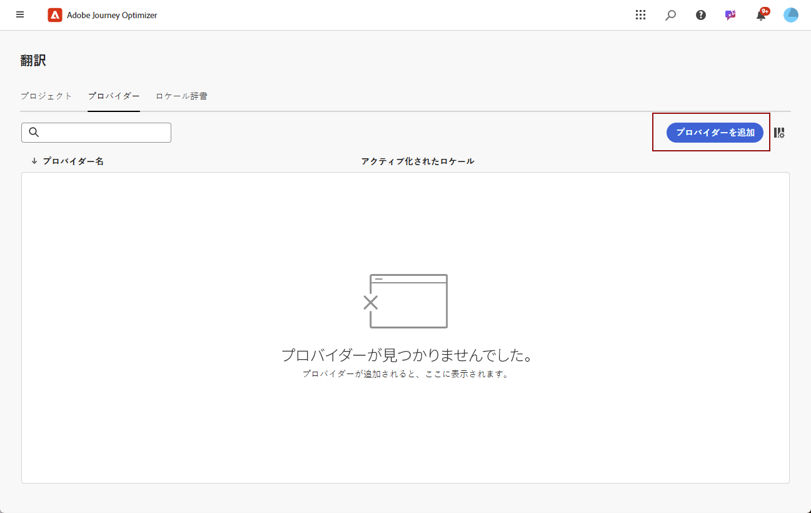
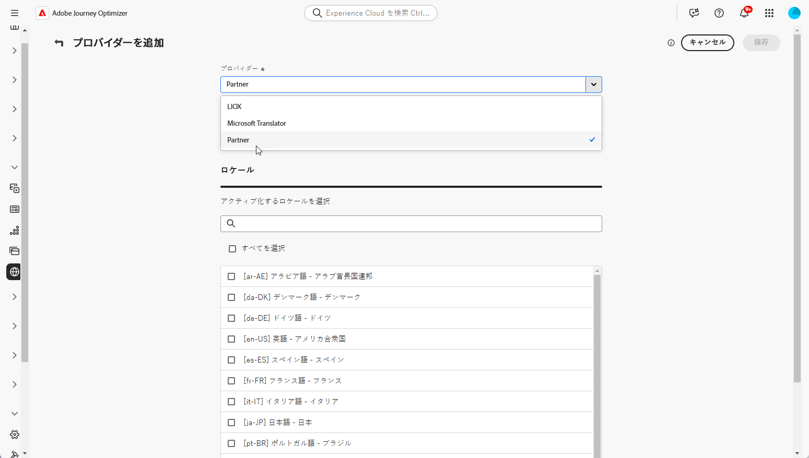
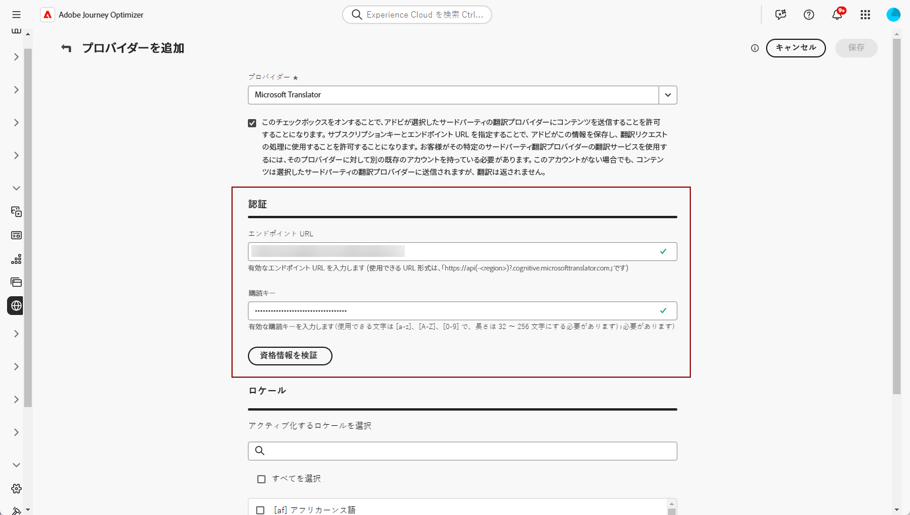
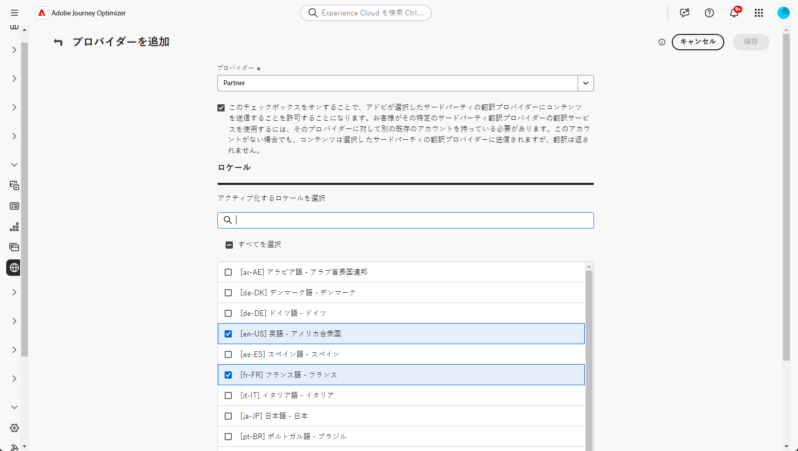

# 言語プロバイダーの追加 {#multilingual-provider}

>[!IMPORTANT]
>
> 翻訳プロバイダーの翻訳サービスを使用した場合、該当するプロバイダーが定める追加の利用条件に同意したと見なされます。Adobe Journey Optimizer ユーザーは、統合を介し、翻訳サービスをサードパーティソリューションとして利用できます。サードパーティ製品について、アドビは一切関係せず、責任も負いません。

Adobe Journey Optimizer は、Adobe Journey Optimizer から独立して、機械翻訳と人間による翻訳の両方のサービスを提供するサードパーティの翻訳プロバイダーと統合されています。

選択した翻訳プロバイダーを追加する前に、それぞれのプロバイダーでアカウントが作成されていることを確認してください。

1. **[!UICONTROL コンテンツ管理]**&#x200B;メニューで、「**[!UICONTROL 翻訳]**」に移動します。

1. 「**[!UICONTROL プロバイダー]**」タブにアクセスし、「**[!UICONTROL プロバイダーを追加]**」をクリックします。

   

1. **[!UICONTROL プロバイダー]**&#x200B;ドロップダウンリストから、目的のプロバイダーを選択します。

   >[!NOTE]
   >
   >新しい&#x200B;**プロバイダー**&#x200B;をリストに追加するには、[このドキュメント](https://developer.adobe.com/gcs/partner/)に記載されている手順に従ってオンボーディングプロセスを完了するように&#x200B;**プロバイダー**&#x200B;に依頼します。

   

1. Microsoft Translator をプロバイダーとして使用する場合は、**[!UICONTROL サブスクリプションキー]**&#x200B;と&#x200B;**[!UICONTROL エンドポイント URL]** を入力します。

   「**[!UICONTROL 資格情報を検証]**」をクリックして、接続をテストします。

   

1. 該当する「**サポート対象のロケール**」を選択します。

   

1. 設定が完了したら、「**[!UICONTROL 保存]**」をクリックして設定を完了します。
