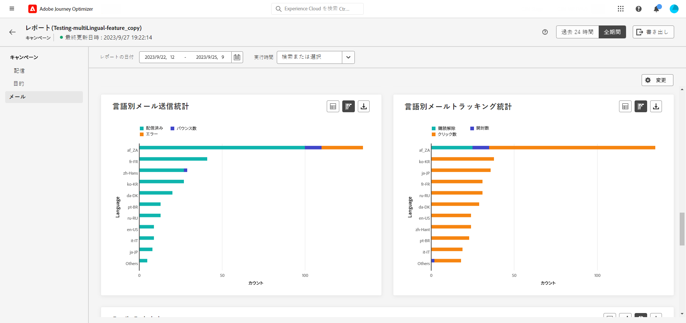

# 多言語キャンペーンレポート {#multilingual-campaign-report}

「**全期間**」タブからアクセスできるグローバルレポートには、少なくとも 2 時間前に発生したイベントと、選択した期間のイベントが表示されます。キャンペーンのグローバルレポートへは、「**[!UICONTROL レポートを表示]**」ボタンを使用して、キャンペーンから直接アクセスできます。

キャンペーンレポートで使用可能なデータについて詳しくは、[このページ](../reports/campaign-global-report.md)を参照してください。

**[!UICONTROL 言語別メール送信統計]**&#x200B;ウィジェットには、**[!UICONTROL ロケール]**&#x200B;に応じて配信の成功の詳細が表示されます。

* **[!UICONTROL 配信済み]**：送信されたメッセージの合計数に対して、正常に配達できたメッセージの数。

* **[!UICONTROL バウンス]**：送信されたメッセージの総数に対して、配信と自動返信の処理中に発生したエラーの累計。

* **[!UICONTROL エラー]**：配信中に発生し、プロファイルへの送信の妨げとなったエラーの合計数。

**[!UICONTROL 言語別メールトラッキング統計]**&#x200B;ウィジェットには、**[!UICONTROL ロケール]**&#x200B;に応じて配信の受信者アクティビティに使用できるデータが含まれます。

* **[!UICONTROL 登録解除]**：登録解除リンクのクリック数。

* **[!UICONTROL 開封数]**：メッセージが開封された回数。

* **[!UICONTROL クリック数]**：コンテンツがクリックされた回数。
