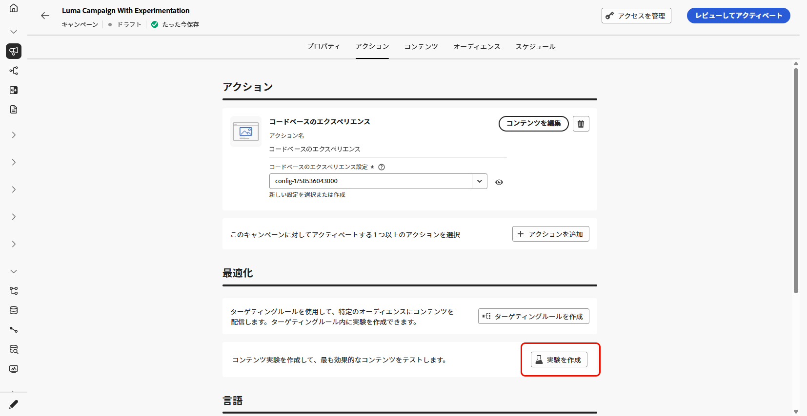
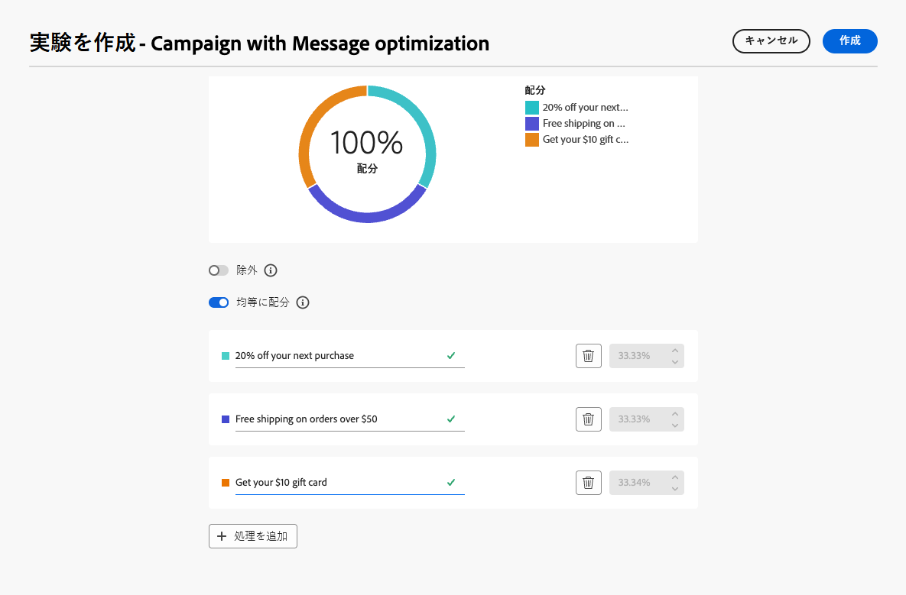

# 実験の使用 {#experimentation}

>[!NOTE]
>
>このページでは、コンテンツ最適化で実験を使用する方法の概要を説明します。 設定オプション、指標、分析など、コンテンツ実験について詳しくは、[ コンテンツ実験ドキュメント ](../content-management/get-started-experiment.md)を参照してください。

実験により、複数のバージョンのコンテンツをテストし、事前定義済みの成功指標に基づいて最もパフォーマンスが高いバージョンを判断できます。

実験を設定するには、次の手順に従います。

キャンペーンで次のプロモーションメッセージをテストするとします。

* **処理 A**：「次回購入時に 20％オフ」
* **処理 B**：「50 ドルを超える注文で送料無料」
* **処理 C**：「10 ドルのギフトカードを入手」

実験を設定し、最も多くの購入を促すメッセージを特定するには、次の手順に従います。

1. [ジャーニー](../building-journeys/journey-gs.md#jo-build)または[キャンペーン](../campaigns/create-campaign.md)を作成します。

   >[!NOTE]
   >
   >ジャーニー中の場合は、**[!UICONTROL アクション]**&#x200B;アクティビティを追加し、チャネルアクティビティを選択して、「**[!UICONTROL アクションを設定]**」を選択します。 [詳細情報](../building-journeys/journey-action.md#add-action)

1. 「**[!UICONTROL アクション]**」タブから、[コードベースのエクスペリエンス](../code-based/get-started-code-based.md)や[アプリ内](../../rp_landing_pages/in-app-landing-page.md)など、2 つのインバウンドアクションを選択します。

1. 「**[!UICONTROL 最適化]**」セクションで、「**[!UICONTROL 実験を作成]**」を選択します。

   {width=85%}

1. 必要に応じて、コンテンツ実験を設計および設定します。 [詳細情報](../content-management/content-experiment.md)

   {width=85%}

   実験が定義されると、そのキャンペーンに、またはジャーニー&#x200B;**[!UICONTROL アクション]**&#x200B;アクティビティを通じて挿入されたすべてのアクションに適用され、すべてのサーフェスで同じお客様に同じオファーが表示されます。

   >[!NOTE]
   >
   >他のアクションを選択できます。実験は、キャンペーンまたはジャーニー[ アクションアクティビティ ](../building-journeys/journey-action.md)に追加されたすべてのアクションに適用されます。

1. ジャーニーまたはキャンペーンを[アクティブ化](../campaigns/review-activate-campaign.md)します。

ジャーニー／キャンペーンがライブになると、ユーザーには様々なコンテンツのバリエーションがランダムに割り当てられます。 [!DNL Journey Optimizer] は、より多くの購入を推進したバリエーションを追跡し、実用的なインサイトを提供します。

[ジャーニー](../reports/journey-global-report-cja.md)と[キャンペーン](../reports/campaign-global-report-cja-experimentation.md)のレポートを使用してキャンペーンの成功を追跡します。<!--Link to Experimentation journey reportis missing-->
