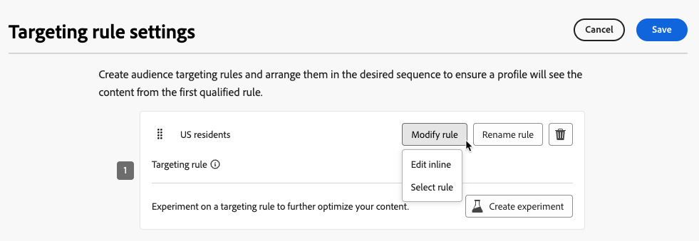

# ターゲティングを使用 {#targeting}

>[!CONTEXTUALHELP]
>id="ajo_content_targeting_fallback"
>title="フォールバックコンテンツとは"
>abstract="フォールバックコンテンツを使用すると、ターゲティングルールが選定されていない場合に、オーディエンスはデフォルトコンテンツを受信できます。 このオプションを選択しない場合、上記で定義したターゲティングルールに選定されていないオーディエンスはコンテンツを受信しません。"

ターゲティングでは、ユーザープロファイル属性またはコンテキスト属性に基づいて、特定のオーディエンスセグメントにパーソナライズされたコンテンツを配信します。

メッセージのコンテンツをランダムに割り当てる実験とは異なり、ターゲティングは、コンテンツを適切なオーディエンスに配信するという点で決定論的です。

ターゲティングでは、次に基づいて特定のルールを定義できます。

* **ユーザープロファイル属性**：場所（例：ジオターゲティング）、年齢、好みなど。例えば、米国のユーザーには「ゴールデンゲート」のプロモーションが表示され、フランスのユーザーには「エッフェル塔」のプロモーションが表示されます。

* **コンテキストデータ**：デバイスタイプ（例：デバイスターゲティング）、時間帯、セッションの詳細など。例えば、デスクトップユーザーはデスクトップ向けに最適化されたコンテンツを受信しますが、モバイルユーザーはモバイル向けに最適化されたコンテンツを受信します。

* **オーディエンス**：特定のオーディエンスメンバーシップを持つプロファイルを含めたり除外したりするために使用できます。

ターゲティングを設定するには、次の手順に従います。

1. [ジャーニー](../building-journeys/journey-gs.md#jo-build)または[キャンペーン](../campaigns/create-campaign.md)を作成します。

   >[!NOTE]
   >
   >ジャーニー中の場合は、**[!UICONTROL アクション]**&#x200B;アクティビティを追加し、チャネルアクティビティを選択して、「**[!UICONTROL アクションを設定]**」を選択します。[詳細情報](../building-journeys/journey-action.md#add-action)

1. 「**[!UICONTROL アクション]**」タブから、1 つ以上のアクションを選択します。

1. 「**[!UICONTROL 最適化]**」セクションで、「**[!UICONTROL ターゲティングルールを作成]**」を選択します。

   {width=85%}

1. **[!UICONTROL ルールを作成]**／**[!UICONTROL 新規作成]**&#x200B;をクリックし、ルールビルダーを使用して外出先で条件を定義します。

   {width=100%}

   例えば、米国居住者向けのルール、フランス居住者向けのルール、インド居住者向けのルールを定義します。

   {width=85%}

1. また、**[!UICONTROL ルールを作成]**／**[!UICONTROL ルールを選択]**&#x200B;をクリックして、**[!UICONTROL ルール]**&#x200B;メニューから作成した既存のターゲティングルールを選択することもできます。[詳細情報](../experience-decisioning/rules.md)

   {width=70%}

   この場合、ルールを構成する数式がジャーニーやキャンペーンにシンプルにコピーされます。その後、**[!UICONTROL ルール]**&#x200B;メニューからそのルールを変更しても、ジャーニーやキャンペーンのコピーには影響しません。

   >[!AVAILABILITY]
   >
   >専用の [!DNL Journey Optimizer] メニューから[ターゲティングルールを作成](../experience-decisioning/rules.md#create)できるのは、現在、決定アドオン機能を購入した組織で、他の組織ではオンデマンドで使用できます（限定提供）。
   >
   >この機能は、すべての顧客に段階的にロールアウトされる予定です。それまでの間、アクセス権を取得するには、アドビ担当者にお問い合わせください。

1. ルールを追加したら、引き続き変更できます。 ルールビルダーを使用して外出先で更新するには「**[!UICONTROL インラインで編集]**」を選択し、別の既存のルールを選択するには「**[!UICONTROL ルールを選択]**」を選択します。

   {width=100%}

   >[!NOTE]
   >
   >ルールをインラインで編集しても、そのルールの元となる既存のルールには影響しません。

1. 必要に応じて、「**[!UICONTROL フォールバックコンテンツを有効にする]**」オプションを選択します。フォールバックコンテンツを使用すると、ターゲティングルールが選定されていない場合に、オーディエンスはデフォルトコンテンツを受信できます。

   >[!NOTE]
   >
   >このオプションを選択しない場合、上記で定義したターゲティングルールに選定されていないオーディエンスはコンテンツを受信しません。

1. ターゲティングルールの設定を保存します。

1. 「**[!UICONTROL アクション]**」タブに戻り、「**[!UICONTROL コンテンツを編集]**」を選択します。

1. ターゲティングルールの設定で定義した各グループに適切なコンテンツを設計します。

   {width=85%}

   この例では、米国居住者向けの特定のコンテンツ、フランス居住者向けの別のコンテンツ、インド居住者向けの別のコンテンツを設計します。

1. ジャーニーまたはキャンペーンを[アクティブ化](../campaigns/review-activate-campaign.md)します。

ジャーニー／キャンペーンがライブになると、米国居住者には特定のメッセージ、フランス居住者には異なるメッセージなど、各ターゲットにカスタマイズされたコンテンツが送信されます。

<!--Default content:

* If no targeting rules match, default content can be delivered.

* If default content is not enabled, passthrough behavior ensures lower-priority campaigns are evaluated.-->

