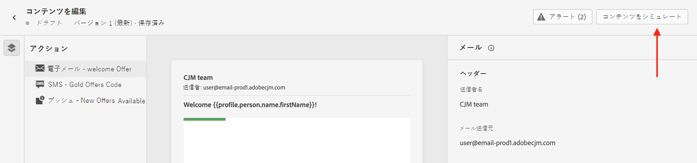

# コンテンツのプレビューとテスト {#preview-test}

>[!CONTEXTUALHELP]
>id="ac_preview_testprofiles"
>title="コンテンツのレンダリング方法の確認"
>abstract="コンテンツを定義したら、テストプロファイルを使用してプレビューし、使用しているチャネルに従ってレンダリングが正しいかどうかを確認できます。"

>[!CONTEXTUALHELP]
>id="ajo_preview_simulate"
>title="コンテンツのレンダリング方法の確認"
>abstract="コンテンツを定義したら、プレビューし、使用しているチャネルに従ってレンダリングが正しいかどうかを確認できます。"

## プレビューとテストについて {#about}

コンテンツを定義したら、メッセージを送信する前にそのコンテンツをプレビューできます。これは、コンテンツが正確であると同時に、コンテンツとパーソナライゼーション設定の両方にエラーがないことを確認するための重要な手順です。

また、テストと検証のために特定の受信者または購読者にメールメッセージのテスト配信を送信したり、一般的なデスクトップ、モバイル、web ベースのクライアントでレンダリングを確認したりすることもできます。

>[!CAUTION]
>
>メッセージをプレビューしたり、配達確認を送信したりすると、プロファイルのパーソナライゼーションデータのみが表示されます。イベント情報などのコンテキストデータに基づくパーソナライゼーションは、ジャーニーのコンテキストでのみテストできます。[こちらのユースケース](../personalization/personalization-use-case.md)では、パーソナライゼーションのテスト方法を説明します。

これらのアクションはすべて、「**[!UICONTROL コンテンツをシミュレート]**」ボタンを使用して実行できます。このボタンには、メッセージのコンテンツ編集画面からアクセスするか、メールチャネルのメールデザイナーや web チャネルの web デザイナーからアクセスできます。

**[!DNL Content Library Manager]** 製品プロファイルに含まれる **[!DNL Manage Simulate Content]** 権限が必要です。[詳細情報](../administration/ootb-product-profiles.md#content-library-manager)

## テストプロファイルまたはサンプル入力データを使用したテスト {#methods}

コンテンツは、次を使用してプレビューおよびテストできます。

* **テストプロファイル**

  テストプロファイルを使用して、コンテンツをプレビューし、メール配達確認を送信し、メールのレンダリングを確認します。パーソナライズされたフィールドを追加した場合は、テストプロファイルデータを使用して、その表示方法を確認できます。詳しくは、次の節を参照してください。

  ➡️ [テストプロファイルの選択](test-profiles.md)

  ➡️ [テストプロファイルを使用したコンテンツのプレビュー](preview.md)

  ➡️ [メール配達確認の送信](proofs.md)

  ➡️ [メールのレンダリングの確認](rendering.md)

  ➡️ [メールのプレビューと配達確認（ビデオ）](#video-preview)

* **サンプル入力データ**

  [!DNL Journey optimizer] を使用すると、CSV／JSON ファイルからアップロードした、または手動で追加したサンプル入力データを使用してコンテンツをプレビューし、配達確認を送信することで、コンテンツの様々なバリアントをテストできます。

  パーソナライズ機能のコンテンツで使用されるすべてのプロファイル属性は、システムによって自動的に検出され、テストで複数のバリアントを作成するのに使用できます。

  ➡️ [詳しくは、サンプル入力データを使用してコンテンツをテストする方法を参照してください](../test-approve/simulate-sample-input.md)

  >[!NOTE]
  >
  >この機能は現在、パブリックベータ版としてすべてのお客様がメール、SMS、プッシュ通知チャネルのみで使用できます。

## チュートリアルビデオ {#video-preview}

テストプロファイルを使用して、複数のインボックスにわたってメールのレンダリングをテストする方法、パーソナライズされたメールをテストプロファイルに対してプレビューする方法、配達確認を送信する方法について説明します。

>[!VIDEO](https://video.tv.adobe.com/v/3425026?quality=12)
