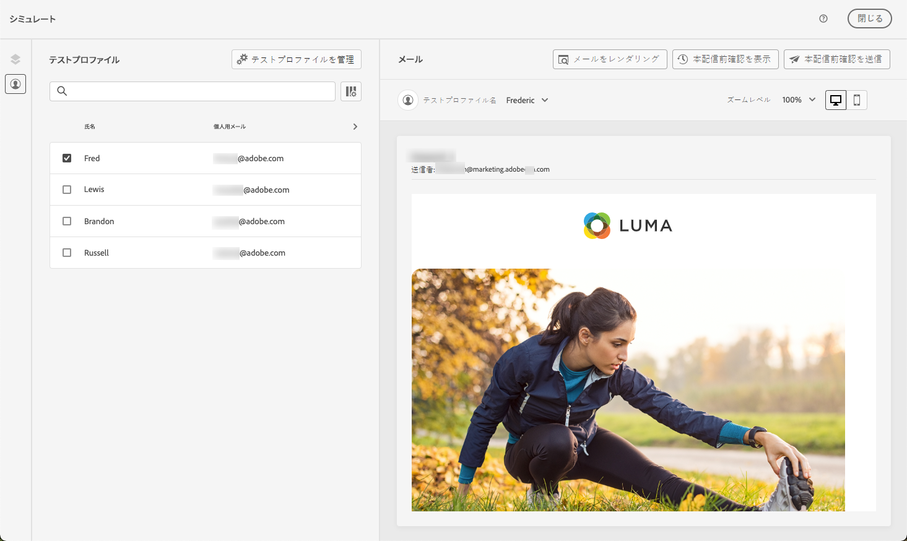
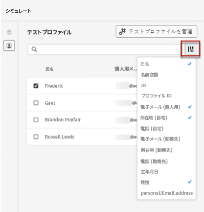
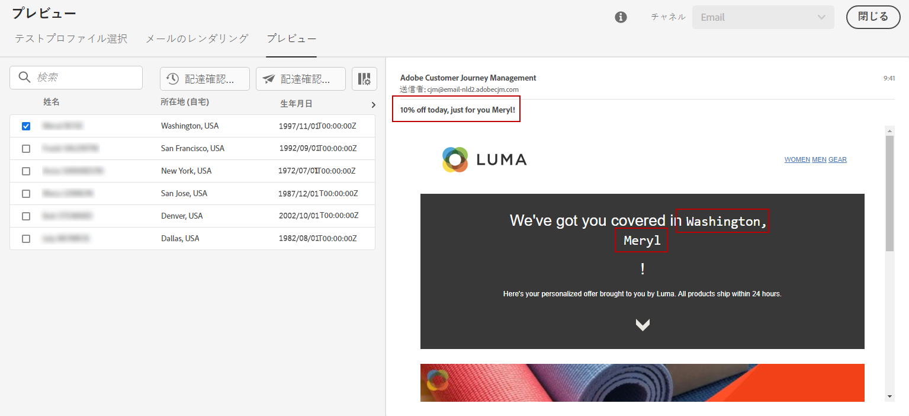

# テストプロファイルを使用したコンテンツのプレビュー {#preview}

[ テストプロファイル ](test-profiles.md) を選択すると、そのデータを使用してコンテンツをプレビューできます。 次の手順に従います。

1. メッセージのコンテンツを編集画面またはメールDesignerで、「**[!UICONTROL コンテンツをシミュレート]**」ボタンをクリックし、「**[!UICONTROL コンテンツをシミュレート]**」を選択します。

1. テストプロファイルを選択します。列内で利用可能な値を確認できます。右向きや左向きの矢印を使用して、データを参照します。

   

   >[!NOTE]
   >
   >テストプロファイルをさらに追加するには、「**[!UICONTROL テストプロファイルを管理]**」を選択します。[詳細情報](test-profiles.md)

1. 列を追加または削除するには、リストの上にある「**[!UICONTROL データを選択]**」アイコンをクリックします。

   リストの最後に、現在のメッセージに固有のパーソナライゼーションフィールドを表示できます。この例では、プロファイルの市区町村、姓、名を使用しています。これらのフィールドを選択し、テストプロファイルにこれらの値が入力されていることを確認します。

   

1. メッセージプレビューでは、パーソナライズされた要素が、選択したテストプロファイルデータに置き換えられます。例えば、次のメッセージの場合、メールのコンテンツと件名の両方がパーソナライズされています。

   

1. メッセージの各バリエーションに対してメールをプレビューするには、他のテストプロファイルを選択します。

   >[!NOTE]
   >
   >設定の詳細にエラーがある場合は、「**[!UICONTROL 設定の詳細を表示]**」ボタンをクリックします。[詳細情報](../email/surface-personalization.md#check-configuration)

コードベースのエクスペリエンスを作成する場合、ブラウザーまたはモバイルデバイスでパーソナライズされたコンテンツをプレビューして、実際のシミュレーションを行うことができます。[詳細情報](../code-based/test-code-based.md#preview-on-device)

>[!NOTE]
>
>また、[!DNL Journey optimizer] を使用すると、CSV／JSON ファイルからアップロードした、または手動で追加したサンプル入力データを使用してコンテンツをプレビューし、配達確認を送信することで、コンテンツの様々なバリアントをテストできます。[ コンテンツのバリエーションをシミュレートする方法を学ぶ ](../test-approve/simulate-sample-input.md)
