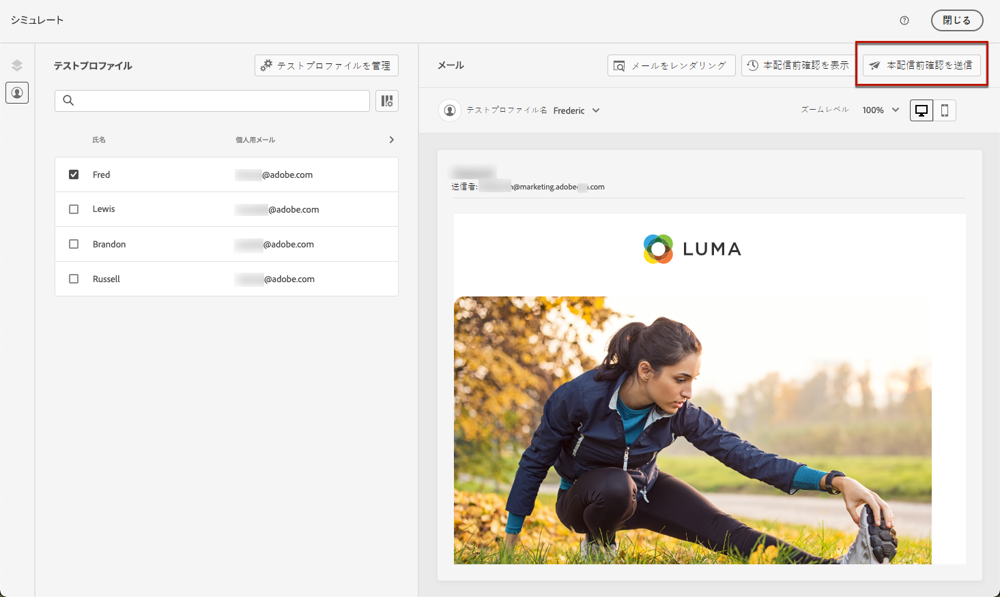
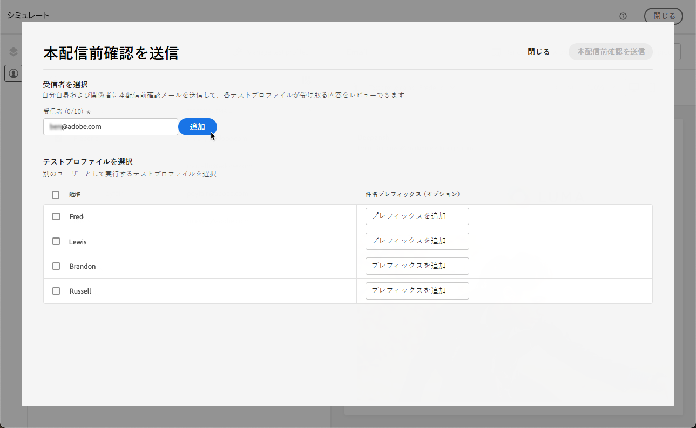
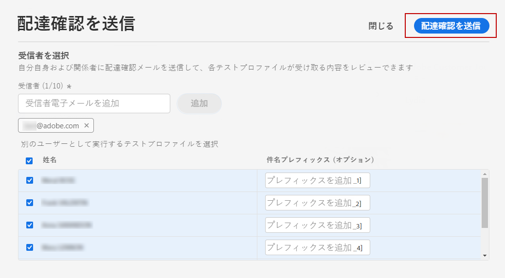
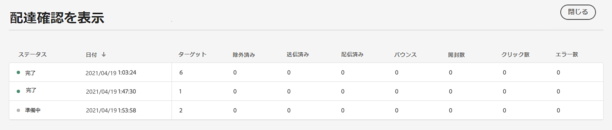

# メール配達確認を送信 {#send-proofs}

配達確認は、メッセージをメインオーディエンスに送信する前にテストできる、特定のメッセージです。配達確認の受信者は、メッセージのレンダリング、コンテンツ、パーソナライゼーションの設定、構成などを確認します。

また、[!DNL Journey optimizer] を使用すると、CSV／JSON ファイルからアップロードした、または手動で追加したサンプル入力データを使用してコンテンツをプレビューし、配達確認を送信することで、コンテンツの様々なバリアントをテストできます。[詳しくは、サンプル入力データを使用してコンテンツをテストする方法を参照してください。](../test-approve/simulate-sample-input.md)

>[!PREREQUISITES]
>
>配達確認を送信するには、メールに関連付けられた特定のリソース（キャンペーンまたはジャーニー）に対する&#x200B;**承認および公開**&#x200B;権限を持っている必要があります。また、ジャーニーで配達確認を送信するには、**ジャーニーを公開**&#x200B;権限も必要です。[詳しくは、権限を参照してください](../administration/ootb-permissions.md)。

メール配達確認を送信するには、まず[テストプロファイル](test-profiles.md)を選択する必要があります。その後、次の手順に従います。

1. **[!UICONTROL シミュレート]**&#x200B;画面で、「**[!UICONTROL 配達確認を送信]**」ボタンをクリックします。

   

1. **[!UICONTROL 配達確認を送信]**&#x200B;ウィンドウで、受信者のメールアドレスを入力し、「**[!UICONTROL 追加]**」をクリックして、自分自身または組織のメンバーに配達確認を送信します。

   なお、配達確認配信には、最大 10 人の受信者を追加できます。

   

1. 使用する&#x200B;**テストプロファイル**&#x200B;を選択して、メッセージコンテンツをパーソナライズします。

   配達確認の各受信者は、選択したテストプロファイルと同じ数のメッセージを受信します。例えば、受信者のメールを 5 件追加し、10 個のテストプロファイルを選択した場合は、50 件の配達確認メッセージを送信することになり、各受信者はそのうち 10 件を受信します。

1. 必要に応じて、配達確認の件名行にプレフィックスを追加できます。英数字と . - _ ( ) などの特殊文字のみ[ ] は件名行のプレフィックスとして使用できます。

1. 「**[!UICONTROL 配達確認を送信]**」をクリックします。

   

1. **[!UICONTROL シミュレート]**&#x200B;画面に戻り、「**[!UICONTROL 配達確認を表示]**」ボタンをクリックしてステータスを確認します。

   

メッセージコンテンツを変更するたびに、配達確認を送信することをお勧めします。

>[!NOTE]
>
>送信される配達確認では、ミラーページへのリンクはアクティブになっていません。最終的なメッセージでのみアクティブ化されます。
