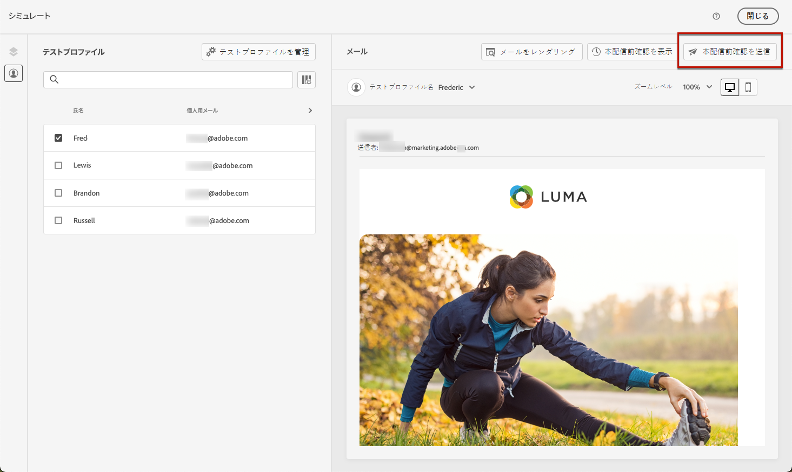
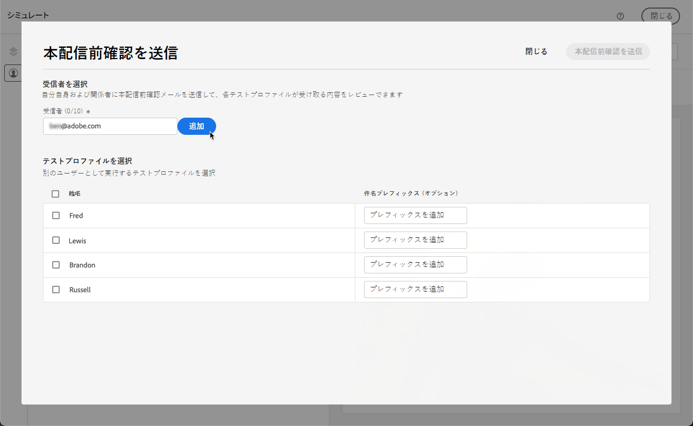
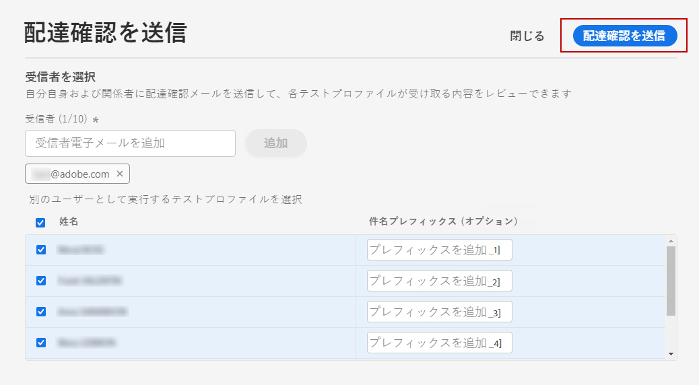
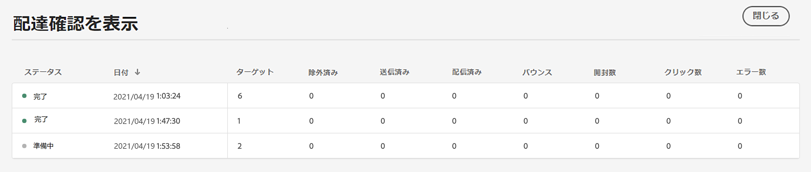

# テストプロファイルデータを使用した本配信前確認の送信 {#send-proofs}

配達確認は、メッセージをメインオーディエンスに送信する前にテストできる、特定のメッセージです。 配達確認の受信者は、メッセージのレンダリング、コンテンツ、パーソナライゼーションの設定、構成などを確認します。

>[!NOTE]
>
>また、[!DNL Journey Optimizer] を使用すると、CSV／JSON ファイルからアップロードした、または手動で追加したサンプル入力データを使用してコンテンツをプレビューし、本配信前確認を送信することで、コンテンツの様々なバリアントをテストできます。 [コンテンツバリエーションのシミュレート方法を学ぶ](../test-approve/simulate-sample-input.md)

## 必読 {#must-read}

**フリークエンシーキャップルール** - 既存のすべてのフリークエンシーキャップルールが本配信前確認に適用されます。 [フリークエンシーキャップルール](../conflict-prioritization/channel-capping.md)（例：プロファイルあたりの最大送信数）を設定している場合は、本配信前確認の送信時にもこれらの制限が適用されます。 テストプロファイルが既にフリークエンシーキャップの制限に達している場合、本配信前確認は完了として表示されますが、メールは配信されません。 繰り返しテストを行う場合は、必要に応じて、一意のテストプロファイルを使用するか、本配信前確認シナリオのフリークエンシーキャップを調整することを考慮します。

**ミラーページ** - 送信される本配信前確認では、ミラーページへのリンクはアクティブになっていません。 最終的なメッセージでのみアクティブ化されます。

**アセット** - アセットと画像には、特定のアクセシビリティルールがあります。

* アセット／画像は、フラグメント／インラインメッセージで最初に公開されてから最大 2 年間（730 日間）、配信済みコンテンツまたは本配信前確認コンテンツでアクセスできます。
* この有効期限の後（730 日後の任意の時間）に、さらに 2 年間アクセスできるようにするには、再公開が必要です。
* 最初の公開から 730 日以内に再公開した場合、アセット／画像の有効期限は次の 730 日間に延長されません。

## 本配信前確認の送信 {#send-proofs-steps}

テストプロファイルデータを使用したメール本配信前確認を送信するには、まず[テストプロファイル](test-profiles.md)を選択する必要があります。 その後、次の手順に従います。

1. **[!UICONTROL シミュレート]**&#x200B;画面で、「**[!UICONTROL 本配信前確認を送信]**」ボタンをクリックします。

   

1. **[!UICONTROL 本配信前確認を送信]**&#x200B;ウィンドウで、受信者のメールアドレスを入力し、「**[!UICONTROL 追加]**」をクリックして、自分自身または組織のメンバーに本配信前確認を送信します。

   なお、本配信前確認の配信には、最大 10 人の受信者を追加できます。

   

1. 使用する&#x200B;**テストプロファイル**&#x200B;を選択して、メッセージコンテンツをパーソナライズします。

   配達確認の各受信者は、選択したテストプロファイルと同じ数のメッセージを受信します。 例えば、受信者のメールを 5 件追加し、10 個のテストプロファイルを選択した場合は、50 件の本配信前確認メッセージを送信することになります。 各受信者はそのうち 10 件を受信します。

1. 必要に応じて、配達確認の件名行に接頭辞を追加できます。 英数字と、などの特殊文字のみ。 - _ ( ) [ ] は件名行の接頭辞として使用できます。

1. 「**[!UICONTROL 配達確認を送信]**」をクリックします。

   

1. **[!UICONTROL シミュレート]**&#x200B;画面に戻り、「**[!UICONTROL 本配信前確認を表示]**」ボタンをクリックしてステータスを確認します。

   

メッセージコンテンツを変更するたびに、本配信前確認を送信することをお勧めします。
