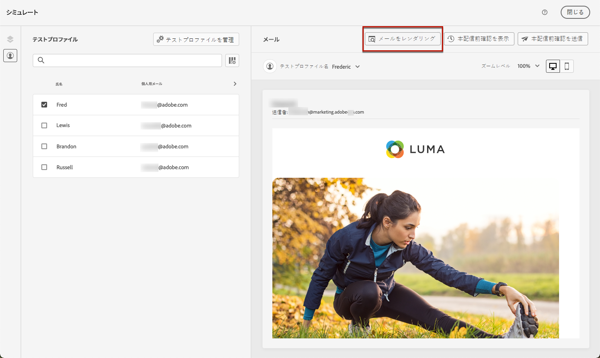
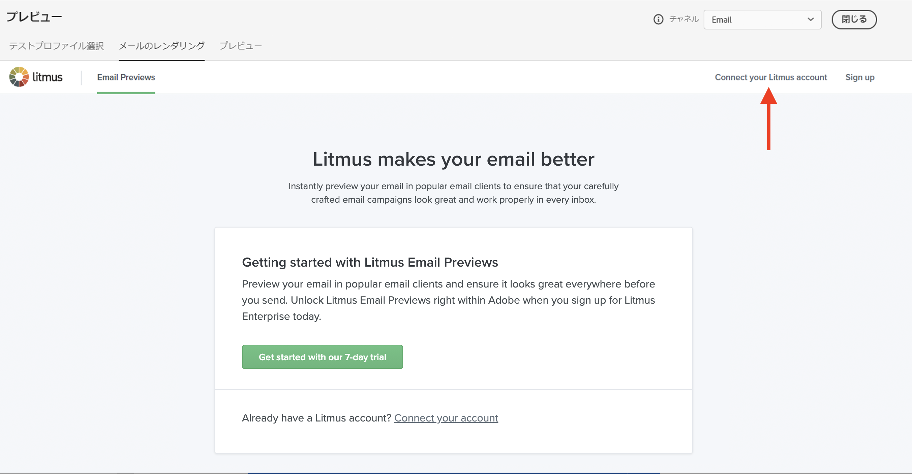
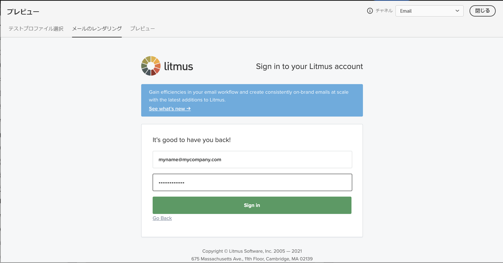
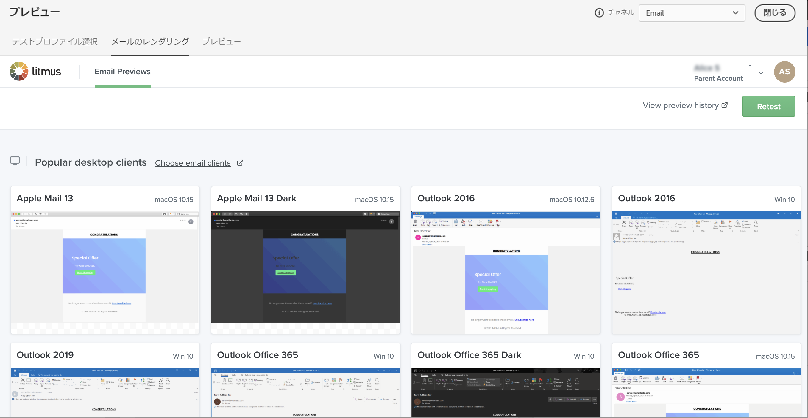

# メールのレンダリングのテスト {#email-rendering}

**Litmus** アカウントを [!DNL Journey Optimizer] に使用すると、よく使うメールクライアントで&#x200B;**メールのレンダリング**&#x200B;を即座にプレビューできます。 すべてのインボックスでメールコンテンツが適切に表示され、正しく機能することを確認できます。

メールのレンダリングを確認するには、次の手順に従います。

1. メッセージのコンテンツを編集画面またはメールDesignerで、「**[!UICONTROL コンテンツをシミュレート]**」をクリックし、ドロップダウンから「**[!UICONTROL コンテンツをシミュレート（AEP プロファイル）]**」を選択します。

1. 「**[!UICONTROL メールをレンダリング]**」ボタンを選択します。

   

1. 右上のセクションで、「**Litmus アカウントを接続**」をクリックします。

   

1. 資格情報を入力し、ログインします。

   

1. 「**テストを実行**」ボタンをクリックして、メールのプレビューを生成します。

1. 一般的なデスクトップ、モバイル、Web ベースのクライアントでメールの内容を確認します。

   

>[!CAUTION]
>
>**Litmus** アカウントを [!DNL Journey Optimizer] に接続する際は、テストメッセージが Litmus に送信されることに同意する必要があります。一度送信すると、これらのメールはアドビでは管理できなくなります。 その結果、テストメッセージに含まれる可能性のあるパーソナライゼーションデータも含め、Litmus データ保持メールポリシーがこれらのメールに適用されます。
