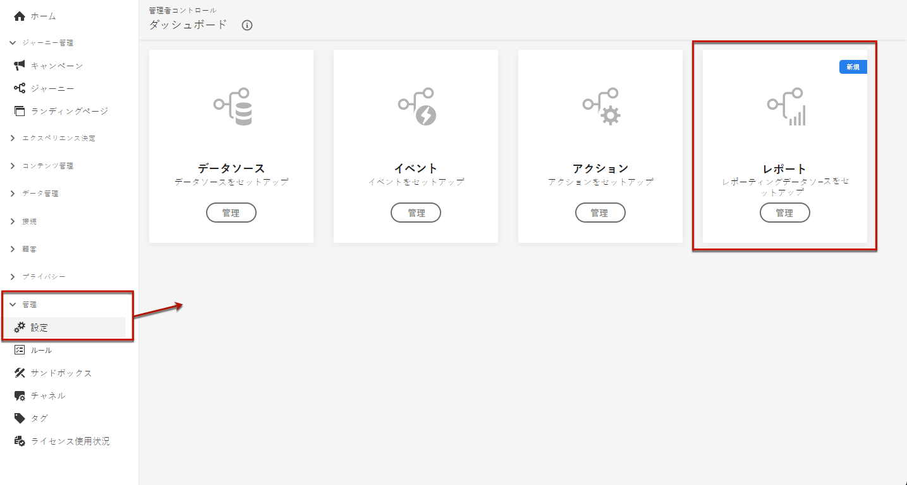
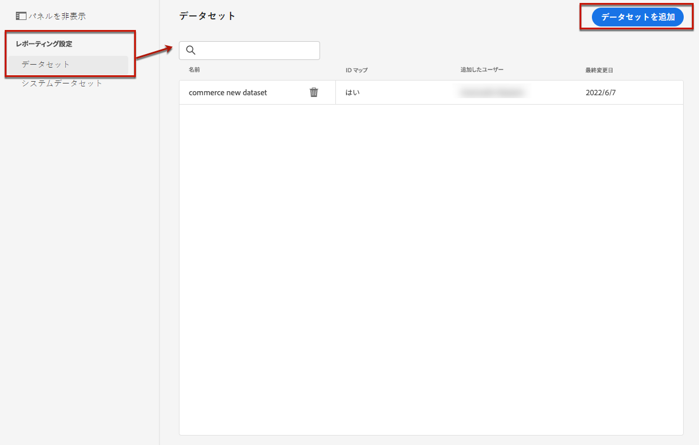
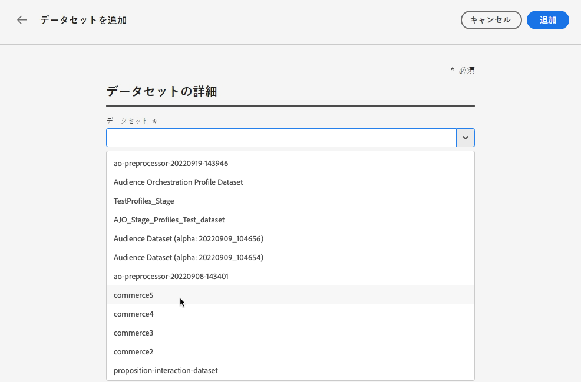
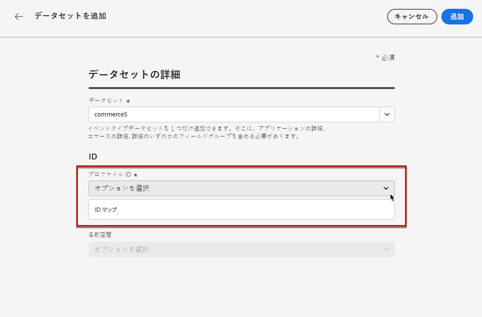
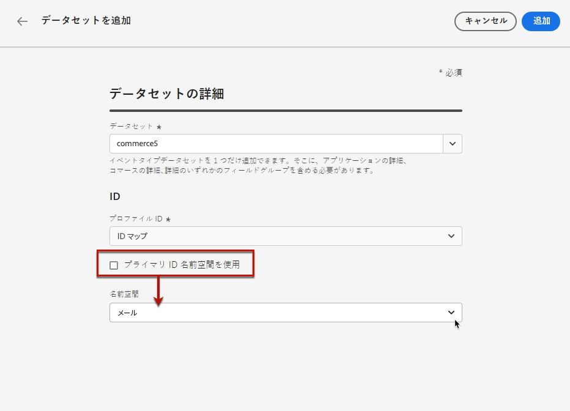
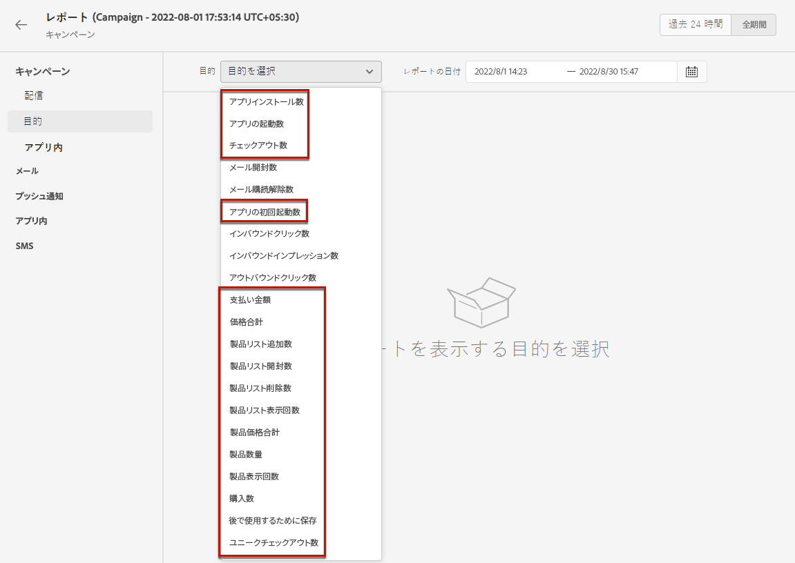

# 実験用のレポートの設定 {#reporting-configuration}

>[!CONTEXTUALHELP]
>id="ajo_admin_reporting_config"
>title="レポート用のデータセットを設定"
>abstract="レポート設定では、キャンペーンレポートで使用する追加指標を取得できます。技術ユーザーが実行する必要があります。"

>[!CONTEXTUALHELP]
>id="ajo_admin_reporting_dataset"
>title="データセットの選択"
>abstract="イベントタイプのデータセット を 1 つだけ選択できます。そのデータセットには、サポートされているフィールドグループ（アプリケーションの詳細、コマースの詳細、web の詳細）を 1 つ以上含める必要があります。"

レポートデータソース設定では、レポートで使用する追加情報を取得するためにシステムへの接続を定義できます。

<!--The reporting data source configuration allows you to retrieve additional metrics that will be used in the **[!UICONTROL Objectives]** tab of your campaign reports.-->

>[!NOTE]
>
>レポートの設定は、技術ユーザーが実行する必要があります。<!--Rights?-->

この設定の場合は、レポートに使用する追加の要素を含む 1 つ以上のデータセットを追加する必要があります。 これをおこなうには、[以下](#add-datasets)の手順に従います。

<!--
➡️ [Discover this feature in video](#video)
-->

## 前提条件

レポート設定にデータセットを追加する前に、そのデータセットを作成する必要があります。方法については、[Adobe Experience Platform ドキュメント](https://experienceleague.adobe.com/docs/experience-platform/catalog/datasets/user-guide.html?lang=ja#create){target="_blank"}を参照してください。

* イベントタイプのデータセットのみを追加できます。

* これらのデータセットには、`Experience Event - Proposition Interactions` [フィールドグループ](https://experienceleague.adobe.com/docs/experience-platform/xdm/tutorials/create-schema-ui.html?lang=ja#field-group){target="_blank"}を含める必要があります。

* また、これらのデータセットには、次の[フィールドグループ](https://experienceleague.adobe.com/docs/experience-platform/xdm/tutorials/create-schema-ui.html?lang=ja#field-group){target="_blank"}のうち 1 つが含まれている場合があります：`Application Details`、`Commerce Details`、 `Web Details`。

  >[!NOTE]
  >
  >他のフィールドグループが含まれる場合もありますが、Journey Optimizer レポートで現在サポートされているのは上記のフィールドグループのみです。

  例えば、メールキャンペーンが購入や注文などのコマースデータに与える影響を知りたい場合は、`Commerce Details` フィールドグループを使用してエクスペリエンスイベントデータセットを作成する必要があります。

  同様に、モバイルインタラクションに関してレポートする場合は、`Application Details` フィールドグループを使用してエクスペリエンスイベントデータセットを作成する必要があります。

  <!--The metrics corresponding to each field group are listed [here](#objective-list).-->

* これらのフィールドグループは、1 つまたは複数のデータセットで使用する、1 つまたは複数のスキーマに追加できます。

>[!NOTE]
>
>XDM スキーマとフィールドグループについて詳しくは、[XDM システムの概要ドキュメント](https://experienceleague.adobe.com/docs/experience-platform/xdm/home.html?lang=ja){target="_blank"}を参照してください。

<!--
## Objectives corresponding to each field group {#objective-list}

The table below shows which metrics will be added to the **[!UICONTROL Objectives]** tab of your campaign reports for each field group.

| Field group | Objectives |
|--- |--- |
| Commerce Details | Price Total Payment Amount (Unique) Checkouts (Unique) Product List Adds (Unique) Product List Opens (Unique) Product List Removal (Unique) Product List Views (Unique) Product Views (Unique) Purchases (Unique) Save For Laters Product Price Total Product Quantity |
| Application Details | (Unique) App Launches First App Launches (Unique) App Installs (Unique) App Upgrades |
| Web Details | (Unique) Page Views |
-->

## データセットを追加 {#add-datasets}

1. **[!UICONTROL 管理]**&#x200B;メニューで、「**[!UICONTROL 設定]**」を選択します。「**[!UICONTROL レポート]**」セクションで、「**[!UICONTROL 管理]**」をクリックします。

   

   既に追加されたデータセットのリストが表示されます。

1. 「**[!UICONTROL データセット]**」タブで、「**[!UICONTROL データセットを追加]**」をクリックします。

   

   >[!NOTE]
   >
   >「**[!UICONTROL システムデータセット]**」タブを選択した場合、システムで作成されたデータセットのみが表示されます。他のデータセットを追加することはできません。

1. **[!UICONTROL データセット]**&#x200B;ドロップダウンリストで、レポートに使用するデータセットを選択します。

   >[!CAUTION]
   >
   >サポートされている[フィールドグループ](https://experienceleague.adobe.com/docs/experience-platform/xdm/tutorials/create-schema-ui.html?lang=ja#field-group){target="_blank"}（**アプリケーションの詳細**、**コマースの詳細**、**web の詳細**）のうち少なくとも 1 つを含むイベントタイプのデータセットのみを選択できます。これらの条件に一致しないデータセットを選択した場合、変更を保存できません。

   

   データセットについて詳しくは、[Adobe Experience Platform ドキュメント](https://experienceleague.adobe.com/docs/experience-platform/catalog/datasets/overview.html?lang=ja){target="_blank"}を参照してください。

1. **[!UICONTROL プロファイル ID]**&#x200B;ドロップダウンリストで、レポート内の各プロファイルを識別するために使用するデータセットフィールド属性を選択します。

   

   >[!NOTE]
   >
   >レポートに使用できる ID のみが表示されます。

1. 「**[!UICONTROL プライマリ ID 名前空間を使用]**」オプションはデフォルトで有効になっています。選択した&#x200B;**[!UICONTROL プロファイル ID]** が **[!UICONTROL ID マップ]**&#x200B;の場合、このオプションを無効にして、表示されるドロップダウンリストから別の名前空間を選択できます。

   

   名前空間について詳しくは、[Adobe Experience Platform のドキュメント](https://experienceleague.adobe.com/docs/experience-platform/identity/namespaces.html?lang=ja){target="_blank"}を参照してください。

1. 変更を保存し、選択したデータセットをレポート設定リストに追加します。

   >[!CAUTION]
   >
   >イベントタイプでないデータセットを選択した場合は、続行できません。

Web チャネルとアプリ内チャネルの場合、データ収集用に設定された[データセット](../data/get-started-datasets.md)もこのレポート設定に追加していることを確認する必要があります。追加していない場合、web データとアプリ内データがコンテンツ実験レポートに表示されません。

* Web チャネルのコンテンツ実験の前提条件について詳しくは、[この節](../web/web-prerequisites.md#experiment-prerequisites)を参照してください。

* アプリ内チャネルの設定について詳しくは、[この節](../in-app/inapp-configuration.md)を参照してください。

<!--
When building your campaign reports, you can now see the metrics corresponding to the field groups used in the datasets you added. Go to the **[!UICONTROL Objectives]** tab and select the metrics of your choice to better fine-tune your reports. [Learn more](content-experiment.md#objectives-global)

>[!NOTE]
>
>If you add several datasets, all data from all datasets will be available for reporting.

## How-to video {#video}

Understand how to configure Experience Platform reporting data sources.

>[!VIDEO]()
-->
