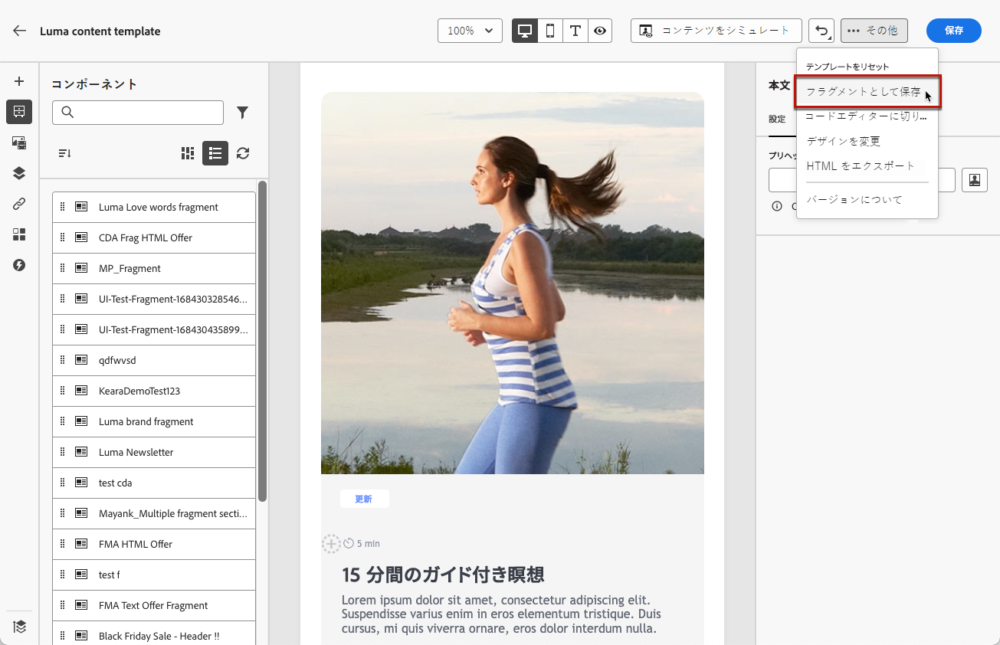
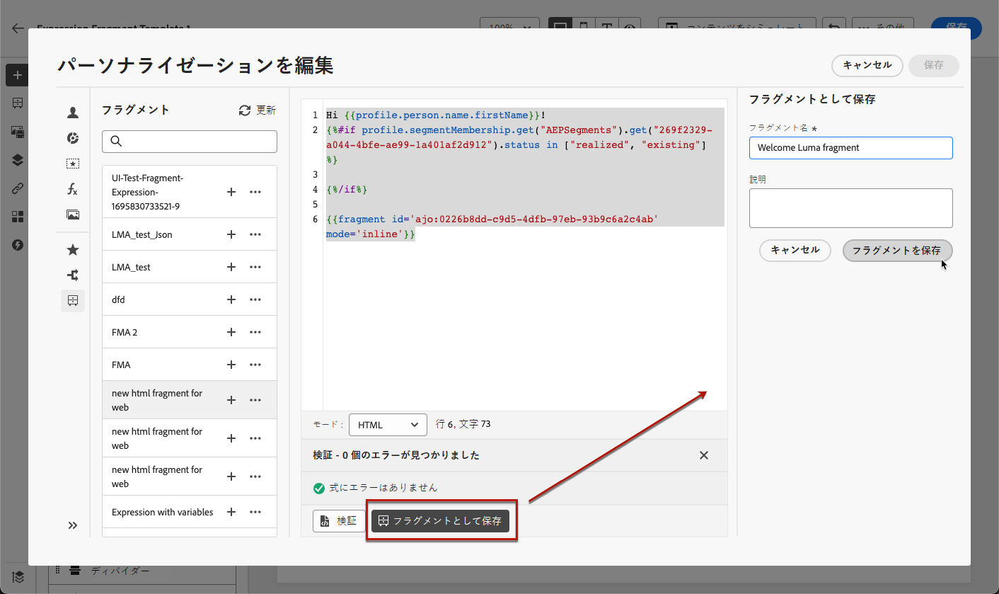

# コンテンツをフラグメントとして保存 {#save-as-fragment}

[!DNL Journey Optimizer] でコンテンツを編集する際、後で再利用するために、コンテンツのすべてまたは一部をフラグメントとして保存できます。

## コンテンツをビジュアルフラグメントとして保存 {#save-as-visual-fragment}

キャンペーンやジャーニーで[コンテンツテンプレート](content-templates.md)または[メール](../email/get-started-email-design.md)をデザインする際、コンテンツの一部をビジュアルフラグメントとして保存できます。それには、次の手順に従います。

1. [E メールデザイナー](../email/get-started-email-design.md)で、画面の右上にある「...」をクリックします。

1. ドロップダウンメニューから「**[!UICONTROL フラグメントとして保存]**」を選択します。

   

1. **[!UICONTROL フラグメントとして保存]**&#x200B;画面が表示されます。パーソナライゼーションフィールドや動的コンテンツなど、フラグメントに含める要素を選択します。コンテキスト属性は、フラグメントではサポートされていません。

   >[!CAUTION]
   >
   >互いに隣接するセクションのみを選択できます。空の構造や別のフラグメントは選択できません。

   

1. 「**[!UICONTROL 作成]**」をクリックします。フラグメントの詳細、名前や説明などを（必要に応じて）入力します。

1. カスタムまたはコアのデータ使用ラベルをフラグメントに割り当てるには、「**[!UICONTROL アクセスを管理]**」を選択します。[オブジェクトレベルのアクセス制御（OLAC）についての詳細はこちらを参照してください](../administration/object-based-access.md)。

1. 「**タグ**」フィールドから Adobe Experience Platform タグを選択または作成してテンプレートを分類し、検索の向上を図ります。[詳細情報](../start/search-filter-categorize.md#tags)

1. 「**[!UICONTROL 作成]**」をもう一度クリックします。フラグメントは[フラグメントリスト](#access-manage-fragments)に保存され、[!DNL Journey Optimizer] 専用メニューからアクセスできます。

   このフラグメントは、そのリストの他の項目と同様に、[アクセス](#access-manage-fragments)、[編集](#edit-fragments)、[アーカイブ](#archive-fragments)できるスタンドアロンのフラグメントになります。

このフラグメントは、[!DNL Journey Optimizer] 内で[メール](../email/get-started-email-design.md)または[コンテンツテンプレート](content-templates.md)を作成する際に使用できるようになりました。[方法についてはこちらを参照](../email/use-visual-fragments.md)

>[!NOTE]
>
>その新しいフラグメントに対する変更は、送信元のメールまたはテンプレートには生成されません。同様に、そのメールまたはテンプレート内で元のコンテンツを編集しても、新しいフラグメントは変更されません。

## コンテンツを式フラグメントとして保存 {#save-as-expression-fragment}

>[!CONTEXTUALHELP]
>id="ajo_perso_library"
>title="式フラグメントとして保存"
>abstract="この [!DNL Journey Optimizer] パーソナライゼーションエディターを使用すると、コンテンツを式フラグメントとして保存できます。 その後、これらの式を使用して、パーソナライズされたコンテンツを作成できます。"

この [!DNL Journey Optimizer] パーソナライゼーションエディターを使用すると、コンテンツを式フラグメントとして保存できます。 その後、これらの式を使用して、パーソナライズされたコンテンツを作成できます。

コンテンツを式フラグメントとして保存するには、次の手順に従います。

1. が含まれる [パーソナライゼーションエディター](../personalization/personalization-build-expressions.md) インターフェイス、式の作成およびクリック **[!UICONTROL フラグメントとして保存]**.

1. 右側のパネルで式の名前と説明を入力して、式を見つけやすくします。

   

1. 「**[!UICONTROL フラグメントを保存]**」をクリックします。

   <!--An expression fragment cannot be nested inside another fragment.-->

1. 式フラグメントが[フラグメントリスト](#access-manage-fragments)に追加されます。この式フラグメントを使用してパーソナライズされたコンテンツを構築することができます。

>[!NOTE]
>
>式は 200 KB 以内にする必要があります。
