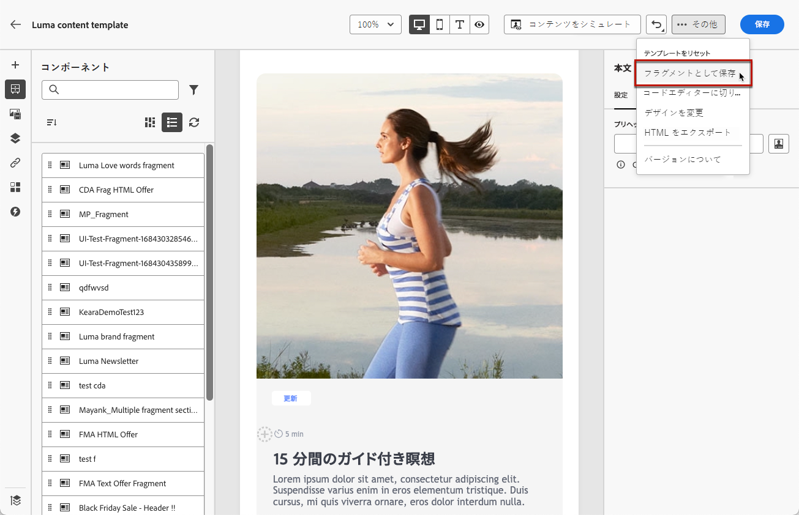
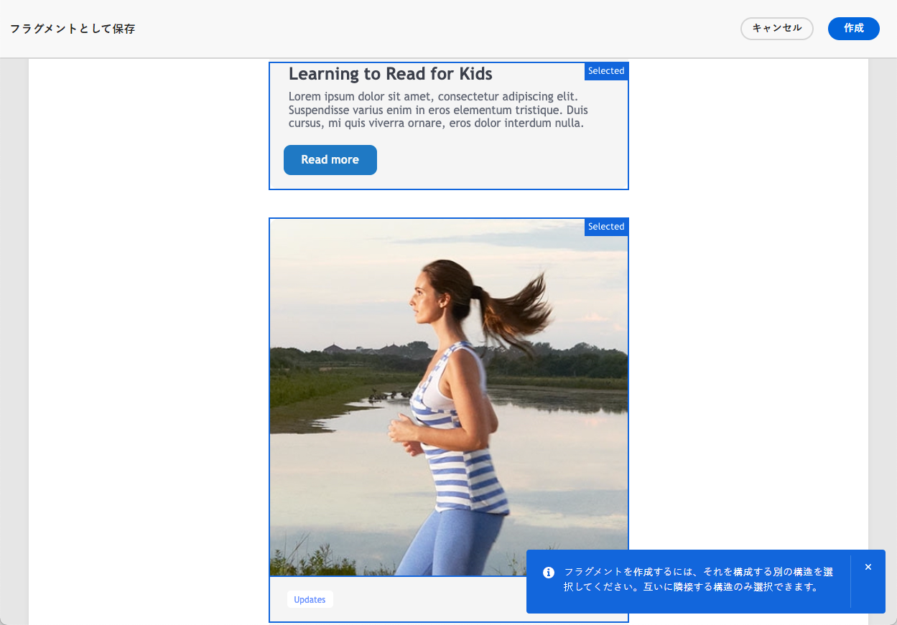
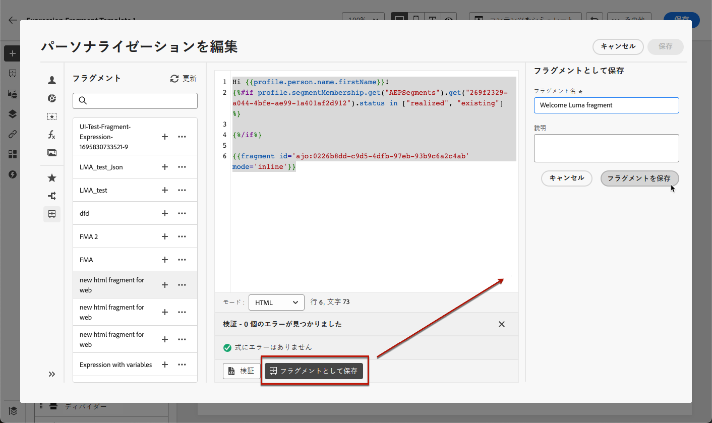

# コンテンツをフラグメントとして保存 {#save-as-fragment}

[!DNL Journey Optimizer] でコンテンツを編集する際、後で再利用するために、コンテンツのすべてまたは一部をフラグメントとして保存できます。 コンテンツは、[E メールデザイナーから](#save-as-visual-fragment)、または[式エディターから](#save-as-expression-fragment)フラグメントとして保存できます。

>[!NOTE]
>
>[コンテキスト属性](../personalization/personalization-build-expressions.md)は、フラグメントではサポートされていません。
>
>ジャーニーまたはキャンペーンでトラッキングが有効になっている場合、保存済みのフラグメントにリンクが存在し、このフラグメントがメッセージで使用されていると、メッセージに含まれる他のすべてのリンクと同様に、これらのリンクが追跡されます。 [リンクとトラッキングの詳細情報](../email/message-tracking.md)

## ビジュアルフラグメントとして保存 {#save-as-visual-fragment}

E メールデザイナーからコンテンツをフラグメントとして保存するには、次の手順に従います。

1. [E メールデザイナー](../email/get-started-email-design.md)で、画面の右上にある「...」をクリックします。

1. ドロップダウンメニューから「**[!UICONTROL フラグメントとして保存]**」を選択します。

   

   >[!NOTE]
   >
   >ビジュアルフラグメントは、100 KB を超えることはできません。

1. **[!UICONTROL フラグメントとして保存]**&#x200B;画面が表示されます。 パーソナライゼーションフィールドや動的コンテンツなど、フラグメントに含める要素を選択します。

   

   >[!CAUTION]
   >
   >互いに隣接するセクションのみを選択できます。 空の構造や別のフラグメントは選択できません。

1. 「**[!UICONTROL 作成]**」をクリックし、フラグメント名と説明を（必要に応じて）入力します。

1. カスタムまたはコアのデータ使用ラベルをフラグメントに割り当てるには、画面の上部セクションで「**[!UICONTROL アクセスを管理]**」ボタンをクリックします。 [詳しくは、オブジェクトレベルのアクセス制御（OLAC）を参照してください](../administration/object-based-access.md)。

1. 「**タグ**」フィールドから Adobe Experience Platform タグを選択または作成してテンプレートを分類し、検索の向上を図ります。 [詳細情報](../start/search-filter-categorize.md#tags)

1. 「**[!UICONTROL 作成]**」をクリックします。 フラグメントが&#x200B;**ドラフト**&#x200B;ステータスで[フラグメントリスト](#access-manage-fragments)に追加されます。 このフラグメントは、そのリストの他のビジュアルフラグメントと同様に使用できるスタンドアロンのフラグメントになります。

   >[!NOTE]
   >
   >その新しいフラグメントに対する変更は、送信元のメールまたはテンプレートには生成されません。 同様に、そのメールまたはテンプレート内で元のコンテンツを編集しても、新しいフラグメントは変更されません。

1. ジャーニーとキャンペーンでフラグメントを使用するには、フラグメントをライブにする必要があります。 [詳しくは、フラグメントのプレビューと公開の方法を参照してください](../content-management/create-fragments.md#publish)

## 式フラグメントとして保存 {#save-as-expression-fragment}

>[!CONTEXTUALHELP]
>id="ajo_perso_library"
>title="式フラグメントとして保存"
>abstract="[!DNL Journey Optimizer] パーソナライゼーションエディターを使用すると、コンテンツを式フラグメントとして保存できます。 その後、これらの式を使用して、パーソナライズされたコンテンツを作成できます。"

[!DNL Journey Optimizer] パーソナライゼーションエディターを使用すると、コンテンツを式フラグメントとして保存できます。 その後、これらの式を使用して、パーソナライズされたコンテンツを作成できます。

コンテンツを式フラグメントとして保存するには、次の手順に従います。

1. [パーソナライゼーションエディター](../personalization/personalization-build-expressions.md)インターフェイスで、式を作成し、「**[!UICONTROL フラグメントとして保存]**」をクリックします。

   >[!NOTE]
   >
   >式は 200 KB 以内にする必要があります。

1. 右側のパネルで式の名前と説明を入力して、式を見つけやすくします。

   

1. 「**[!UICONTROL フラグメントを保存]**」をクリックします。

   <!--An expression fragment cannot be nested inside another fragment.-->

1. フラグメントが&#x200B;**ドラフト**&#x200B;ステータスで[フラグメントリスト](#access-manage-fragments)に追加されます。 このフラグメントは、そのリストの他の式フラグメントと同様に使用できる、スタンドアロンのフラグメントになります。

1. ジャーニーとキャンペーンでフラグメントを使用するには、フラグメントをライブにする必要があります。 [詳しくは、フラグメントのプレビューと公開の方法を参照してください](../content-management/create-fragments.md#publish)
