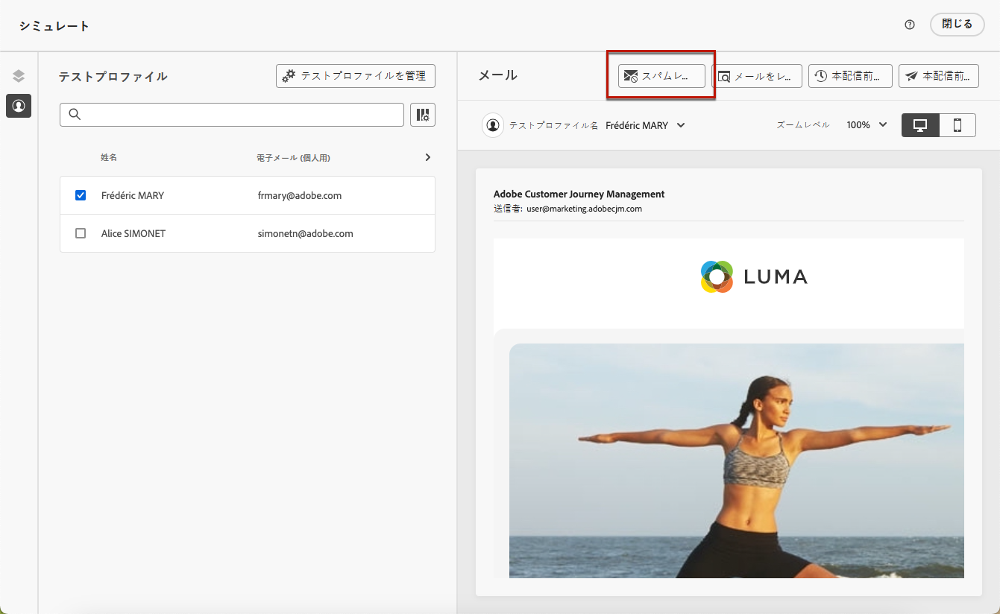
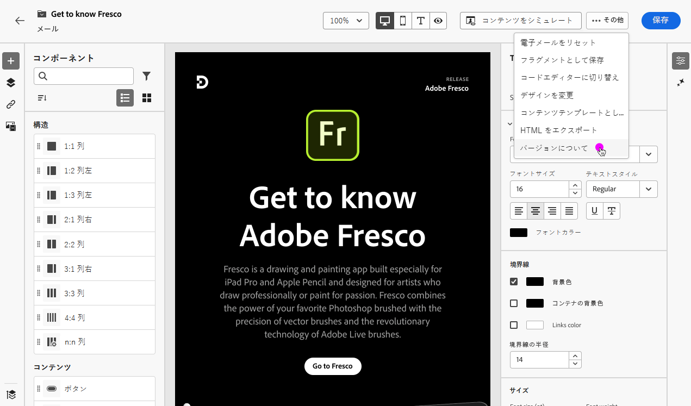
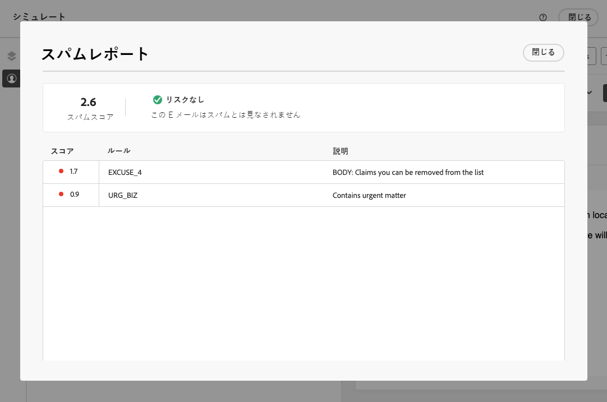
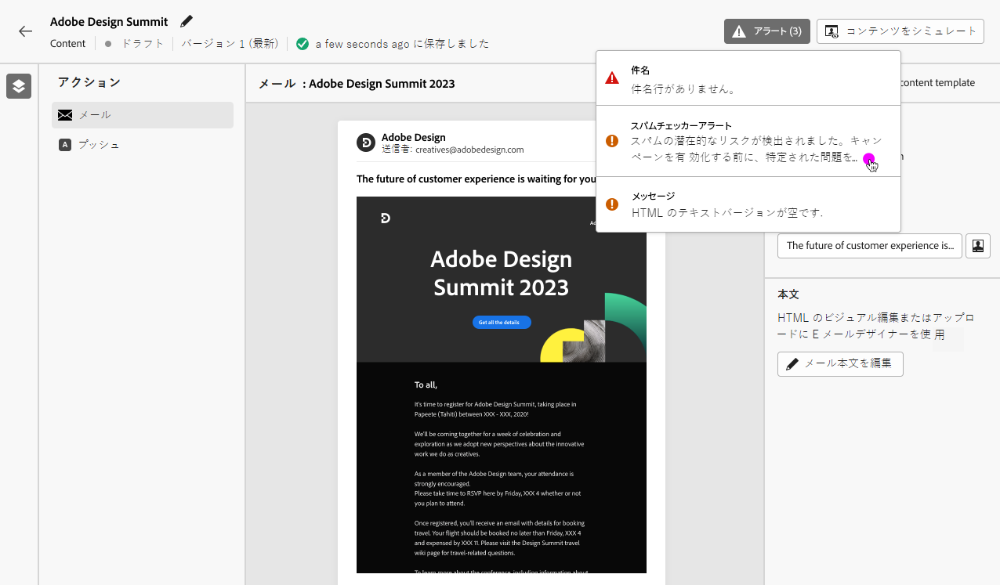

# E メールスパムレポート {#spam-report}

>[!CONTEXTUALHELP]
>id="ajo_simulate_spam_report"
>title="E メールスパムレポート"
>abstract="スパムレポートを使用すると、メールコンテンツのスパムのスコアを確認できます。 このスコアは、ISP またはメールボックスプロバイダーがメッセージをスパムと見なすかどうかを示します。 スコアが低いほど、より良い。 メールコンテンツスコアが 2 を超える場合は、テストが失敗する原因となる問題の修正を検討する必要があります。"

専用のスパムレポートで、メールコンテンツのスパムのスコアを確認できます。 使用 [SpamAssassin](https://spamassassin.apache.org/){target="_blank"}を使用すると、Adobe Journey Optimizerはメールコンテンツをテストし、ISP やメールボックスプロバイダーがスパムと見なすかどうかを示すスコアを付与できます。

>[!AVAILABILITY]
>
>この機能は現在ベータ版で、ベータ版のお客様のみご利用いただけます。 ベータ版プログラムに参加するには、アドビカスタマーケアにお問い合わせください。

メールコンテンツの編集またはプレビュー時、 **[!UICONTROL スパムレポート]** ボタンには、リストされている個々の項目のスコアを向上させるためのスコアとアドバイスが表示されます。

この機能を使用すると、受信時に使用されるスパム対策ツールでメッセージがスパムと見なされるかどうか、およびその場合にアクションを実行できます。 多くのメールインボックスプロバイダーは、スパムフィルタリングプロセスの一環としてツールを使用しています。 悪いスコアのメールを送信すると、配信品質に大きな影響を与える可能性があります。

にアクセスするには **[!UICONTROL スパムレポート]**&#x200B;は、次の手順に従います。

1. **[!UICONTROL シミュレート]**&#x200B;画面で、「**[!UICONTROL スパムレポート]**」ボタンをクリックします。

   

<!--
    You can also open the [Email Designer](../email/content-from-scratch.md), click the **[!UICONTROL More]** button and select **[!UICONTROL Check spam score]** from the menu.

    
-->

1. スパム対策チェックが自動的に実行され、**[!UICONTROL スパムレポート]**&#x200B;ウィンドウに結果が表示されます。本文のレイアウト、構造、画像サイズ、スパムのトリガー語（存在する場合）などの観点から、コンテンツに関する情報を示します。

   

1. 各項目のスコアと説明を確認します。

   スコアが低いほど、より良い。 スコアが 5 を超える場合は、警告が表示されます。これは、一部のメッセージが受信時にブロックされるか、スパムと見なされる可能性があることを示しています。 ベストプラクティスは、スコアを 2 未満にすることです。

1. このスコアリングに基づいて一部の要素が改善可能であると判断した場合は、 [電子メールデザイナー](../email/content-from-scratch.md) 必要な更新を行います。

1. 変更が完了したら、に戻ります **[!UICONTROL スパムレポート]** 画面を使用して、スコアが向上したことを確認します。

   

<!--You can also check the message's alerts for warnings on potential risk of spam detection. Follow the steps below.

1. Click the **[!UICONTROL Alerts]** button on top right of the screen. [Learn more on email alerts](../email/create-email.md#check-email-alerts)

1. If **[!UICONTROL Spam checker alert]** is displayed, you should check your content for a potential risk of spam using the **[!UICONTROL Spam report]** feature as detailed above.

    
-->
