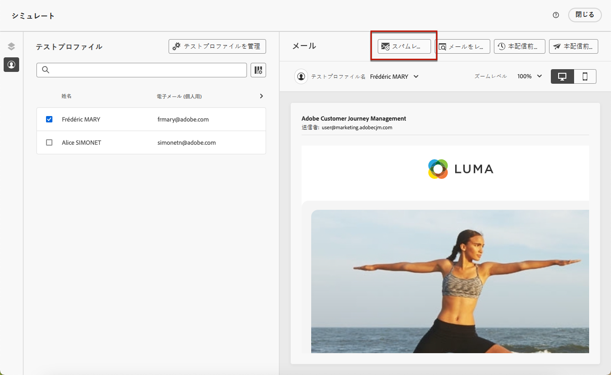
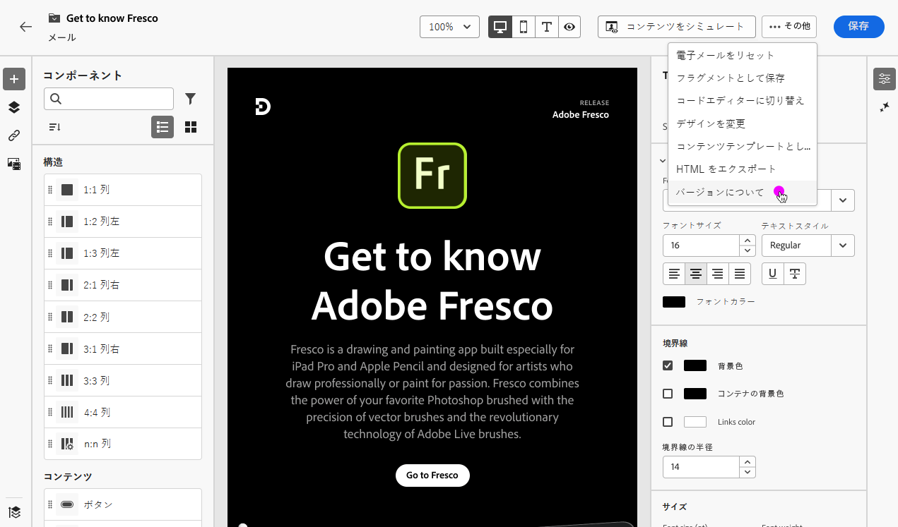
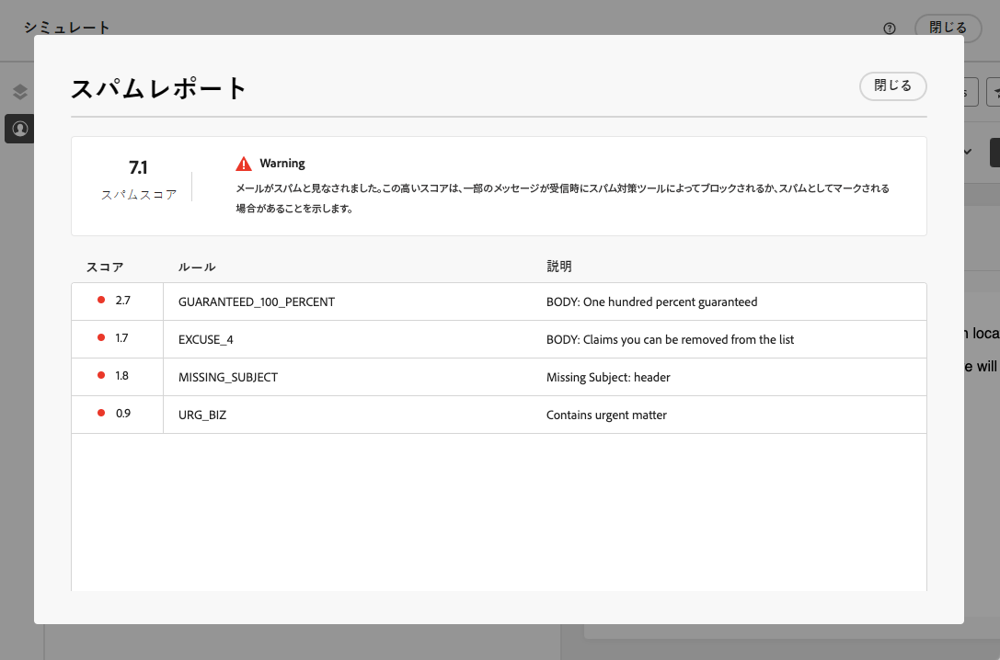
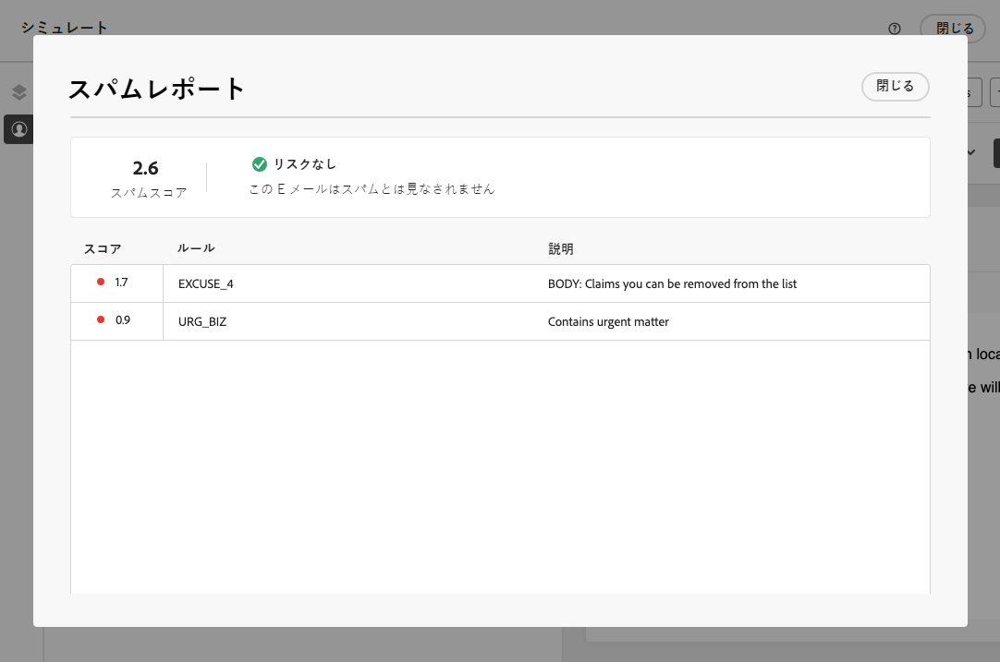
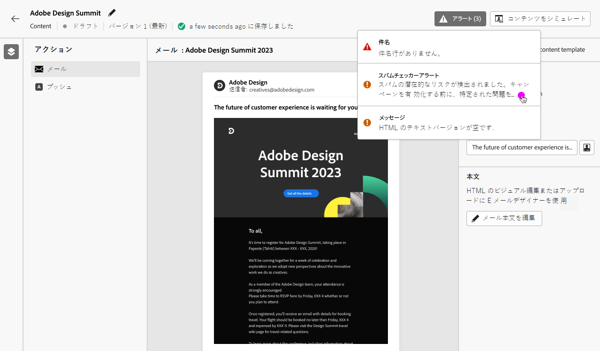

# メールスパムレポート {#spam-report}

>[!BEGINSHADEBOX]

**このページ：** Adobe Journey Optimizerのスパムレポートを使用して、メールコンテンツのスパムスコアリングを確認し、配信品質を向上させるアドバイスを送信する前に適用する方法を説明します。

>[!ENDSHADEBOX]

>[!CONTEXTUALHELP]
>id="ajo_simulate_spam_report"
>title="メールスパムレポート"
>abstract="スパムレポートを使用すると、メールコンテンツのスパムスコアを確認できます。 このスコアは、ISP またはメールボックスプロバイダーがメッセージをスパムと見なすかどうかを示します。 スコアが低いほど、より良い結果が得られます。 メールコンテンツスコアが 2 を超える場合は、テストが失敗する原因である問題の修正を検討する必要があります。"

専用のスパムレポートで、メールコンテンツのスパムスコアを確認できます。 [SpamAssassin](https://spamassassin.apache.org/){target="_blank"}を使用して、Adobe Journey Optimizerで電子メールの内容をテストし、ISPまたはメールプロバイダーがそれを迷惑メールと見なすかどうかを示すスコアを付与できます。

メールの内容を編集またはプレビューする際に、「**[!UICONTROL スパムレポート]**」オプションでは、リストされる個々の項目のスコアを向上させるために、スコアリングとアドバイスを提供します。

この機能を使用すると、受信時に使用されるスパム対策ツールによってメッセージがスパムと見なされるかどうかを判断し、スパムと判断された場合に対策を講じることができます。 多くのメールインボックスプロバイダーは、スパムフィルタリングプロセスの一環としてツールを使用しています。 悪いスコアのメールを送信すると、配信品質に重大な影響を与える可能性があります。

**[!UICONTROL スパムレポート]**&#x200B;にアクセスするには、次の手順に従います。

1. **[!UICONTROL シミュレート]**&#x200B;画面で、「**[!UICONTROL スパムレポート]**」ボタンをクリックします。

   

<!--
    You can also open the [Email Designer](../email/content-from-scratch.md), click the **[!UICONTROL More]** button and select **[!UICONTROL Check spam score]** from the menu.

    
-->

1. スパム対策チェックが自動的に実行され、**[!UICONTROL スパムレポート]**&#x200B;ウィンドウに結果が表示されます。 本文のレイアウト、構造、画像サイズ、スパムのトリガー語（存在する場合）などの観点から、コンテンツに関する情報を示します。

   

1. 各項目のスコアと説明を確認します。

   スコアが低いほど、より良い結果が得られます。 スコアが 5 以上の場合、警告が表示されます。これは、一部のメッセージが受信時にブロックされるか、スパムとしてマークされる可能性があることを示します。 ベストプラクティスは、スコアを 2 未満にすることです。

   >[!NOTE]
   >
   >スパムスコアは[SpamAssassin](https://spamassassin.apache.org/){target="_blank"}を通じて取得されます。ルールはAdobeが所有していません。 これらのルールについて詳しくは、SpamAssassin ドキュメントを参照してください。
   >

1. このスコアリングに基づいて、一部の要素を改善できると考えられる場合は、[E メールデザイナー](../email/content-from-scratch.md)でコンテンツを編集し、必要な更新を行ってください。

1. 変更が完了したら、**[!UICONTROL スパムレポート]**&#x200B;画面に戻り、スコアが向上していることを確認します。

   

<!--
You can also check the message's alerts for warnings on potential risk of spam detection. Follow the steps below.

1. Click the **[!UICONTROL Alerts]** button on top right of the screen. [Learn more about email alerts](../email/create-email.md#check-email-alerts)

1. If **[!UICONTROL Spam checker alert]** is displayed, you should check your content for a potential risk of spam using the **[!UICONTROL Spam report]** feature as detailed above.

    
-->
