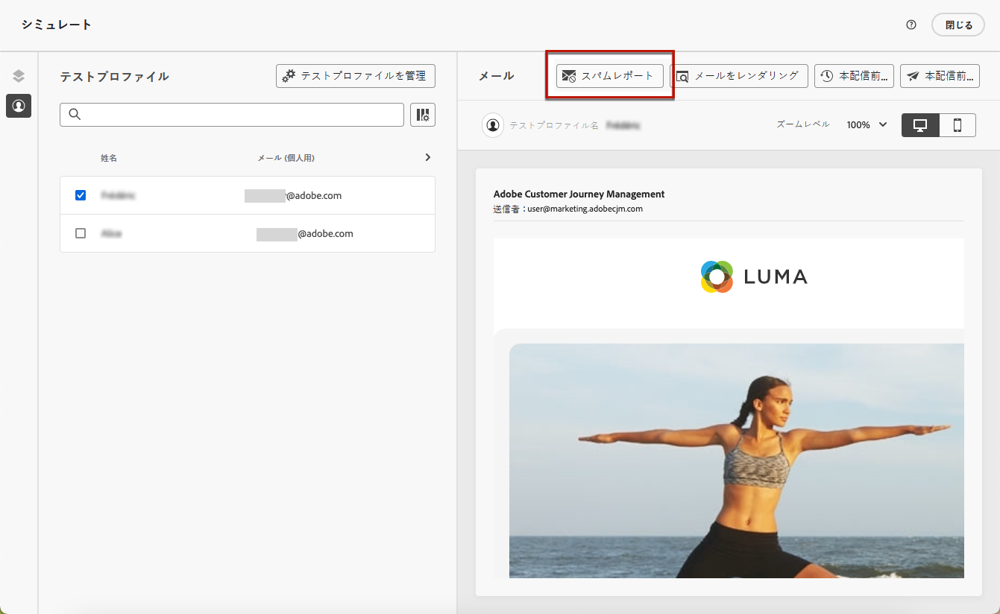
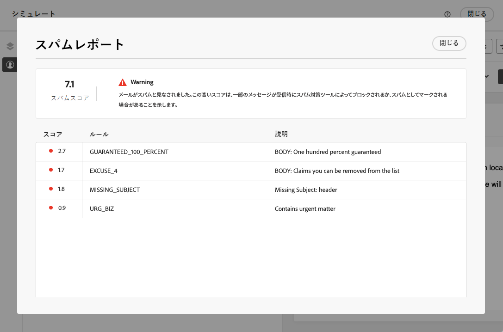

# E メールスパムレポート {#spam-report}

[!DNL Journey Optimizer] では、コンテンツがスパムフィルタリングに対してどのように実行されるかを確認し、メッセージがスパムではなく、顧客の受信ボックスに着信されることを確認できます。

メールコンテンツの編集またはプレビュー時、 **[!UICONTROL スパムレポート]** オプションには、リストされている個々の項目のスコアを向上させるためのスコアリングとアドバイスが用意されています。

これにより、メッセージが受信時に使用されるスパム対策ツールによってスパムと見なされるリスクを冒しているかどうかを判断し、そうでない場合はアクションを実行できます。 多くのメールインボックスプロバイダーは、スパムフィルタリングプロセスの一環としてツールを使用しています。 悪いスコアのメールを送信すると、配信品質に大きな影響を与える可能性があります。

>[!CAUTION]
>
>* この機能は現在、プライベートベータ版としてのみ利用できます。
>
>* 現時点では、スパムレポート分析は英語のコンテンツに対してのみ実行できます。
>
>* スパムレポートは有益で、で不正なスコアのメッセージが送信されるのを防ぐことはできません。

にアクセスするには **[!UICONTROL スパムレポート]**&#x200B;は、次の手順に従います。

1. **[!UICONTROL シミュレート]**&#x200B;画面で、「**[!UICONTROL スパムレポート]**」ボタンをクリックします。

   

<!--
    You can also open the [Email Designer](../email/content-from-scratch.md), click the **[!UICONTROL More]** button and select **[!UICONTROL Check spam score]** from the menu.

    
-->

1. スパム対策チェックが自動的に実行され、**[!UICONTROL スパムレポート]**&#x200B;ウィンドウに結果が表示されます。本文のレイアウト、構造、画像サイズ、スパムのトリガー語（存在する場合）などの観点から、コンテンツに関する情報を示します。

   

1. 各項目のスコアと説明を確認します。

   スコアが低いほど、より良い。 スコアが 5 を超える場合は、警告が表示されます。これは、一部のメッセージが受信時にブロックされるか、スパムと見なされる可能性があることを示しています。

1. このスコアリングに基づいて一部の要素が改善可能であると判断した場合は、 [電子メールデザイナー](../email/content-from-scratch.md) 必要な更新を行います。

1. 変更が完了したら、に戻ります **[!UICONTROL スパムレポート]** 画面を使用して、スコアが向上したことを確認します。

   

<!--You can also check the message's alerts for warnings on potential risk of spam detection. Follow the steps below.

1. Click the **[!UICONTROL Alerts]** button on top right of the screen. [Learn more on email alerts](../email/create-email.md#check-email-alerts)

1. If **[!UICONTROL Spam checker alert]** is displayed, you should check your content for a potential risk of spam using the **[!UICONTROL Spam report]** feature as detailed above.

    
-->
