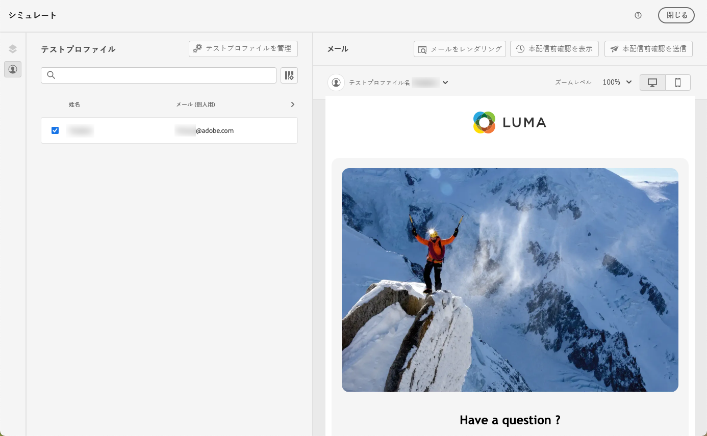
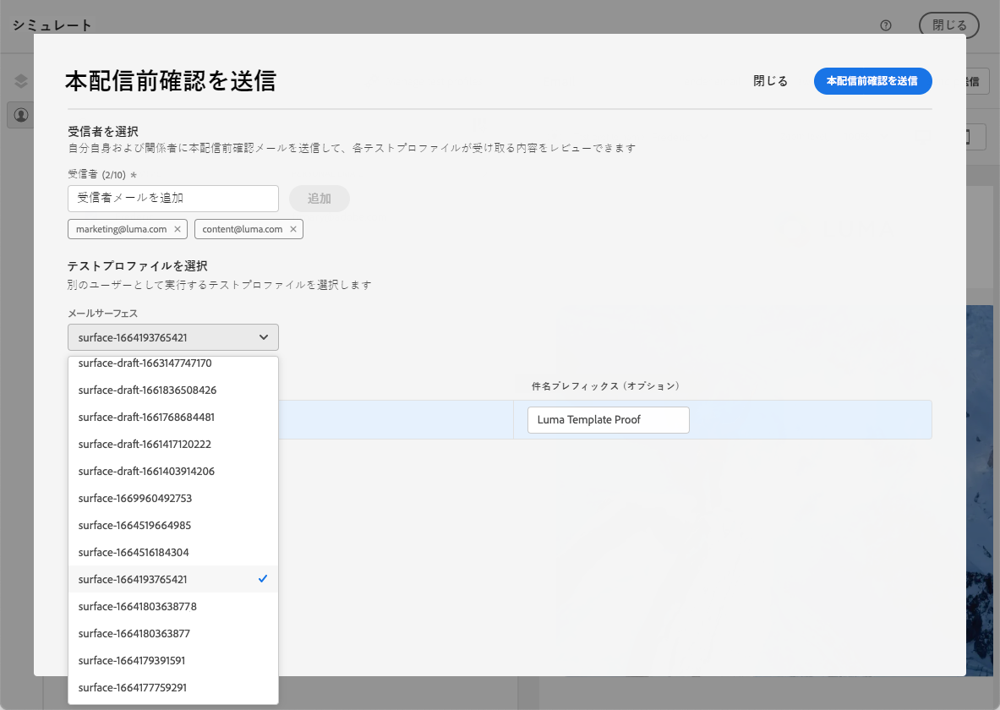

# メールコンテンツテンプレートのテスト {#test-template}

ゼロから作成した場合でも、既存のコンテンツから作成した場合でも、一部のメールテンプレートのレンダリングをテストできます。 これを行うには、以下の手順に従います。

1. **[!UICONTROL コンテンツ管理]**／**[!UICONTROL コンテンツテンプレート]**&#x200B;メニューからコンテンツテンプレートリストにアクセスし、任意のメールテンプレートを選択します。

1. **[!UICONTROL テンプレートプロパティ]**&#x200B;から「**[!UICONTROL コンテンツを編集]**」をクリックします。

1. 「**[!UICONTROL コンテンツをシミュレート]**」をクリックして、コンテンツをプレビューおよびテストします。 [コンテンツのプレビューとテストの方法について学ぶ](../content-management/preview-test.md)

   

1. ジャーニーやキャンペーンで使用する前に、コンテンツをテストするための配達確認を送信し、一部の内部ユーザーから承認を得ることができます。

   * これを行うには、「**[!UICONTROL 配達確認を送信]**」ボタンをクリックし、[この節](../content-management/proofs.md)で説明されている手順に従います。

   * 配達確認を送信する前に、コンテンツのテストに使用する[メール設定](../configuration/channel-surfaces.md)を選択する必要があります。

     

>[!CAUTION]
>
>現在、メールコンテンツテンプレートをテストする際のトラッキングはサポートされていません。つまり、テンプレートから送信される配達確認では、トラッキングイベント、UTM パラメーター、ランディングページリンクの追跡が有効になりません。 トラッキングをテストするには、メールで[コンテンツテンプレート](../email/use-email-templates.md)を使用し、テストプロファイルや、CSV／JSON ファイルからアップロードまたは手動で追加したサンプル入力データを使用して、配達確認を送信します。 [詳しくは、コンテンツをプレビューおよびテストする方法を参照してください](../content-management/preview-test.md)
