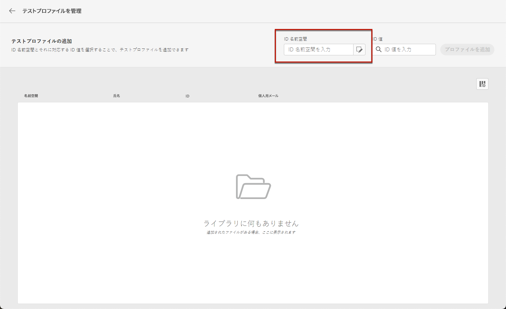
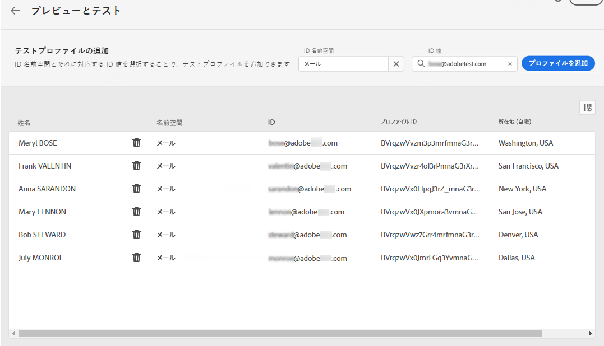

# テストプロファイルを選択 {#select-test-profiles}

>[!CONTEXTUALHELP]
>id="ajo_preview_test_profiles"
>title="テストプロファイルを使用したコンテンツの確認"
>abstract="テストプロファイルを使用して、コンテンツをプレビューおよびテストします。パーソナライズされたフィールドを追加した場合は、テストプロファイルデータを使用して、その表示方法を確認できます。"

コンテンツをプレビューまたはテストする前に、まずテストプロファイルを選択する必要があります。テストプロファイルは、定義されたターゲティング条件に一致しない追加の受信者です。[詳しくは、テストプロファイルの作成方法を参照してください](../audience/creating-test-profiles.md)

>[!NOTE]
>
>テストプロファイルに加えて、[!DNL Journey optimizer] では、コンテンツの様々なバリアントをプレビューし、CSV/JSON ファイルからアップロードされたサンプル入力データを使用して配達確認を送信するか、手動で追加することで、テストすることもできます。 [ サンプル入力データを使用してコンテンツをテストする方法を説明します ](../test-approve/simulate-sample-input.md)

テストプロファイルを選択するには、次の手順に従います。

1. メッセージのコンテンツを編集画面またはメールデザイナーで、「**[!UICONTROL コンテンツをシミュレート]**」ボタンをクリックします。

1. 「**[!UICONTROL テストプロファイルを管理]**」ボタンをクリックし、「**[!UICONTROL ID 名前空間]**」選択アイコンをクリックして、テストプロファイルの識別に使用する名前空間を選択します。[詳しくは、Adobe Experience Platform の ID 名前空間を参照してください](../audience/get-started-identity.md)。

   以下の例では、**メール**&#x200B;名前空間を使用します。

   

1. 検索フィールドで名前空間を探して選択し、「**[!UICONTROL 選択]**」をクリックします。

   

1. 「**[!UICONTROL ID 値]**」フィールドに値（ここではメールアドレス）を入力して、テストプロファイルを識別し、「**[!UICONTROL プロファイルを追加]**」をクリックします。

   <!---->

1. メッセージにパーソナライゼーションを追加した場合は、別のプロファイルを追加して、プロファイルデータに応じて異なるバリエーションのメッセージをテストできるようにします。追加したプロファイルは、選択フィールドの下に表示されます。

   

   メッセージのパーソナライゼーションの要素に基づいて、各テストプロファイルのデータがリストの関連する列に表示されます。
