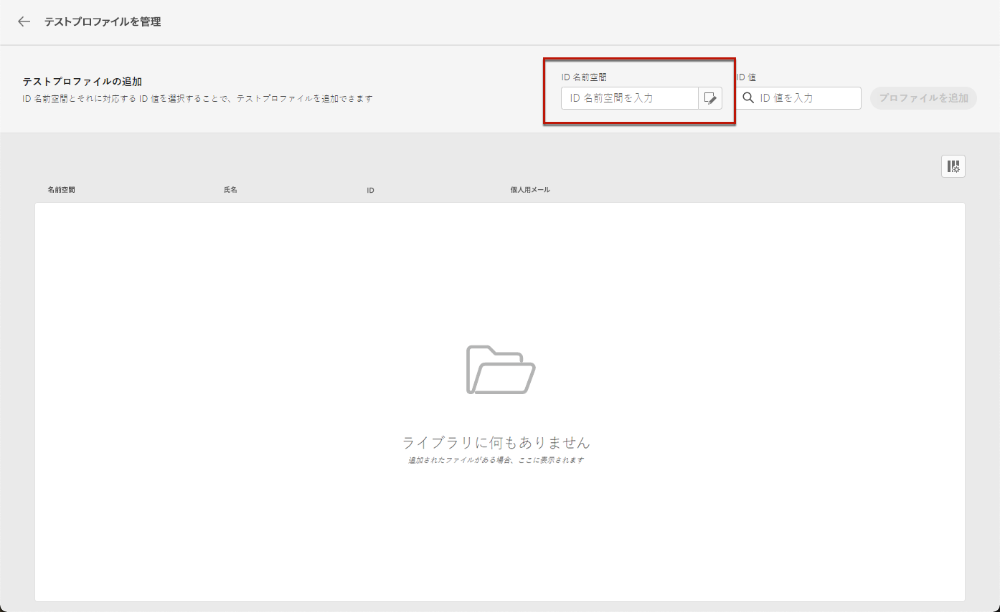
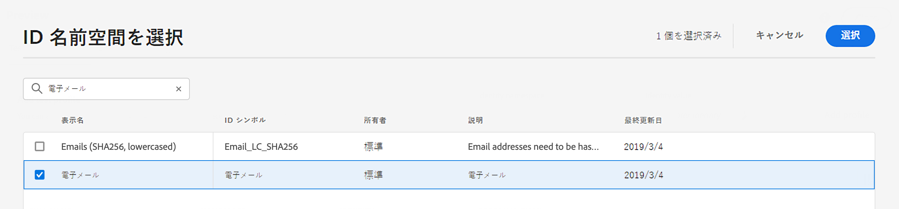
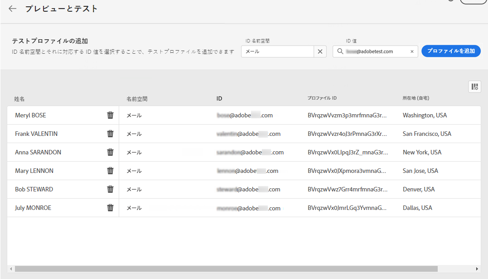

# テストプロファイルの選択 {#select-test-profiles}

>[!BEGINSHADEBOX]

**このページ：** Adobe Journey OptimizerのID名前空間でテストプロファイルを選択して、様々なプロファイルデータのバリエーションに対してコンテンツをプレビューおよびテストする方法について説明します。

>[!ENDSHADEBOX]

>[!CONTEXTUALHELP]
>id="ajo_preview_test_profiles"
>title="テストプロファイルを使用したコンテンツの確認"
>abstract="テストプロファイルを使用して、コンテンツをプレビューおよびテストします。 パーソナライズされたフィールドを追加した場合は、テストプロファイルデータを使用して、その表示方法を確認できます。"

テストプロファイルは、定義したターゲティング条件に一致しない追加の受信者です。 [テストプロファイルの作成方法を学ぶ](../audience/creating-test-profiles.md)

テストプロファイルを選択する前に、使用するID名前空間が、テストプロファイルがAdobe Experience Platformに保存されている名前空間（例：**電子メール**&#x200B;または&#x200B;**電話**）と一致していることを確認してください。 一致しない場合、テストプロファイルは検索フィールドで正しく解決されません。

テストプロファイルを使用してコンテンツをテストする前に、まずテストプロファイルを選択する必要があります。 それには、次の手順に従います。

1. メッセージのコンテンツを編集画面またはメールDesignerで、「**[!UICONTROL コンテンツをシミュレート]**」をクリックし、ドロップダウンから「**[!UICONTROL コンテンツをシミュレート（AEP プロファイル）]**」を選択します。

1. 「**[!UICONTROL テストプロファイルを管理]**」ボタンをクリックし、「**[!UICONTROL ID 名前空間]**」選択アイコンをクリックして、テストプロファイルの識別に使用する名前空間を選択します。 [詳しくは、Adobe Experience Platform の ID 名前空間を参照してください](../audience/get-started-identity.md)。

   以下の例では、**メール**&#x200B;名前空間を使用します。

   

1. 検索フィールドで名前空間を探して選択し、「**[!UICONTROL 選択]**」をクリックします。

   

1. 「**[!UICONTROL ID 値]**」フィールドに値（ここではメールアドレス）を入力して、テストプロファイルを識別し、「**[!UICONTROL プロファイルを追加]**」をクリックします。

   <!---->

1. メッセージにパーソナライゼーションを追加した場合は、別のプロファイルを追加して、プロファイルデータに応じて異なるバリエーションのメッセージをテストできるようにします。 追加したプロファイルは、選択フィールドの下に表示されます。

   

   メッセージのパーソナライゼーションの要素に基づいて、各テストプロファイルのデータがリストの関連する列に表示されます。

>[!NOTE]
>
>テストプロファイルに加えて、[!DNL Journey optimizer] を使用すると、CSV／JSON ファイルからアップロードした、または手動で追加したサンプル入力データを使用してコンテンツをプレビューし、本配信前確認を送信することで、コンテンツの様々なバリアントをテストできます。 [コンテンツバリエーションのシミュレート方法を学ぶ](../test-approve/simulate-sample-input.md)
