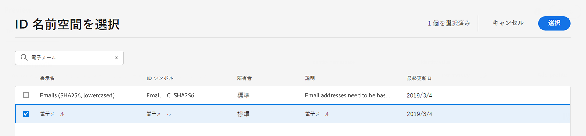

# テストプロファイルの選択 {#select-test-profiles}

コンテンツをプレビューまたはテストする前に、まずテストプロファイルを選択する必要があります。テストプロファイルは、定義されたターゲット条件に一致しない追加の受信者です。 [テストプロファイルの作成方法を説明します](../audience/creating-test-profiles.md)

テストプロファイルを選択するには、次の手順に従います。

1. メッセージのコンテンツを編集画面または E メールデザイナーで、 **[!UICONTROL コンテンツをシミュレート]** 」ボタンをクリックします。

1. 次をクリック： **[!UICONTROL テストプロファイルの管理]** ボタンをクリックしてから、 **[!UICONTROL ID 名前空間]** 選択アイコン。 [Adobe Experience Platform ID 名前空間の詳細](../audience/get-started-identity.md).

   次の例では、 **電子メール** 名前空間。

   

1. 検索フィールドで名前空間を探して選択し、「**[!UICONTROL 選択]**」をクリックします。

   

1. 「**[!UICONTROL ID 値]**」フィールドに値（ここではメールアドレス）を入力して、テストプロファイルを識別し、「**[!UICONTROL プロファイルを追加]**」をクリックします。

   <!---->

1. メッセージにパーソナライゼーションを追加した場合は、別のプロファイルを追加して、プロファイルデータに応じて異なるバリエーションのメッセージをテストできるようにします。追加したプロファイルは、選択フィールドの下に表示されます。

   

   メッセージのパーソナライゼーションの要素に基づいて、各テストプロファイルのデータがリストの関連する列に表示されます。
