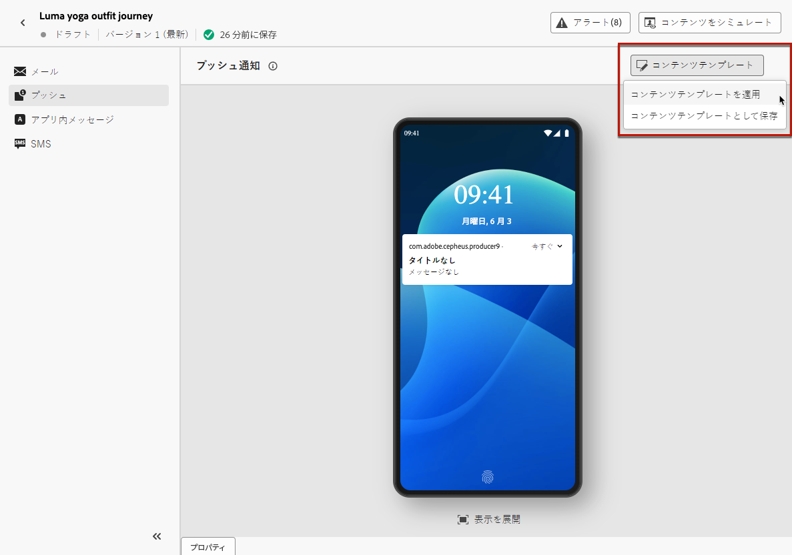
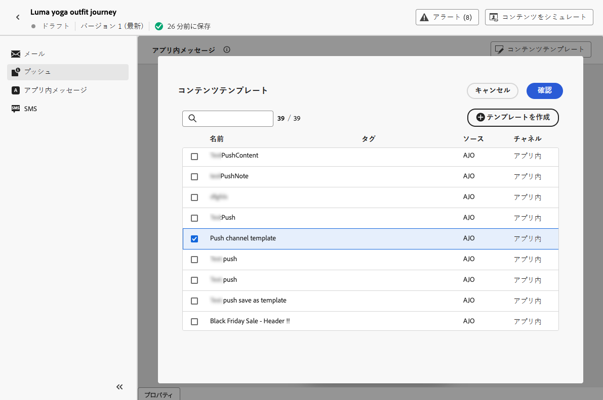

# コンテンツテンプレートの使用 {#use-content-templates}

>[!BEGINSHADEBOX]

**このページ：** Adobe Journey OptimizerでWeb以外の任意のチャネルのコンテンツを作成する際にコンテンツテンプレートを適用して、メッセージの作成をより迅速に開始する方法を説明します。

>[!ENDSHADEBOX]

[!DNL Journey Optimizer] で任意のチャネル（web を除く）のコンテンツを作成する際、次のいずれかのカスタムテンプレートを使用できます。

* 「**[!UICONTROL コンテンツテンプレート]**」メニューを使用してゼロから作成する。 [詳細情報](#create-template-from-scratch)

* 「**[!UICONTROL コンテンツテンプレートとして保存]**」オプションを使用して、ジャーニーまたはキャンペーンのメールから保存する。 [詳細情報](#save-as-template)

これらのテンプレートの 1 つを使用してコンテンツの作成を開始するには、次の手順に従います。

1. キャンペーンまたはジャーニーのいずれかで、「**[!UICONTROL コンテンツを編集]**」を選択した後、「**[!UICONTROL コンテンツテンプレート]**」ボタンをクリックします。

1. 「**[!UICONTROL コンテンツテンプレートを適用]**」を選択します。

   

1. リストから目的のテンプレートを選択します。 選択したチャネルやタイプと互換性のあるテンプレートのみが表示されます。

   

   >[!NOTE]
   >
   >この画面から、新しいタブが開く専用のボタンを使用して、新しいテンプレートを作成することもできます。

1. 「**[!UICONTROL 確認]**」をクリックします。 テンプレートがコンテンツに適用されます。

1. 必要に応じて、引き続きコンテンツを編集します。

>[!NOTE]
>
>[メールデザイナー](../email/get-started-email-design.md)を使用してコンテンツテンプレートからメールのデザインを開始するには、[この節](../email/use-email-templates.md)で説明する手順に従います。
