# ユーザーインターフェイスでのメールコンテンツのデザイン {#create-email-content}

[メッセージを作成](create-message.md)したら、メールコンテンツの作成に取り掛かることができます。

1. 新しく作成したメッセージから、「**[!UICONTROL 本文]**」セクションの「**[!UICONTROL E メールデザイナー]**」を選択します。

   

1. E メールデザイナーのホームページで、次のオプションからメールのデザイン方法を選択します。

   * 「**[!UICONTROL 最初からデザイン]**」を選択し、E メールデザイナー機能を使用してメールコンテンツを作成します。[詳細](#design-scratch)

   * 「**[!UICONTROL テンプレートから開始]**」を選択して、テンプレートの組み込みリストからメールを作成します。その他のテンプレートは作成できません。

   * 「**[!UICONTROL 独自のコード]**」を選択して、HTML Raw コードを入力または貼り付けます。[詳細情報](existing-content.md#import-raw-html-code)。

   * 「**[!UICONTROL HTML を読み込み]**」を選択して、HTML ファイルまたは .zip フォルダーを読み込みます。[詳細情報](existing-content.md#import-html-content-from-file)。

   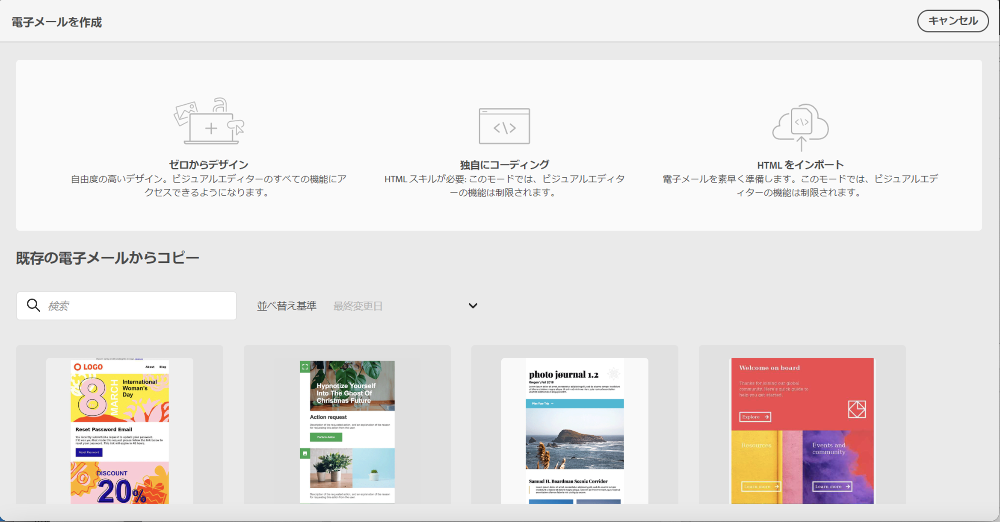

## ゼロからデザイン {#design-scratch}

>[!CONTEXTUALHELP]
>id="ac_structure_components"
>title="構造コンポーネントについて"
>abstract="構造コンポーネントはメールのレイアウトを定義します。"

>[!CONTEXTUALHELP]
>id="ac_edition_columns"
>title="メール列の定義"
>abstract="E メールデザイナーを使用すると、列構造を定義することで、メールのレイアウトを簡単に定義できます。"

E メールデザイナーを使用すると、メールの構造を簡単に定義できます。単純なドラッグ＆ドロップ操作で構造要素を追加したり移動したりして、メールの形を数秒でデザインすることができます。

E メールデザイナーでメールコンテンツの作成を開始するには、次の手順に従います。

1. 「**[!UICONTROL ゼロからデザイン]**」オプションを選択した後、**[!UICONTROL 構造コンポーネント]**&#x200B;をドラッグ＆ドロップしてメールのレイアウトを定義し、メールコンテンツのデザインを開始します。

   >[!NOTE]
   >
   >列のスタックは、すべてのメールプログラムと互換性があるわけではありません。サポートされていない場合、列は積み重ねられません。
   >
   >メールに配置した後は、既にコンテンツコンポーネントまたはフラグメントが内部に配置されていない限り、コンポーネントを移動または削除できません。

   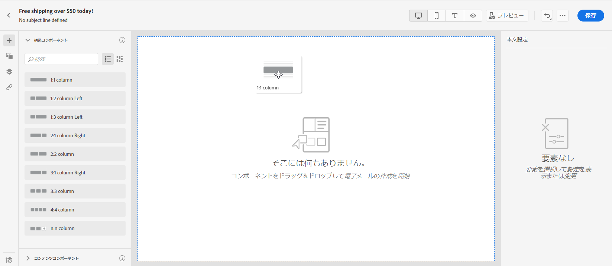

1. 必要な数の&#x200B;**[!UICONTROL 構造コンポーネント]**&#x200B;を追加します。

   「**[!UICONTROL n:n 列]**」コンポーネントを選択して、選択する列数（3～10）を定義します。各列の下部にある矢印を動かして、各列の幅を定義することもできます。

   >[!NOTE]
   >
   >各列のサイズを構造コンポーネントの全幅の 10％未満にすることはできません。空でない列は削除できません。

1. 「**[!UICONTROL コンテンツコンポーネント]**」ドロップダウンから、必要な数の&#x200B;**[!UICONTROL コンテンツコンポーネント]**&#x200B;を構造コンポーネントに追加できます。[コンテンツコンポーネントの詳細情報](content-components.md)。

   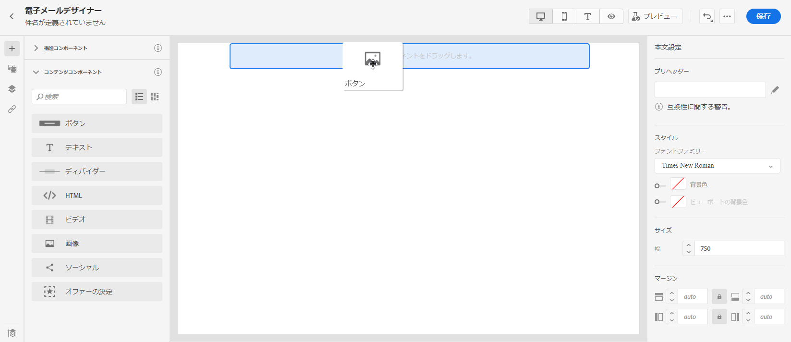

1. 各コンポーネントは、「**[!UICONTROL コンポーネント設定]**」セクションで詳細にカスタマイズできます。例えば、コンポーネントのテキストスタイル、パディング、またはマージンを変更できます。[整列とパディングの詳細については、こちらを参照](#adjusting-vertical-alignment-and-padding)してください。

   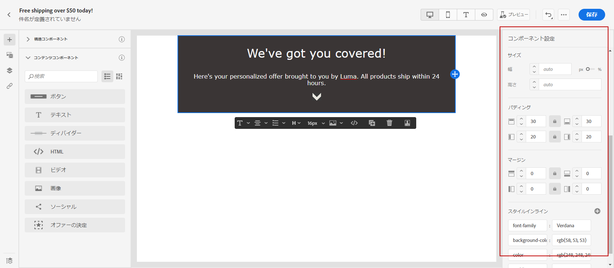

1.  「**[!UICONTROL アセットピッカー]**」から、**[!UICONTROL アセットライブラリ]**&#x200B;に保存されているアセットをメールに直接追加できます。[アセット管理の詳細情報](assets-essentials.md)。

   アセットを含むフォルダーをダブルクリックし、メールに追加するアセットをドラッグ＆ドロップします。

   

1. パーソナライズフィールドを追加して、プロファイルデータのコンテンツをカスタマイズします。[コンテンツのパーソナライゼーションの詳細情報](personalization/personalize.md)。

   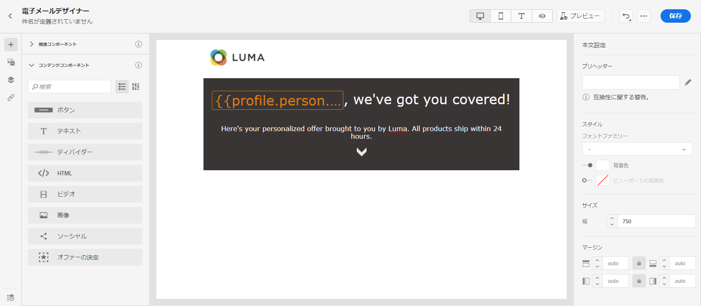

1. 左側のペインの「**[!UICONTROL リンク]**」タブで、追跡するコンテンツのすべての URL のリストを確認します。必要に応じて、**[!UICONTROL トラッキングタイプ]**、**[!UICONTROL ラベル]**、**[!UICONTROL タグ]**&#x200B;を変更できます。

   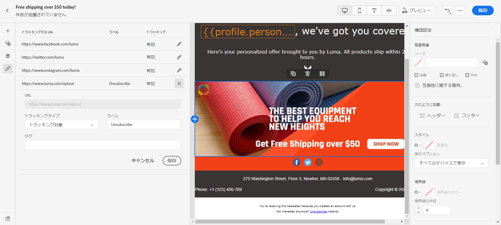

   >[!NOTE]
   >
   >リンクとメッセージの追跡について詳しくは、[このページ](message-tracking.md)を参照してください。

1. 必要に応じて、詳細メニューの「**[!UICONTROL コードエディターに切り替え]**」をクリックしてコードエディターに切り替え、メールをさらにパーソナライズできます。コードエディターについて詳しくは、この [ページ](existing-content.md#import-raw-html-code)を参照してください。

   >[!NOTE]
   >
   >コードエディターに切り替えると、このメールのビジュアルデザイナーは使用できなくなります。

   

1. 「**[!UICONTROL プレビューを表示]**」をクリックして、メールのレンダリングを確認します。デスクトップまたはモバイル表示を選択できます。

   メールのプレビュー方法について詳しくは、[メッセージのプレビューとテスト](preview.md)を参照してください。

   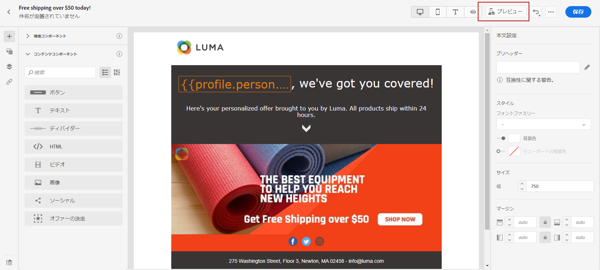

1. メールの準備が整ったら、「**[!UICONTROL 保存して閉じる]**」をクリックします。

これで、メッセージでメールコンテンツを使用できるようになります。[メッセージの送信方法の詳細情報](publish-manage-message.md)。

## メールのテキストバージョンの作成 {#generate-text-version}

HTML コンテンツを表示できない場合に使用するため、メール本文のテキストバージョンを作成することをお勧めします。

デフォルトでは、E メールデザイナーは、パーソナライゼーションフィールドを含め、メールの&#x200B;**[!UICONTROL プレーンテキスト]**&#x200B;バージョンを作成します。このバージョンは自動的に生成され、HTML バージョンの内容と同期されます。

別の内容のプレーンテキストバージョンを使用するには、次の手順に従います。

1. メールから「**[!UICONTROL プレーンテキスト]**」タブを選択します。

   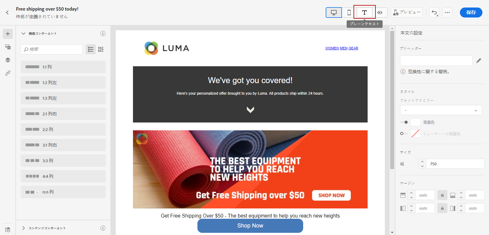

1. 「**[!UICONTROL HTML と同期]**」トグルで同期を無効にします。

   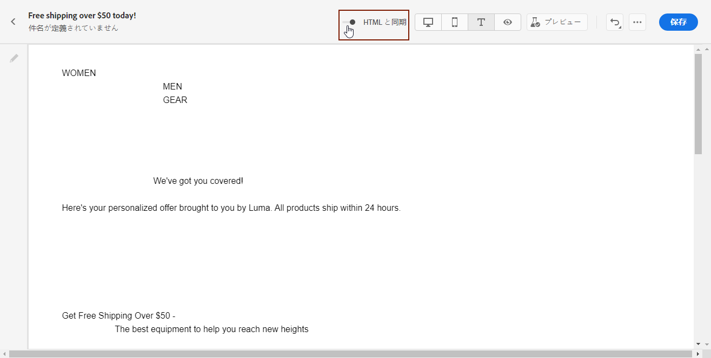

1. チェックマークをクリックして、選択を確定します。

   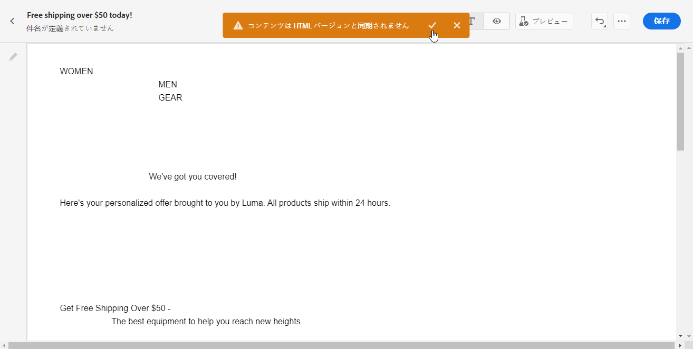

1. その後、必要に応じてプレーンテキストバージョンを編集します。

>[!CAUTION]
>
>* **[!UICONTROL プレーンテキスト]**&#x200B;表示で加えた変更は、HTML 表示には反映されません。
>
>* プレーンテキストの内容を更新した後にもう一度「**[!UICONTROL HTML と同期]**」オプションを有効にすると、変更は失われ、HTML バージョンから生成されたテキストの内容に置き換えられます。

## プリヘッダーの使用 {#preheader}

>[!CONTEXTUALHELP]
>id="ac_edition_preheader"
>title="プリヘッダーの使用"
>abstract="プリヘッダーでは、メールの追跡とカスタマイズを向上できるよう、短い概要テキストを設定できます。"

>[!NOTE]
>
>プリヘッダーは、すべてのメールクライアントと互換性があるわけではありません。サポートされていない場合、プリヘッダーは表示されません。

プリヘッダーは、メールクライアントでメールを閲覧したときに、件名行の後に表示される短い概要テキストです。プリヘッダーは、メールの追跡とカスタマイズの改善に役立ちます。

1. E メールデザイナーから、**[!UICONTROL 構造コンポーネント]**&#x200B;を追加して、メールのデザインを開始します。

   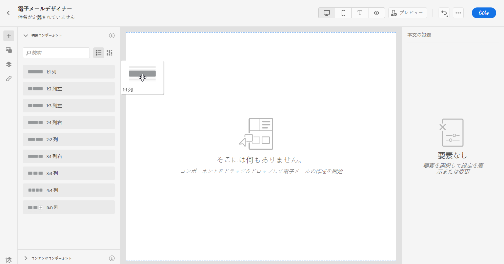

1. **[!UICONTROL 本文設定]**&#x200B;右側のウィンドウで、**[!UICONTROL プリヘッダー]**&#x200B;フィールドの横にある「**編集**」をクリックして、コンテンツを追加します。

   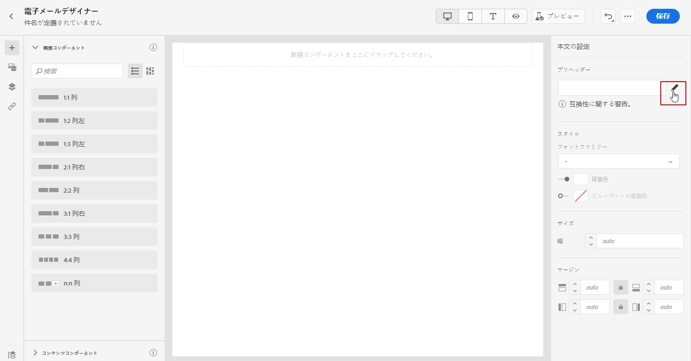

1. プリヘッダーを追加します。 「**[!UICONTROL パーソナライゼーションを追加]**」アイコンをクリックして、さらにパーソナライズできます。

   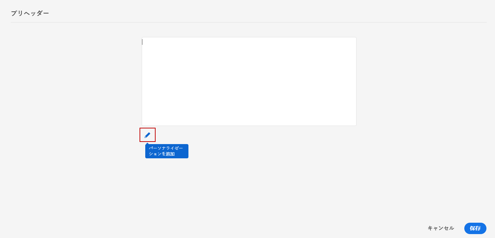

1. **[!UICONTROL パーソナライゼーションを編集]**&#x200B;ウィンドウから、**[!UICONTROL コンテンツブロック]**、**[!UICONTROL 動的コンテンツ]**&#x200B;または&#x200B;**[!UICONTROL パーソナライゼーションフィールド]**&#x200B;を追加できます。

1. 「**[!UICONTROL 検証]**」をクリックして、パーソナライゼーション構文を確認します。

   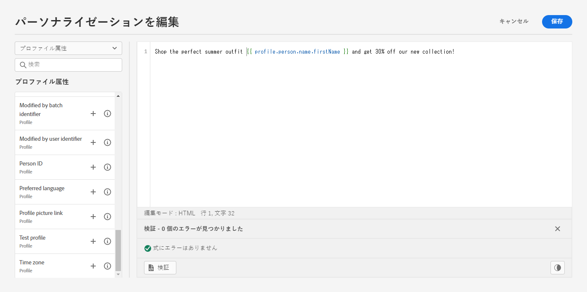

1. 「**[!UICONTROL 保存]**」をクリックします。

これで、プリヘッダーがメール用に設定されました。

## 背景の設定 {#about-backgrounds}

>[!CONTEXTUALHELP]
>id="ac_edition_backgroundimage"
>title="背景の設定"
>abstract="E メールデザイナーでは、コンテンツの背景色や背景画像をパーソナライズできます。なお、背景画像は、すべてのメールクライアントでサポートされているわけではありません。"
>additional-url="https://docs.google.com/spreadsheets/d/1TLo62YKm3tThUWDOIliCQFWs3dpNjpDfw6DdTr1oGOw/edit#gid=0" text="追加情報"

E メールデザイナーで背景を設定する場合、アドビでは次の操作を推奨します。

1. デザインで必要な場合は、メールの本文に背景色を適用します。
1. ほとんどの場合、列レベルで背景色を設定します。
1. 管理が困難な画像やテキストコンポーネントでは、背景色を使用しないようにしてください。

使用可能な背景の設定は次のとおりです。

* メール全体に対して&#x200B;**[!UICONTROL 背景色]**&#x200B;を設定する。左側のパレットからアクセスできるナビゲーションツリーで、本文の設定を選択していることを確認します。

* 「**[!UICONTROL ビューポートの背景色]**」を選択して、すべての構造コンポーネントに同じ背景色を設定する。このオプションを使用した場合、背景色とは異なる設定を選択できます。

* 構造コンポーネントごとに異なる背景色を設定する。左側のパレットからアクセス可能なナビゲーションツリーで構造を選択し、特定の背景色をその構造にのみ適用します。

   構造の背景色が隠れる場合があるので、ビューポートの背景色は設定しないでください。

* 構造コンポーネントのコンテンツに&#x200B;**[!UICONTROL 背景画像]**&#x200B;を設定する。

   >[!NOTE]
   >
   >一部のメールプログラムは、背景画像をサポートしていません。サポートされていない場合は、行の背景色が代わりに使用されます。画像を表示できない場合に備えて、適切な代替背景色を選択してください。

* 列レベルで背景色を設定する。

   >[!NOTE]
   >
   >これは、最も一般的なユースケースです。アドビでは、メールコンテンツ全体をより柔軟に編集できるよう、列レベルで背景色を設定することをお勧めします。

   また、列レベルで背景画像を設定することもできますが、この設定はほとんど使用されません。

## 垂直方向の整列とパディングを調整する {#adjusting-vertical-alignment-and-padding}

この例では、3 つの列で構成される構造コンポーネント内のパディングと垂直方向の整列を調整します。

1. メール内で構造コンポーネントを直接選択するか、左側のメニューで使用可能な&#x200B;**[!UICONTROL ナビゲーションツリー]**&#x200B;を使用します。

   

1. ツールバーから、「**[!UICONTROL 列を選択]**」をクリックし、編集する列を選択します。構造ツリーから選択することもできます。

   その列の編集可能なパラメーターが、**[!UICONTROL 列設定]**&#x200B;メニューに表示されます。

   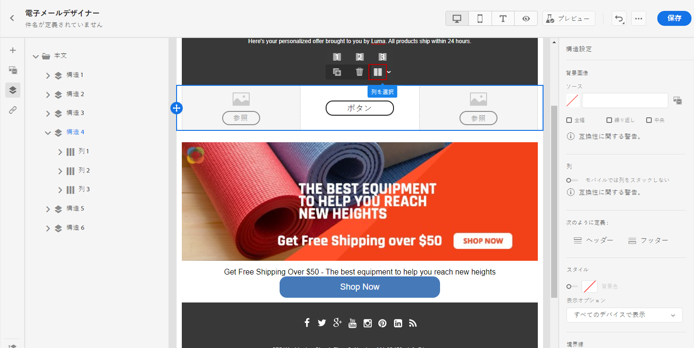

1. 「 **[!UICONTROL 垂直方向の整列]**」で、「**[!UICONTROL 下]**」を選択します。

   コンテンツコンポーネントが列の一番下に移動します。

   

1. 「**[!UICONTROL パディング]**」で、列の上のパディングを定義します。鍵アイコンをクリックして、下のパディングとの同期を解除します。

   その列の左右のパディングを定義します。

   

1. 同じようにして、他の列の位置揃えとパディングを調整します。

1. 変更を保存します。

## リンクのスタイルの定義 {#about-styling-links}

E メールデザイナーでリンクに下線を引き、リンクの色とターゲットを選択できます。

1. リンクが挿入されるテキスト&#x200B;**[!UICONTROL コンテンツコンポーネント]**&#x200B;で、リンクを選択します。

1. **[!UICONTROL コンポーネント設定]**&#x200B;メニューで、「**[!UICONTROL リンクに下線を引く]**」にチェックを入れると、リンクのラベルテキストに下線を引くことができます。

   

1. **[!UICONTROL ターゲット]**&#x200B;ドロップダウンで、オーディエンスのリダイレクト方法を選択します。

   * **[!UICONTROL なし]**：クリックしたフレームと同じフレームでリンクを開きます（デフォルト）。
   * **[!UICONTROL 空白]**：リンクを新しいウィンドウまたは新しいタブで開きます。
   * **[!UICONTROL セルフ]**：クリックしたフレームと同じフレームでリンクを開きます。
   * **[!UICONTROL 親]**：親フレームでリンクを開きます。
   * **[!UICONTROL トップ]**：ウィンドウ全体でリンクを開きます。

   

1. リンクの色を変更するには、「**[!UICONTROL リンクの色]**」をクリックします。

   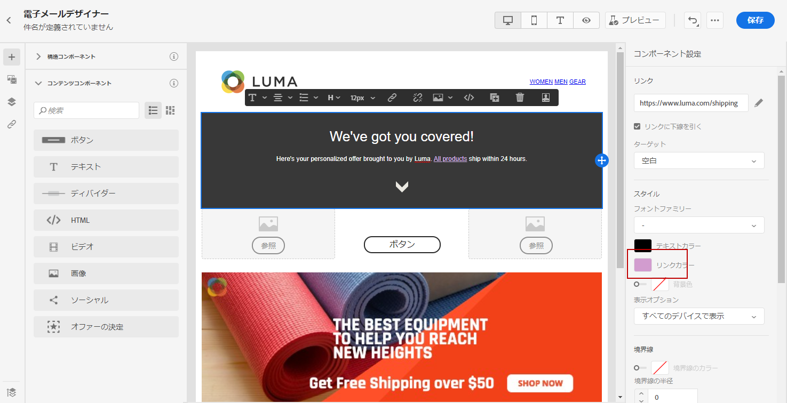

1. 必要な色を選択します。

1. 変更を保存します。

## インラインのスタイル属性の追加 {#adding-inline-styling-attributes}

E メールデザイナーインターフェイスで要素を選択し、サイドパネルで設定を表示すると、その要素のインライン属性と属性の値をカスタマイズできます。

1. コンテンツの要素を選択します。
1. サイドパネルで、**[!UICONTROL インラインのスタイル]**&#x200B;設定を探します。

1. 既存の属性の値を変更するか、「**+**」ボタンを使用して新しい属性を追加します。CSS に準拠する任意の属性と値を追加できます。

すると、選択した要素にスタイルが適用されます。子要素に特定のスタイル設定属性が定義されていない場合、親要素のスタイル設定が継承されます。
