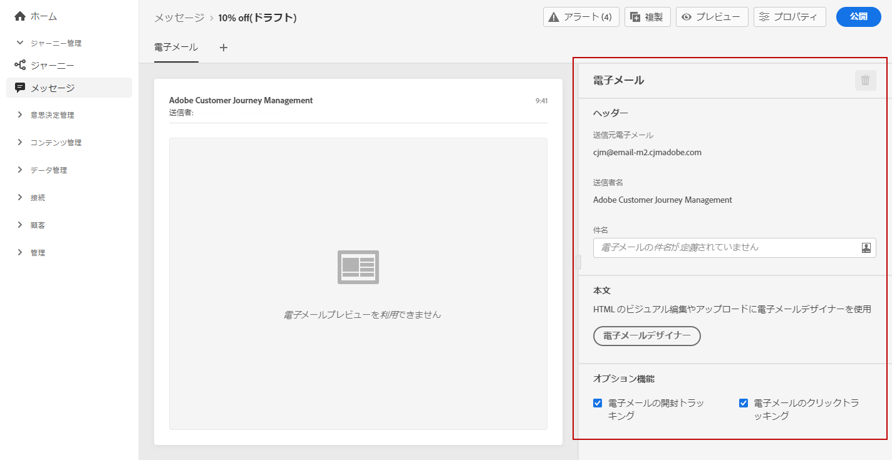

# E メールの作成 {#configure-email}

[メッセージ](create-message.md)を作成したら、「**[!UICONTROL Eメール]**」タブを使用して、Eメールチャネルの設定とコンテンツを定義します。

>[!NOTE]
>
>「**[!UICONTROL メールから]**」と「**[!UICONTROL 名前から]**」は読み取り専用であり、[メッセージの作成](create-message.md)時に選択した&#x200B;**[!UICONTROL プリセット]**&#x200B;によって決定されます。

メールの設定手順は次のとおりです。

1. **[!UICONTROL メールの件名]**&#x200B;を指定します。 右側のボタンをクリックして式エディターを開き、メールの件名を作成します。 パーソナライズ機能を追加する方法については、[このセクション](personalization/personalization-aeras.md)を参照してください。

1. 「**[!UICONTROL メールデザイナー]**」をクリックして、メールをデザインします。 メールをデザインする方法については、[このセクション](design-emails.md)を参照してください。

1. 受信者の動作を開封数やリンクのクリック数で追跡する場合、「**[!UICONTROL メールの開封トラッキング]**」オプションと「**[!UICONTROL メールのクリックトラッキング]**」オプションが有効になっていることを確認します。トラッキングの詳細については、[このセクション](message-tracking.md)を参照してください。
