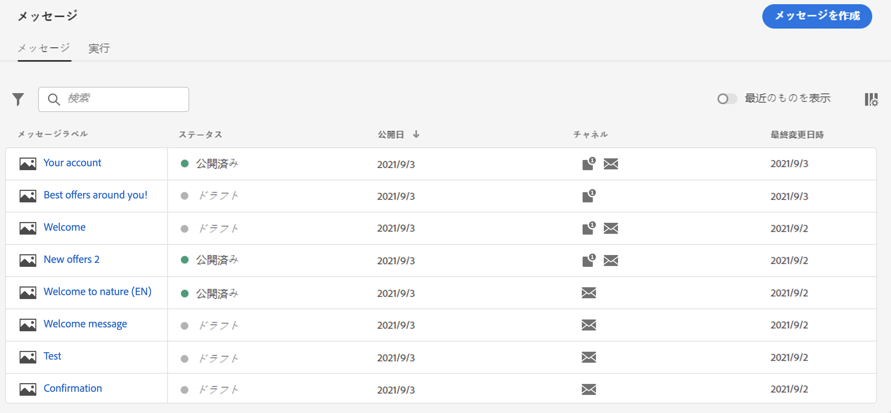
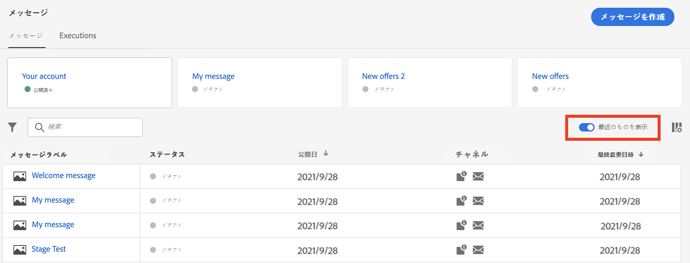
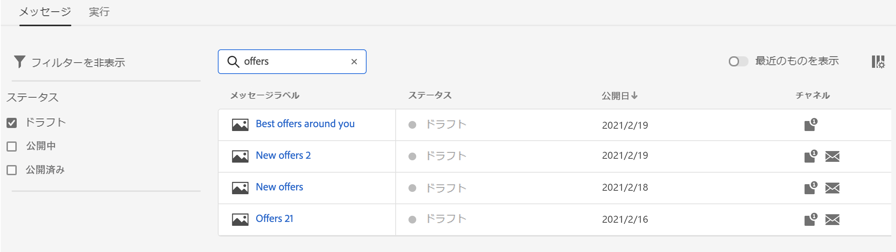
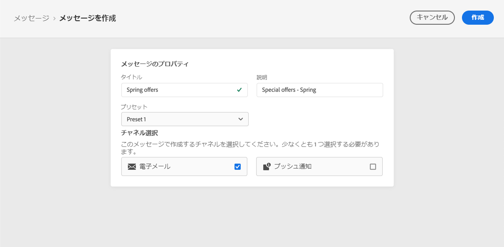
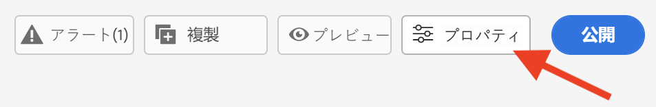
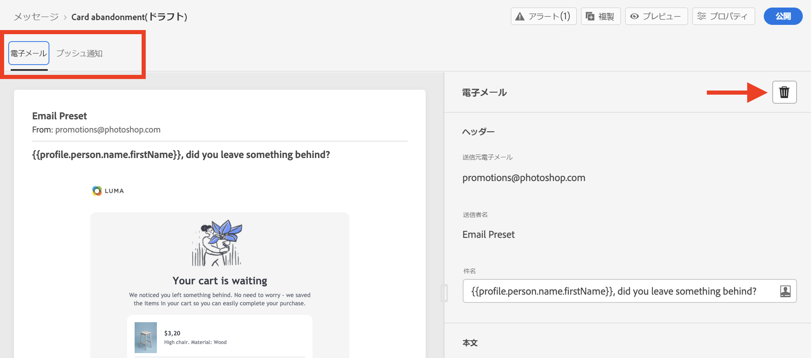
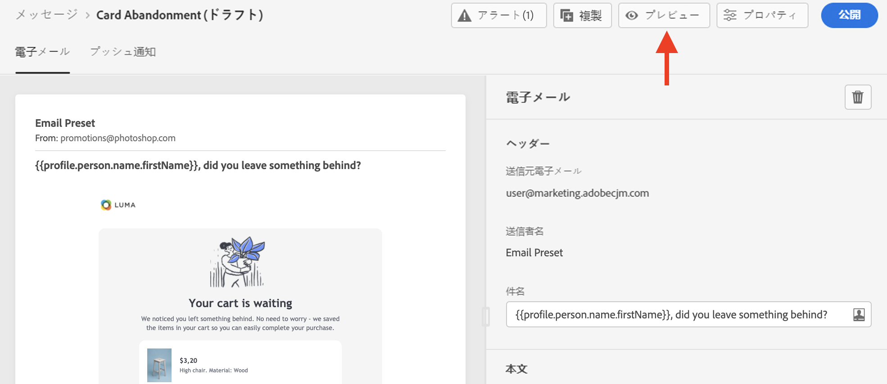
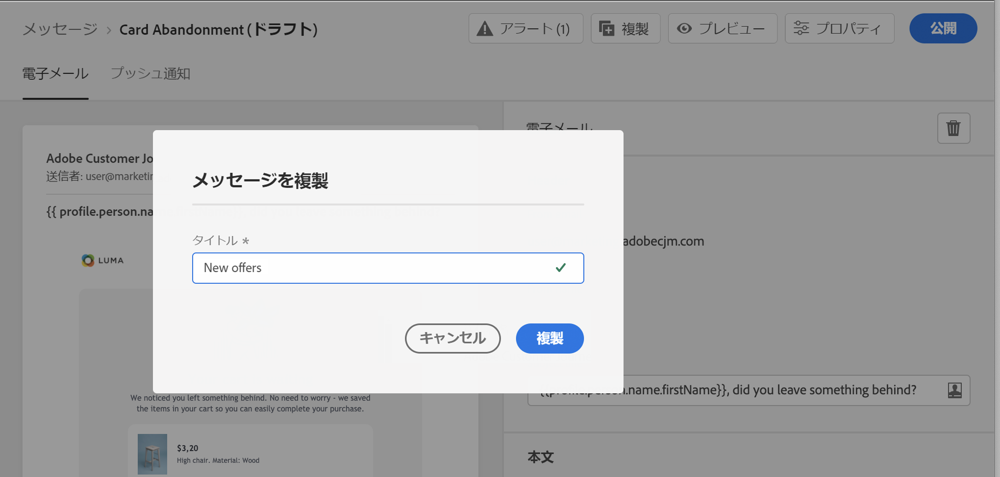
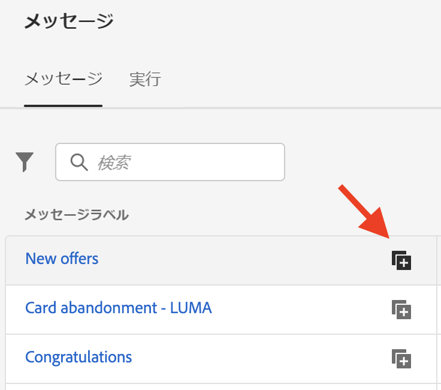

# メッセージを作成{#create-message}

メッセージは、左側のナビゲーションバーの&#x200B;**[!UICONTROL メッセージ]**&#x200B;ショートカットから入手できます。 すべてのメッセージが、発行日（発行済みメッセージの場合）または作成日（ドラフトメッセージの場合）で並べ替えられて表示されます。

>[!NOTE]
>
>すべてのユーザーは、メッセージにアクセス、作成、編集および公開できます。 ユーザー権限[についての詳細は、このセクション](permissions.md)を参照してください。

「**[!UICONTROL 最近のイベントを表示]**」トグルを使用して、過去5日間にアクセスしたメッセージにダイレクトリンクを追加します。

フィルターアイコンを使用して、ドラフト、公開、または公開中のメッセージのみを表示します。 次に示すように、メッセージラベルを検索することもできます。

## 新しいメッセージの作成

新しいメッセージを作成するには、次の手順に従います。

1. メッセージリストにアクセスし、「**[!UICONTROL メッセージを作成]**」をクリックします。

1. メッセージのプロパティを定義します。

   

   * **[!UICONTROL タイトル]**（必須）と&#x200B;**[!UICONTROL 説明]**&#x200B;を入力します。

   * メッセージに使用する&#x200B;**[!UICONTROL プリセット]**&#x200B;を選択します。

      プリセットには、ブランドに従って電子メールやプッシュ通知を送信するために必要なすべてのパラメーターが含まれます。 [ブランディングの詳細を表示します](administration.md#cjm-branding)。

   * そのメッセージに使用するチャネルを選択します。電子メールまたはプッシュ通知。 メッセージを作成するには、少なくとも1つのチャネルを選択する必要があります。
   メッセージインターフェイスの「**[!UICONTROL プロパティ]**」ボタンを使用すると、メッセージのタイトル、説明、プリセットにいつでもアクセスして変更できます。

   

1. 「**[!UICONTROL 作成]**」をクリックして、メッセージの作成を確定します。 メッセージがメッセージリストの&#x200B;**[!UICONTROL ドラフト]**&#x200B;ステータスに追加されます。

   選択したチャネルごとに1つのタブを使用できます。 これらのタブを使用して、各チャネルのコンテンツを設定します。 タブを削除するには、タブを選択し、右側の&#x200B;**[!UICONTROL チャネルを削除]**&#x200B;ボタンをクリックします。

   

   メッセージの内容を作成し、設定を調整できるようになりました。 電子メールおよびプッシュ通知の設定に関する詳細は、次の節で確認できます。

   * [電子メールの設定](configure-email.md)
   * [プッシュ通知の設定](configure-push.md)

   >[!NOTE]
   >   
   >式エディターを使用して、プロファイルのデータを使用してメッセージをパーソナライズできます。 パーソナライゼーションについて詳しくは、[このセクション](personalization/personalize.md)を参照してください。

1. メッセージのレンダリングを制御し、左側の「プレビュー」セクションを使用して、テストプロファイルでパーソナライズ設定を確認します。 詳しくは、[こちらの節](preview.md)を参照してください。

   

1. エディターの上部セクションでアラートをチェックします。  単純な警告もありますが、メッセージの公開を妨げる可能性のある警告もあります。 詳しくは、[この節](alerts.md)を参照してください。

1. これで、「**[!UICONTROL 投稿]**」ボタンをクリックしてメッセージを投稿するか、メッセージをドラフトのままにして後で投稿できます。 メッセージの公開方法について詳しくは、[このセクション](publish-manage-message.md)を参照してください。

## メッセージの重複

既存のメッセージからメッセージを作成するには、メッセージインターフェイスの&#x200B;**[!UICONTROL 重複]**&#x200B;ボタンを使用します。 すべての設定と構成が新しいメッセージにコピーされます

重複を確認する前に、メッセージの名前を変更できます。

新しいメッセージが作成されると、ウィンドウの下部に確認メッセージが表示されます。

専用のアイコンを使用して、メッセージリストから重複することもできます。

同じ確認プロセスが適用されます。
