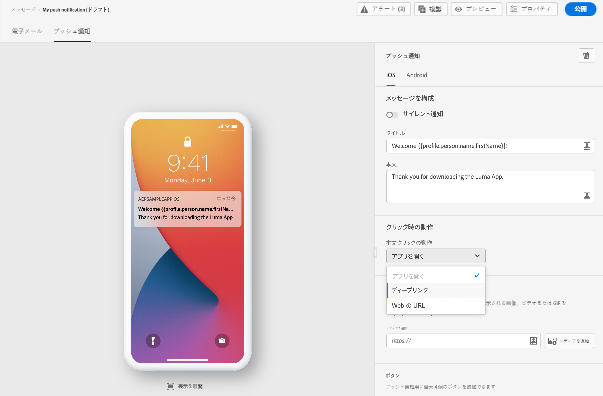
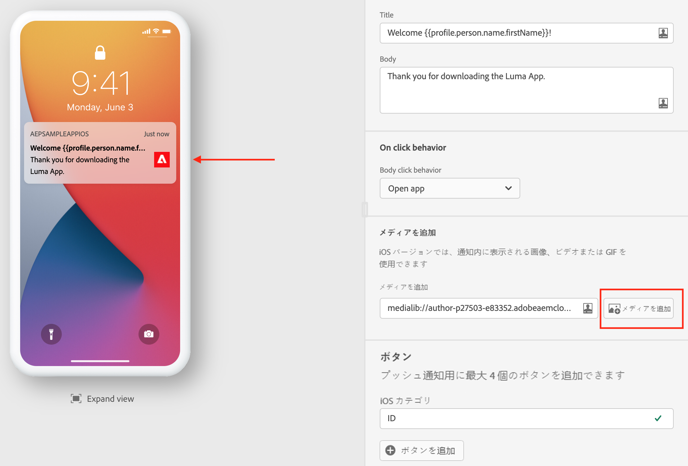
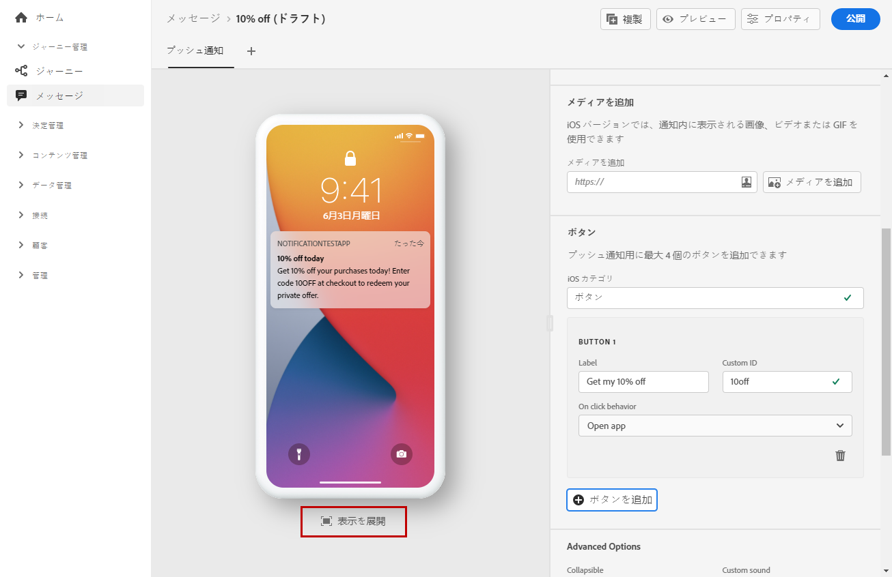

# プッシュ通知の作成 {#create-push-notification}

[メッセージ](create-message.md)を作成したら、「**[!UICONTROL プッシュ通知]**」タブをクリックして、プッシュ通知の設定と内容を定義します。

専用のタブを使用して、**iOS**&#x200B;および&#x200B;**Android**&#x200B;オペレーティングシステムのプッシュ通知設定を定義します。

>[!NOTE]
>
>「**[!UICONTROL メッセージを作成]**」セクションは、「**[!UICONTROL iOS]**」タブと「**[!UICONTROL Android]**」タブの両方に共通です。このセクションの変更は、両方のタブに反映されます。

## タイトルと本文

メッセージを作成するには、「**[!UICONTROL タイトル]**」フィールドと「**[!UICONTROL 本文]**」フィールドをクリックします。式エディターを使用して、コンテンツとパーソナライゼーションデータを定義します。[この節で、](personalization/personalize.md)式エディターでのパーソナライゼーションについて詳しく説明します

デバイスのプレビューセクションを使用すると、iOS 端末と Android 端末で表示されるプッシュ通知を視覚化できます。

## クリック時の動作 {#on-click-behavior}

受信者がプッシュ通知の本文をクリックしたときの動作を選択します。

* 「**[!UICONTROL アプリを開く]**」オプションを使用すると、メッセージ&#x200B;**[!UICONTROL プリセット]**&#x200B;に関連付けられているアプリを開くことができます。
* 「**[!UICONTROL ディープリンク]**」オプションを使用すると、アプリケーション内の特定のコンテンツに受信者をリダイレクトできます。関連するフィールドにディープリンクを入力します。
* 「**[!UICONTROL Web URL]**」オプションを使用すると、受信者を外部の URL にリダイレクトできます。関連するフィールドに URL を入力します。

## メディアの追加

iOS バージョンのプッシュ通知では、通知内に表示する画像、ビデオまたは GIF を追加できます。

Android バージョンで追加できるのは、画像アイコンと、拡張通知用の画像のみです。

2 つのオプションを使用できます。次のことができます：

* 「**[!UICONTROL メディアを追加]**」ボタンをクリックして、**[!DNL Adobe Experience Manager Assets Essentials]**&#x200B;内のアセットを選択します。

   **[!DNL Adobe Experience Manager Assets Essentials]**&#x200B;を使用する方法については、[このページ](assets-essentials.md)を参照してください。

* または、「**[!UICONTROL メディアを追加]**」フィールドをクリックして、メディアの URL を入力します。 その場合は、パーソナライゼーションを追加できます。

メディアを追加すると、通知本文の右側に表示されます。

## ボタンの追加

プッシュコンテンツにボタンを追加することで、アクションにつながる通知を作成できます。

デバイスの画面がロックされている場合、次のボタンは表示されません。通知の&#x200B;**タイトル**&#x200B;と&#x200B;**メッセージ**&#x200B;のみが表示されます。 デバイスのロックが解除されている場合、受信者にボタンが表示されます。

iOS バージョンでは、最大 4 つのボタンを追加できます。 Android バージョンでは、最大 3 つのボタンを追加できます。

>[!NOTE]
>
>iOS の場合、「**[!UICONTROL iOS カテゴリ]**」フィールドを使用して、アクションを通知カテゴリに関連付けます。

「**[!UICONTROL 追加ボタン]**」をクリックして次の設定を定義します：ラベルと関連するアクション。 可能なアクションは、[クリック時の動作](#on-click-behavior)の場合と同じです。

「**[!UICONTROL ビューを展開]**」をクリックして、パーソナライズされたボタンをプレビューします。

## サイレント通知の送信

サイレントプッシュ通知（バックグラウンド通知）は、アプリケーションに配信される非表示の命令です。これは、例えば、新しいコンテンツが利用可能であることをアプリケーションに通知したり、バックグラウンドでダウンロードを開始したりする場合に使用します。

「**[!UICONTROL サイレント通知]**」オプションを選択すると、アプリケーションにサイレントに通知できます。この場合、通知はアプリケーションに直接転送されます。デバイスの画面にアラートは表示されません。

「**[!UICONTROL カスタムデータ]**」セクションを使用すると、キーと値のペアを追加できます。

## カスタムデータ

**[!UICONTROL カスタムデータ]**&#x200B;セクションでは、モバイルアプリケーションの設定に応じて、ペイロードにカスタム変数を追加できます。Adobe Experience Platform と Adobe Launch でのプッシュ通知の設定方法の詳細については、[この節](push-gs.md)を参照してください。

## 詳細オプション

プッシュ通知用に&#x200B;**[!UICONTROL 詳細オプション]**&#x200B;を設定できます。使用できるパラメーターは以下のとおりです。

| パラメーター | 説明 |
|---------|---------|
| **[!UICONTROL 折りたたみ可能]**（iOS／Android） | 折りたたみ可能なメッセージとは、古くなった場合に新しいメッセージに置き換えられる可能性のあるメッセージです。 折りたたみ可能なメッセージの一般的なユースケースは、モバイルアプリに対して、サーバーからのデータを同期するよう伝えるメッセージです。 例えば、最新のスコアでユーザーを更新するスポーツアプリが挙げられます。 最新のメッセージのみが関連します。 一方、折りたたみが不可能なメッセージは、クライアントアプリにとってすべてのメッセージが重要であり、配信する必要があるものです。 |
| **[!UICONTROL カスタムサウンド]**（iOS／Android） | 通知を受け取ったときにモバイル端末が再生するサウンド。サウンドは、アプリにバンドルされている必要があります。 |
| **[!UICONTROL バッジ]**（iOS／Android） | バッジは、新しい未読情報の数をアプリケーションアイコンに直接表示するために使用します。 バッジの値は、ユーザーがアプリケーションで新しいコンテンツを開いたり読んだりするとすぐに消えます。デバイスで通知を受け取ると、関連アプリのバッジ値を更新したり追加したりできます。 例えば、顧客の未読記事の数を保存している場合、パーソナライズ機能を利用して、顧客ごとに未読記事の固有のバッジ値を送信できます。パーソナライゼーションの詳細については、[この節](personalization/personalize.md)を参照してください。 |
| **[!UICONTROL 通知グループ]**（iOS のみ） | 通知グループをプッシュ通知に関連付けます。 iOS 12 以降は、通知グループを使用すると、メッセージスレッドと通知トピックをスレッド ID に統合できます。例えば、あるブランドでは、1 つのグループ ID でマーケティング通知を送信すると同時に、1 つ以上の異なる ID で、より多くの運用に関する通知を送信することができます。 例を挙げると、groupID：123 「セーターの新しい春のコレクションをチェックしてください」と groupID：456 「あなたのパッケージが配達されました」という通知グループを設定できます。この例では、すべての配達通知はグループ ID：456 の下にバンドルされます。 |
| **[!UICONTROL 通知チャネル]**（Android のみ） | プッシュ通知に通知チャネルを関連付けます。 Android 8.0（API レベル 26）以降では、表示するすべての通知をチャネルに割り当てる必要があります。詳しくは、[Android 開発者向けドキュメント](https://developer.android.com/guide/topics/ui/notifiers/notifications#ManageChannels)を参照してください。 |
| **[!UICONTROL コンテンツ可用性フラグの追加]**（iOS のみ） | プッシュ通知を受け取ると（アプリがペイロードデータにアクセスできるようになると）すぐにアプリを起動し、コンテンツ利用可能フラグをプッシュペイロードで送信します。 この機能は、アプリがバックグラウンドで実行されていて、ユーザーからの操作（プッシュ通知のタップなど）がない場合でも動作しますが、アプリが実行されていない場合は動作しません。詳しくは、[Apple 開発者向けドキュメント](https://developer.apple.com/library/content/documentation/NetworkingInternet/Conceptual/RemoteNotificationsPG/CreatingtheNotificationPayload.html)を参照してください。 |
| **[!UICONTROL 可変コンテンツフラグの追加]**（iOS のみ） | プッシュペイロードに可変コンテンツフラグを送信し、iOS SDK で提供される通知サービスアプリケーション拡張機能によって、プッシュ通知の内容を変更できるようにします。詳しくは、[Apple 開発者向けドキュメント](https://developer.apple.com/library/content/documentation/NetworkingInternet/Conceptual/RemoteNotificationsPG/ModifyingNotifications.html)を参照してください。 その後、モバイルアプリの拡張機能を利用して、[!DNL Journey Optimizer] から送信される着信プッシュ通知の内容や表示をさらに変更できます。このオプションを使用すると、データの復号化、通知の本文やタイトルテキストの変更、通知へのスレッド ID の追加などをおこなうことができます。 |
| **[!UICONTROL 通知の表示]**（Android のみ） | プッシュ通知の表示を定義します。 <b>プライベート</b>に設定すると、すべてのロック画面に通知が表示されますが、保護されたロック画面では機密情報やプライベートな情報を非表示にします。 <b>パブリック</b>に設定すると、すべてのロック画面に通知全体を表示します。 <b>シークレット</b>に設定すると、保護されたロック画面に通知を一切表示しません。 詳しくは、[Android 開発者向けドキュメント](https://developer.android.com/reference/android/app/Notification)を参照してください。 |
| **[!UICONTROL 通知の優先度]**（Android のみ） | プッシュ通知の重要度を「低」から「最高」まで定義します。プッシュ通知が配信された際の、プッシュ通知の「割り込み」の度合いを決定します。詳しくは、[Android 開発者向けドキュメント](https://developer.android.com/guide/topics/ui/notifiers/notifications#importance)を参照してください。 |
| **[!UICONTROL 配信の優先順位]**（Android のみ） | プッシュ通知の優先度を「高」または「通常」に設定します。メッセージの優先度の詳細については、[Google 開発者向けドキュメント](https://firebase.google.com/docs/cloud-messaging/concept-options#setting-the-priority-of-a-message)を参照してください。 |

**関連トピック**

<!--
* [Understand push notification flow](push-gs.md)
-->

* [プッシュチャネルの設定](push-gs.md)
* [新規メッセージの作成](create-message.md)
* [ジャーニーへのメッセージの追加](building-journeys/journeys-message.md)

