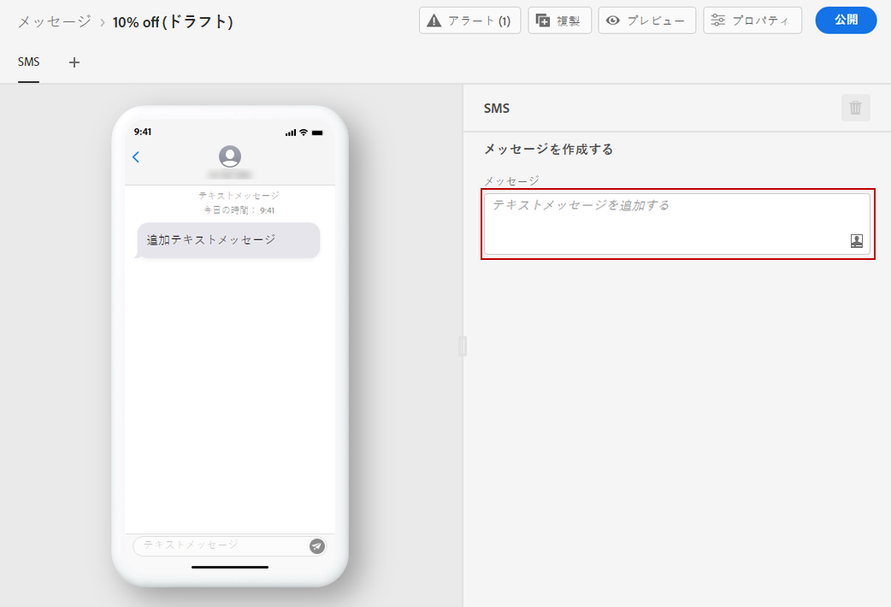
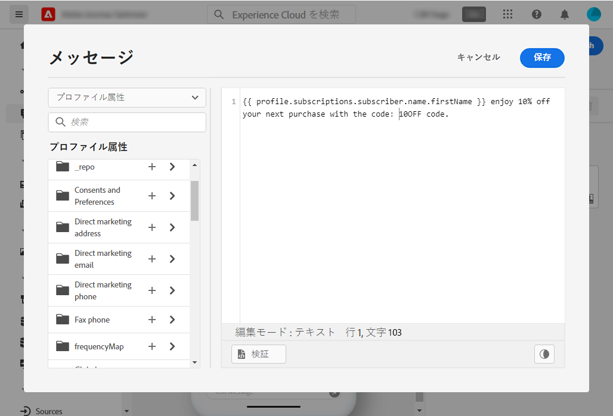

# SMS メッセージの作成 {#create-sms}

>[!CAUTION]
>
> SMS チャネルは、現在、一部のユーザーのみが早期アクセスで利用できます。この機能を利用する場合は、アドビアカウント担当者にお問い合わせください。

[メッセージを作成](create-message.md)したら、「**[!UICONTROL SMS]**」タブを使用して、SMS チャネルの設定とコンテンツを定義します。

SMS メッセージのパーソナライズを開始するには、次の手順に従います。

1. 「**[!UICONTROL テキストメッセージの追加]**」フィールドをクリックして、式エディターを開きます。

   

1. 式エディターを使用して、コンテンツとパーソナライゼーションデータを定義します。[この節で、](personalization/personalize.md)式エディターでのパーソナライゼーションについて詳しく説明します

   >[!NOTE]
   >
   > SMS メッセージの長さは 160 文字に制限されています。

   

1. パーソナライズされたメッセージの準備が整ったら、「**[!UICONTROL 保存]**」をクリックします。

1. 「**[!UICONTROL プレビュー]**」をクリックして、モバイルデバイスで SMS メッセージがどのように表示されるかを視覚化します。詳しくは、[この節](preview.md)を参照してください。

1. メッセージの準備が整ったら、「**[!UICONTROL 公開]**」ボタンを使用してメッセージを公開し、実行可能な状態にできます。このアクションにより、ジャーニーの次回の実行に使用される新しいバージョンのメッセージが公開されます。

ジャーニーで SMS メッセージを使用できるようになりました。 [ジャーニーの作成方法を説明します](building-journeys/journey-gs.md)。

**関連トピック**

* [SMS チャネルの設定](configuration/sms-configuration.md)
* [新規メッセージの作成](create-message.md)
* [ジャーニーへのメッセージの追加](building-journeys/journeys-message.md)
