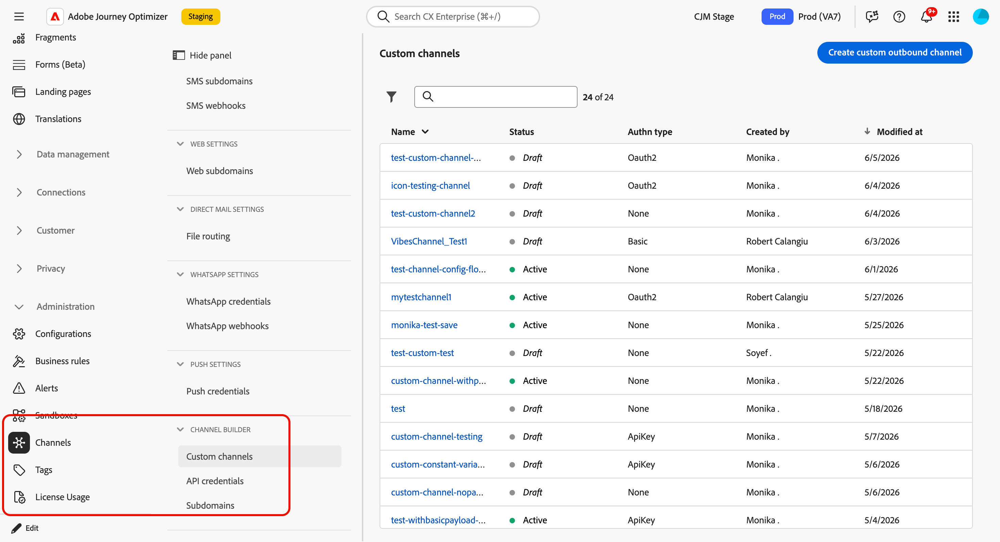
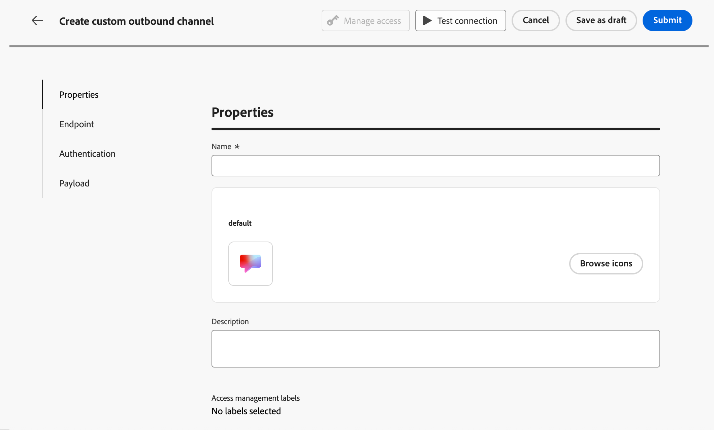
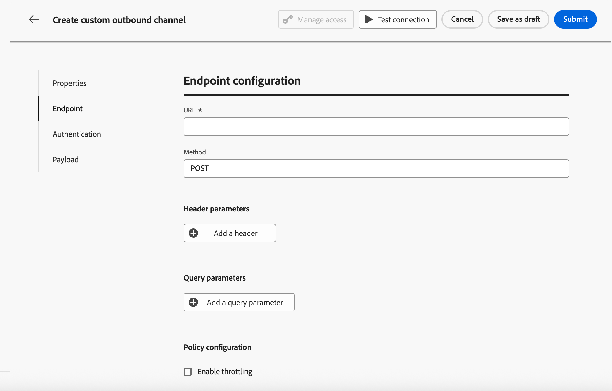
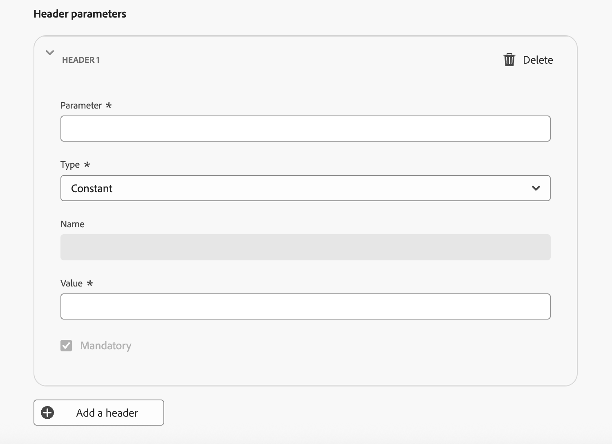
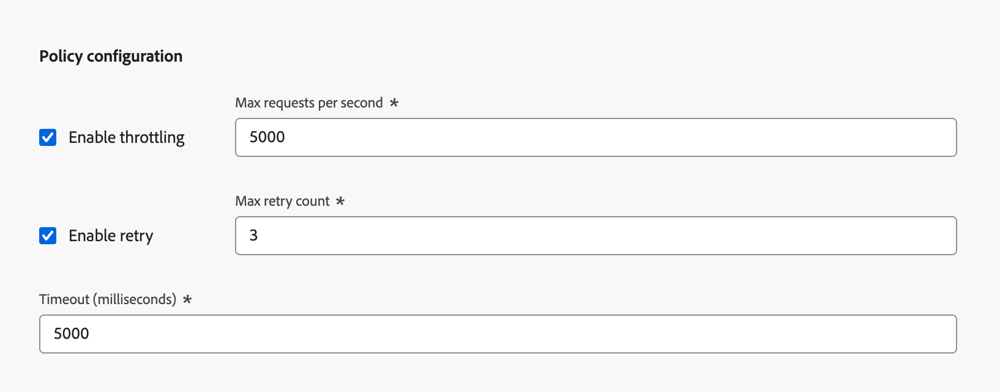
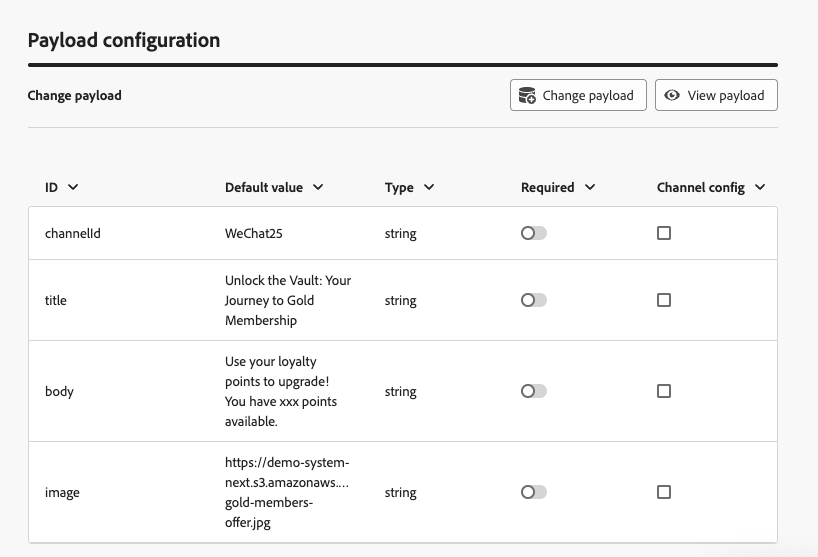
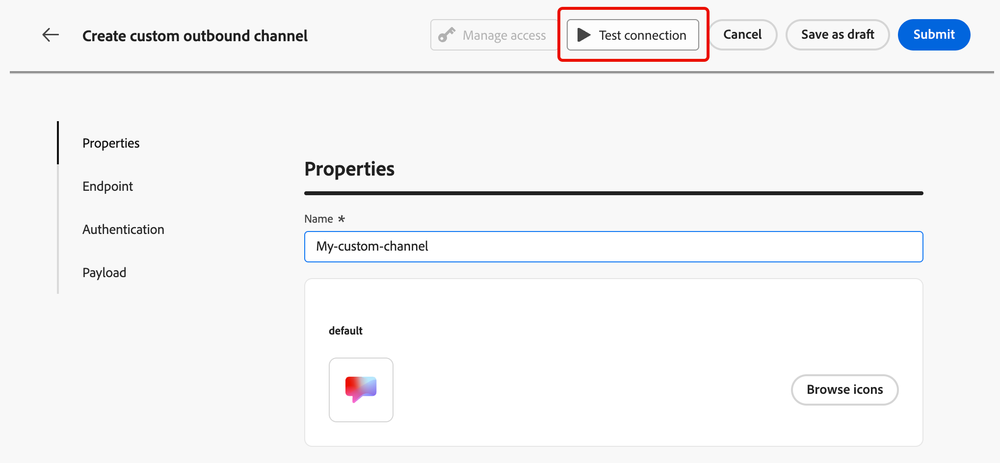

# カスタムチャネルの設定 {#create-custom-channel}

>[!CONTEXTUALHELP]
>id="ajo_custom_channel_settings"
>title="カスタムチャネルについて"
>abstract="カスタムチャネルを使用すると、Adobe Journey Optimizerは、独自のAPI エンドポイントを介してパーソナライズされたメッセージを外部システムに送信できます。 一般的なプロパティ、エンドポイント、認証、ペイロードを定義し、新しいカスタムチャネルをテストしてアクティブ化します。 完了したら、チャネル設定の作成時に使用できるので、マーケターはジャーニーやキャンペーンで使用できます。"
>additional-url="" text="カスタムチャネルの基本を学ぶ"

<!--Contextual help final location TBC (here or in Settings subsection-->

キャンペーンとジャーニーでカスタムチャネルを使用できるようにするには、管理者が最初にチャネルを作成する必要があります。 これには、エンドポイント、認証、スロットルポリシー、メッセージペイロード構造の定義が含まれます。

**チャネルビルダー** セクションは、新しいカスタムチャネルを定義するための中央インターフェイスです。 <!--It is accessible to users with the **[!UICONTROL Administrator]** role. --> カスタムチャネルを作成および設定できるだけでなく、API資格情報を管理したり、サブドメインをデリゲートしたりできます。

>[!IMPORTANT]
>
>チャネルビルダーにアクセスし、カスタムチャネルを作成および管理するには、**カスタムチャネルの表示**&#x200B;および&#x200B;**カスタムチャネルの管理**&#x200B;権限が付与されている必要があります。<!--[Learn more](../administration/high-low-permissions.md)--> [このセクション ](../administration/permissions.md)で権限を管理する方法について説明します。

## カスタムチャネルへのアクセスと管理 {#access-channel-builder}

**チャネルビルダー**&#x200B;にアクセスし、カスタムチャネルを管理するには、次の手順に従います。

1. 左側のナビゲーションパネルで&#x200B;**[!UICONTROL 管理]** > **[!UICONTROL チャネル]**&#x200B;に移動します。

1. 「**[!UICONTROL チャネルビルダー]**」セクションで「**[!UICONTROL カスタムチャネル]**」を選択します。

   {width="70%"}

1. インベントリには、サンドボックス内のすべてのカスタムチャネルが一覧表示されます。これには、現在のステータスと、外部エンドポイントへの接続に使用された認証タイプが含まれます。

1. カスタムチャネルは、作成者のステータス（**ドラフト**、**アクティブ**、または&#x200B;**アーカイブ**）でフィルタリングし、名前で検索できます。

1. チャネルを編集するには、インベントリ内のチャネル名をクリックし、変更を加えて保存します。 アクティブなチャネルの場合は、特定のフィールドのみを編集できます – [詳細情報](#test-activate)。

   >[!CAUTION]
   >
   >アクティブなチャネルのスロットル設定または再試行設定を変更すると、実行中および今後のすべての実行に対して直ちに有効になります。

1. チャネルをアーカイブするには、インベントリからチャネルを開き、**[!UICONTROL アーカイブ]**&#x200B;をクリックします。

   アクティブなチャネルをアーカイブすると、キャンペーンアクションセレクター、ジャーニーアクションパレット、オーケストレーションされたキャンペーン、チャネルリスト、チャネル設定、コンテンツテンプレートなど、すべての選択ドロップダウンからチャネルが削除されます。 すでにチャネルを使用している既存のジャーニーやキャンペーンは、引き続き正常に機能します。

## カスタムチャネルの作成 {#create-channel}

新しいカスタムチャネルを作成するには、次の手順に従います。

1. 「**[!UICONTROL カスタムチャネルを作成]**」ボタンをクリックして、チャネル作成フォームを開きます。 まず、カスタムチャネルの一般的な設定を定義します。

   {width="70%"}

1. 「**[!UICONTROL プロパティ]**」セクションに、カスタムチャネルの&#x200B;**[!UICONTROL 名前]**&#x200B;を入力します。 この名前は、ジャーニーキャンバス、キャンペーンアクションセレクター、オーケストレーションされたキャンペーンのチャネルリストに表示されます。

   >[!NOTE]
   >
   >名前は一意で、文字（A ～ Z）で始まり、英数字または特殊文字（_、.、 – ）のみを含め、1文字より大きくする必要があります。

1. デフォルトのアイコンライブラリからアイコンを選択するか、コンピューターからSVG ファイルを選択できます。

   >[!NOTE]
   >
   >ファイルは150 KB以下である必要があります。

   このアイコンは、ジャーニーキャンバスのチャネル名の横に表示されます。 アイコンがアップロードされない場合は、デフォルトのアイコンが使用されます。

1. オプションの&#x200B;**[!UICONTROL 説明]**&#x200B;を入力します。

<!--
1. Optionally, assign **[!UICONTROL Access labels]** to restrict access to this channel based on data usage policies. Learn more
-->

## エンドポイントの設定 {#endpoint-configuration}

外部メッセージングシステムのHTTP URLであるエンドポイントを設定する必要があります。 プロファイルがキャンペーンまたはジャーニーで適格である場合、[!DNL Journey Optimizer]は、パーソナライズされたペイロードを使用して、このエンドポイントにPOST リクエストを送信します。

{width="70%"}

1. **[!UICONTROL エンドポイント設定]** セクションで、外部メッセージシステムのホスト **[!UICONTROL URL]**&#x200B;を入力します。

   <!--The HTTP method to is currently set to **POST**.-->

   >[!IMPORTANT]
   >外部メッセージシステムは、[!DNL Journey Optimizer]がHTTP POST経由で呼び出すことができるHTTPS エンドポイントを公開する必要があります。 エンドポイントは次の必要があります。
   >
   >* チャネルで定義したペイロード形式（JSON）を受け入れます。
   >* チャネルビルダーで使用できる認証方法の1つをサポートします。 [詳細情報](#authentication-settings)
   >* リクエストの正常な受信を確認するために、HTTP 2xx応答を返します。

1. 必要に応じて&#x200B;**[!UICONTROL Headers]**&#x200B;を追加します。 ヘッダーは、HTTP リクエストレベルで送信されるキーと値のペアです。 エンドポイントへのあらゆるリクエストと並行して送信され、通常は認証トークン、コンテンツタイプの仕様、または外部システムに必要なその他のメタデータに使用されます。

   <!--At minimum, `Content-Type` and `Charset` are available as default headers.-->

   

   各ヘッダーについて、その値が次であるかどうかを定義できます。

   * **[!UICONTROL 定数]** – 静的値が1回設定され、すべてのリクエストに含まれます。 例えば、値`application/json`の`Content-Type` パラメーターまたは値`UTF-8`の`Charset` パラメーターを定義できます。
   * **[!UICONTROL 変数]** - デフォルト値がここに入力されている場合は、チャネル設定で上書きされない限り使用されます。 例えば、実行時に解決されるユーザーIDの変数を定義できます。 [詳細情報](custom-channel-configuration.md) <!--From Custom actions section: For these parameters, you can define where to get this information (example: events, data sources), pass values manually or use the advanced expression editor for advanced use cases. Advanced uses cases can be data manipulation and other function usage. Refer to this [page](expression/expressionadvanced.md).-->

1. 必要に応じて、同じ定数/変数パターンを使用して&#x200B;**[!UICONTROL クエリパラメーター]**&#x200B;を追加します。 クエリパラメーターは、配信時にエンドポイント URLに追加されます。 定数パラメーターは常に同じ値で追加されます。変数パラメーターは送信時に解決されます。例えば、ユーザー識別子をプロファイルから渡します。

   {width="70%"}

1. 「**[!UICONTROL ポリシー設定]**」セクションで、[!DNL Journey Optimizer]がリクエストのスループットと失敗をどのように処理するかを定義します。 これは、外部システムがリクエストの量を処理できるようにし、過剰な負荷を避けるために重要です。

   

   * **[!UICONTROL スロットルを有効にする]** - デフォルトでは無効になっています。 1秒あたりのリクエストの最大数を設定します（デフォルト：**5,000c**）。 制限に達すると、リクエストはキューに入れられ、できるだけ早く送信されます。
   * **[!UICONTROL 再試行を有効にする]** - デフォルトで有効になっています。 失敗したリクエストの最大再試行回数（デフォルト：**3**、設定可能な範囲：0 ～ 10）を設定します。 これにより、一時的なエラー時にエンドポイントに負担をかけるのを防ぐことができます。
   * **[!UICONTROL タイムアウト]** - デフォルト：**5,000 ミリ秒**。 リクエストが失敗したと考える前に、エンドポイントからの応答を待つための最大時間を設定します。
     <!--* **[!UICONTROL Enable cache]** – Disabled by default. Set the caching duration (default TTL: **600 seconds**). After the TTL (Time To Live) expires, the next request is sent to the endpoint. Caching is useful for endpoints that return the same response for identical requests, reducing load and improving performance.-->

## 認証設定 {#authentication-settings}

>[!CONTEXTUALHELP]
>id="ajo_custom_channel_authentication"
>title="認証タイプの定義"
>abstract="認証により、許可されたリクエストのみが外部メッセージシステムに送信されます。 API キー、基本認証、OAuth 2.0など、複数の認証方法から選択できます。 アクティベーション時に、Adobe Journey Optimizerはチャネルの初期のAPI資格情報セットを自動的に生成し、API資格情報インベントリで管理できます。 ただし、後で資格情報を変更できる場合でも、ここで認証の詳細を指定して、チャネルをアクティブ化する前にエンドポイントへの接続をテストする必要があります。"
>additional-url="" text="API認証情報の詳細"

このチャネルに使用する必要がある&#x200B;**[!UICONTROL 認証タイプ]**&#x200B;を選択します。 使用可能なオプションは、外部メッセージングシステムでサポートされている認証方法によって異なります。

{width="70%"}

エンドポイントで必要に応じて認証の詳細を指定します。

* **[!UICONTROL なし]** - リクエストは資格情報なしで送信されます。
* **[!UICONTROL API キー]** - キー名、値、場所（クエリパラメーターまたはヘッダー）を指定します。
* **[!UICONTROL 基本認証]** - ユーザー名とパスワードを入力します。
* **[!UICONTROL OAuth 2.0]** - OAuth 2.0認証用のペイロードを設定します。
  <!--* **[!UICONTROL Custom]** – Define the authentication configuration using a JSON payload.-->

認証タイプが&#x200B;**None**&#x200B;以外の場合、[!DNL Journey Optimizer]は、このチャネルがアクティブ化されたときに、このチャネルの初期のAPI資格情報セットを自動的に生成します。 これらの資格情報を変更し、API資格情報インベントリで新しい資格情報を作成できます。 [詳細情報](custom-channel-api-credentials.md) <!--TBC-->

ただし、認証の詳細は、チャネルをアクティブ化する前にエンドポイントへの接続をテストするために必要です。 認証設定を検証するには、**[!UICONTROL 接続をテスト]** ボタンを使用できます。 [詳細情報](#test-activate)

## ペイロード設定 {#payload-configuration}

>[!CONTEXTUALHELP]
>id="ajo_custom_channel_payload_config"
>title="チャネル設定のフィールドを有効にする"
>abstract="有効にすると、この列のフィールドがチャネル設定に表示され、管理者は設定ごとに異なる値を設定できます（例えば、ブランドまたは地域ごとに異なる送信者ID）。 これは、キャンペーンやジャーニーのコンテキストに応じて異なる可能性のあるフィールド（送信者情報やメッセージテンプレートなど）に役立ちます。"
>additional-url="" text="カスタムチャネル設定での動的パラメーターの設定"

<!--Create a page on Custom channel config to explain how to use the payload in a channel configuration.-->

ペイロードは、キャンペーンまたはジャーニーでプロファイルが適格である場合に、エンドポイントに送信されます。

ペイロード設定では、メッセージペイロードの構造と、マーケターがオーサリングおよびパーソナライズできるフィールドを定義します。

1. 「**[!UICONTROL ペイロードを定義]**」をクリックし、ペイロードの定義方法を選択します。

   * **[!UICONTROL サンプル JSON ペイロードの貼り付け]** – 代表的なJSON オブジェクトを貼り付けると、[!DNL Journey Optimizer]は、そのオブジェクトからスキーマを自動的に推測します。
   * **[!UICONTROL JSON スキーマの読み込み]** （近日リリース予定） – 完全なJSON スキーマファイルをアップロードします。

     >[!AVAILABILITY]
     >
     >この機能はまだ利用できません。 将来のリリースで追加される予定です。

1. スキーマを生成すると、[!DNL Journey Optimizer]は検出されたすべてのフィールドをフォームビューに表示します。

   

1. 各フィールドに対して、次の設定を行います。

   | 設定 | 説明 |
   | --- | --- |
   | **[!UICONTROL デフォルト値]** | オプション。 オーサリング時にパーソナライズされた値が提供されない場合に使用されます。 |
   | **[!UICONTROL タイプ]** | 読み取り専用。ペイロードから派生します。 サポートされているタイプ：`string`、`integer`、`decimal`、`boolean`、`dateTime`、`dateTimeOnly`、`dateOnly`、`listObject`、`listString`、`listInteger`、`listDecimal`、`listBoolean`、`listDateTime`、`listDateTimeOnly`、`listDateOnly`。 |
   | **[!UICONTROL 必須]** | 有効にした場合、チャネルがキャンペーンまたはジャーニーで使用される場合、フィールドに値が必要です。 必須フィールドが見つからない場合、アクティベーションを妨げる検証エラーがトリガーされます。 |
   | **[!UICONTROL チャネル設定]** | 有効にすると、このフィールドはチャネル設定に表示され、管理者は設定ごとに異なる値を設定できます（例えば、ブランドまたは地域ごとに異なる送信者ID）。 [詳細情報](custom-channel-configuration.md) |

   ネストされたフィールドは、ドット表記法を使用して表されます（例：`image.id`）。<!--TBC-->

## 検証と活用 {#test-activate}

チャネルのステータスが&#x200B;**[!UICONTROL ドラフト]**&#x200B;である間、画面上部の&#x200B;**[!UICONTROL 接続をテスト]** ボタンを使用して、エンドポイントにテストリクエストを送信し、エンドツーエンドの接続を検証します。

{width="70%"}

外部システムのログを確認して、リクエストが期待される認証とペイロードで受信されたことを確認します。

テストが成功したら、チャネルを保存またはアクティブ化できます。

* 「**[!UICONTROL ドラフトとして保存]**」をクリックして、チャネルを利用せずに進行状況を保存します。
* 「**[!UICONTROL アクティブ化]**」をクリックして、チャネルをチャネル設定、キャンペーン、ジャーニーで使用できるようにします。

>[!IMPORTANT]
>
>チャネルをアクティブ化した後は、名前、説明、アイコン、スロットリング、再試行設定の各フィールドのみが編集可能のままになります。 エンドポイント URL、ヘッダー、クエリパラメーター、認証、ペイロード構造がロックされています。<!--TBC-->

<!--TBC: An activated channel can be **archived** (hidden from all selection drop-downs while existing journeys and campaigns continue to function), but it cannot be **deleted**. Deletion is only possible while the channel is in **[!UICONTROL Draft]** status.TBC-->

## 次の手順 {#next-steps}

これでカスタムチャネルが作成されました。 残りの手順に従って、設定を完了します。

* [API資格情報を設定](custom-channel-api-credentials.md) （チャネルが認証を使用している場合）
* [ サブドメインをデリゲート ](custom-channel-subdomains.md) （オプション – リンクトラッキングに必要）
* [チャネル設定の作成](custom-channel-configuration.md)
