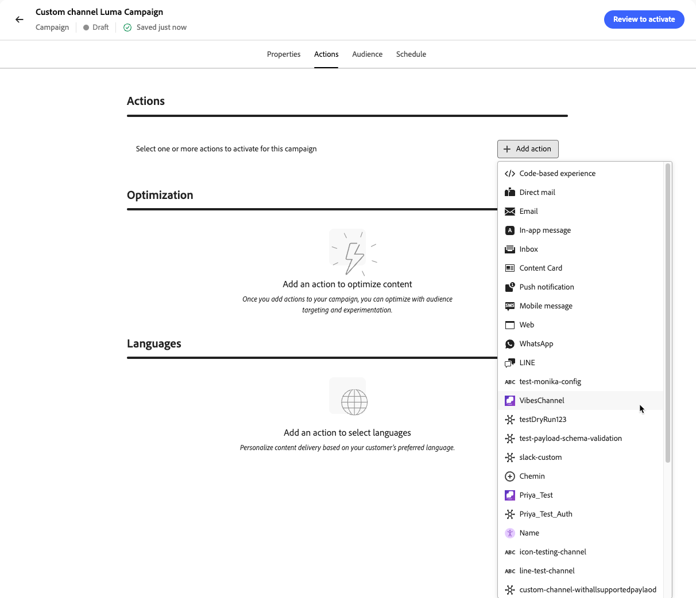
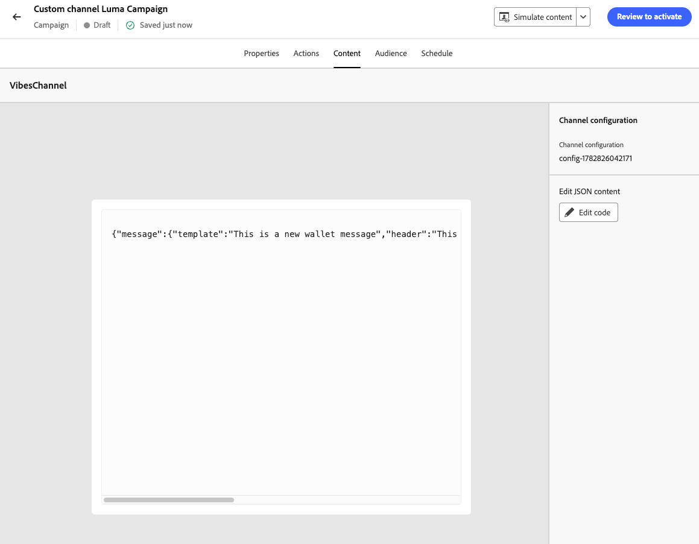

# カスタムチャネルエクスペリエンスの構築 {#create-custom-channel}

>[!AVAILABILITY]
>
>この機能は、限定提供で使用できます。 アクセス権を取得するには、アドビ担当者にお問い合わせください。

[!DNL Journey Optimizer]では、キャンペーン、ジャーニー、およびオーケストレーションされたキャンペーンのカスタムチャネルを使用してメッセージを配信できます。 カスタムチャネルエクスペリエンスを設定するには、次の手順に従います。

>[!NOTE]
>
>カスタムチャネルエクスペリエンスを作成する前に、管理者がカスタムチャネルを設定していることを確認してください。 [詳細情報](configure-custom-channel.md)

## ジャーニーまたはキャンペーンを通じてカスタムアクションを追加する {#create-custom-channel-experience}

>[!CONTEXTUALHELP]
>id="ajo_journey_action_custom_channel"
>title="カスタムチャネルアクション"
>abstract="カスタムチャネルアクションは、プロファイルがジャーニーのこのステップに到達したときにメッセージを配信します。 ラベルは、ジャーニーキャンバス内のアクティビティを識別し、アクションは、メッセージの配信に使用されるエンドポイント、ペイロード、資格情報を定義するカスタムチャネル設定を参照します。 **最適化** セクションには、コンテンツの実験またはターゲティングルールを含めることができます。アクションが失敗した場合、**タイムアウトまたはエラー** セクションでは、代替パスを定義できます。"
>additional-url="https://experienceleague.adobe.com/ja/docs/journey-optimizer/using/orchestrate-journeys/about-journey-building/journey-action#add-action" text="カスタムチャネルの基本を学ぶ"


>[!BEGINTABS]

>[!TAB  ジャーニーにカスタムチャネルを追加]

カスタムチャネルは、ジャーニーキャンバスパレットの&#x200B;**[!UICONTROL アクション]** セクションに表示され、チャネルビルダーで定義されている表示名とカスタムアイコンでリストされます。

カスタムチャネルアクションをジャーニーに追加するには：

1. [ジャーニーを作成します](../building-journeys/journey-gs.md)。

1. ジャーニーを「[イベント](../building-journeys/general-events.md)」または「[オーディエンスを読み取り](../building-journeys/read-audience.md)」アクティビティで開始します。

1. パレットの&#x200B;**[!UICONTROL アクション]** セクションから&#x200B;**[!UICONTROL アクション]** アクティビティをドラッグ&amp;ドロップします。 [ アクションアクティビティ ](../building-journeys/journey-action.md)の詳細をご覧ください。

1. 「**[!UICONTROL アクション]**」ドロップダウンで、使用するカスタムチャネルを選択します。 カスタムチャネルは、チャネルビルダーで割り当てられた名前とアイコンで一覧表示されます。

   {width="80%"}

1. アクションにラベルを追加し、右側のパネルの&#x200B;**[!DNL Configure action]**&#x200B;をクリックして、使用する&#x200B;**[!UICONTROL チャネル設定]**&#x200B;を選択します。 [ カスタムチャネル設定の作成方法について説明します](custom-channel-configuration.md#create-channel-config)

1. **[!UICONTROL メッセージ]** セクションで、**[!UICONTROL コンテンツを編集]**&#x200B;をクリックしてペイロードエディターを開き、メッセージを作成します。 [ コンテンツの作成方法を学ぶ](#author-content)

1. 必要に応じて追加の手順を追加してジャーニーフローを完了し、ジャーニーを公開します。 [詳細情報](../building-journeys/journey-gs.md)

>[!TAB  カスタムチャネルキャンペーンの作成]

キャンペーンでカスタムチャネルを使用するには：

1. [ キャンペーンを作成](../campaigns/create-campaign.md)。

1. キャンペーンタイプを選択します。

   * **[!UICONTROL スケジュール済み – マーケティング]** – すぐに、または指定した日付に実行されました。 マーケティングメッセージ用に設計され、UIから設定できます。
   * **[!UICONTROL API トリガー – マーケティング/トランザクション]** - API呼び出しを介して実行されます。 イベントをトリガーとしたメッセージ（注文確認やパスワードリセットなど）用に設計されています。 [詳細情報](../campaigns/api-triggered-campaigns.md)

1. キャンペーンの設定を完了します。キャンペーンプロパティ、[ オーディエンス ](../audience/about-audiences.md)、[ スケジュール ](../campaigns/create-campaign.md#schedule)。

1. 「**[!UICONTROL アクション]**」セクションで、チャネルセレクターからカスタムチャネルを選択します。 サンドボックスで設定されたすべてのカスタムチャネルが、ネイティブチャネルと一緒に表示されます。

   {width="80%"}

1. 使用する&#x200B;**[!UICONTROL チャネル設定]**&#x200B;を選択または作成します。 [ チャネル設定の作成方法について説明します](custom-channel-configuration.md#create-channel-config)

1. オプションで、**[!UICONTROL アクショントラッキング]**&#x200B;を有効にして、メッセージペイロードに含まれるリンクを自動的に追跡します（カスタムチャネル用に設定されたサブドメインが必要です）。 [ カスタムチャネルのサブドメインをデリゲートする方法について説明します](custom-channel-subdomains.md#subdomain-delegation)

1. 「**[!UICONTROL 最適化]**」セクションでは、次のことができます。

   * **[!UICONTROL ターゲティングルール]**&#x200B;を作成して、オーディエンスのさまざまなセグメントに異なるメッセージを送信します。 [詳細情報](../campaigns/create-campaign.md#targeting)
   * 「**[!UICONTROL 実験を作成]**」をクリックして、カスタムチャネルメッセージに対してA/B テストを実行します。 [詳細情報](../campaigns/create-campaign.md#content-experiment)

1. 「**[!UICONTROL コンテンツを編集]**」をクリックしてペイロードエディターを開き、メッセージを作成します。 [ コンテンツの作成方法を学ぶ](#author-content)

1. キャンペーンを確認し、アクティブ化します。 [詳細情報](../campaigns/create-campaign.md)

<!--
>[!TAB Add a custom channel to an orchestrated campaign]

Custom channels appear in the channel selection list in the orchestrated Campaigns canvas, below the native channels, with their custom icon and display name.

To add a custom channel in an orchestrated campaign:

1. Open or create an orchestrated campaign.

1. In the canvas, add a channel action node and select your custom channel from the list.

1. Select the **[!UICONTROL Channel configuration]** to use. Ensure the configuration includes the **[!UICONTROL Execution details]** section required for orchestrated campaigns.

1. Click **[!UICONTROL Edit content]** to open the payload editor and author your message. [Learn how to author content](#author-content)
-->

>[!ENDTABS]

## カスタムチャネルコンテンツの作成 {#author-content}

コンテンツエディターには、カスタムチャネルの設定時に定義したペイロード構造が反映されます。 「**[!UICONTROL コードを編集]**」をクリックしてペイロードエディターを開き、メッセージコンテンツを入力します。

{width="80%"}

オーサリングおよびパーソナライズできるフィールドが表示されます。 [!DNL Journey Optimizer] パーソナライゼーションエディターのすべてのパーソナライズ機能およびオーサリング機能を活用できます。 [詳細情報](../personalization/personalization-build-expressions.md)

>[!NOTE]
>
>JSON ペイロードのみがサポートされます。 カスタムチャネルペイロードがJSONでない場合は、JSON ラッパーを使用してコンテンツをカプセル化できます。 例えば、ペイロードがXMLの場合は、次のようなJSON オブジェクトでラップできます。
>
>```json
>{
>   "payload": "<xml>...</xml>"
>}
>```

### ペイロードのパーソナライズ {#personalize}

[!DNL Journey Optimizer]の完全なパーソナライゼーション機能は、ペイロードエディターで使用できます。

* **プロファイル属性** - `{{profile.person.name.firstName}}`などのXDM プロファイル属性、またはカスタム名前空間に保存されたメッセージングプラットフォームのユーザーIDなどのカスタム IDを挿入します。
* **コンテキスト属性** - ジャーニーイベント属性または送信時に解決されたキャンペーンのコンテキストデータを使用します。
* **ヘルパー関数** – 組み込みの文字列、日付、または算術関数を使用して値を書式設定します。 [詳細情報](../personalization/functions/helpers.md)
* **式フラグメント** – 複数のチャネルとキャンペーンで共有パーソナライゼーションロジックを再利用します。 [詳細情報](../content-management/customizable-fragments.md)

>[!CAUTION]
>
>現在、オーサリング時にペイロードの検証はありません。 **[!UICONTROL コンテンツをシミュレート]**&#x200B;機能を使用して、ペイロードが適切な形式のJSONであり、すべてのパーソナライゼーション式がテストプロファイルに対して正しく解決されていることを検証できます。 [詳細情報](test-custom-channel.md#simulate-content)

### ペイロードの例 {#example-payload}

次の例は、カスタムメッセージングチャネル <!--(to be replaced with a meaningful realistic example)-->のプロファイルパーソナライゼーションを使用したJSON ペイロードを示しています。

```json
{
  "recipient_id": "{{profile.mobilePhone.number}}",
  "message_text": "Hello {{profile.person.name.firstName}}, your order {{context.journey.events.0.commerce.order.purchaseID}} has been confirmed.",
  "channel": "my-custom-channel",
  "image": {
    "id": "{{profile.preferences.imageId | default('default-image-001')}}"
  }
}
```

### ペイロード内のリンクの追跡 {#track-links}

追跡されたリンクをカスタムチャネルペイロードに含め、クリックが自動的に追跡され、チャネルのレポートダッシュボードに表示されるようにするには、次のハンドルバー構文を使用してURLをラップします。

```
{{url trackedUrl='' originalUrl='https://example.com/' type='TRACKED'}}
```

* `originalUrl` – 受信者をリダイレクトする宛先URL。
* `trackedUrl` – これは空のままにします。[!DNL Journey Optimizer]は、送信時にトラッキング可能なリダイレクト URLを自動的に入力します。
* `type` - `TRACKED`に設定してください。

>[!NOTE]
>
>リンクトラッキングには、カスタムチャネル用に設定されたサブドメインが必要です。 [ カスタムチャネルのサブドメインをデリゲートする方法について説明します](custom-channel-subdomains.md#subdomain-delegation)

**例 – LINE ペイロードで追跡されたリンク：**

```json
{
  "to": "{{profile.mobilePhone.number}}",
  "messages": [
    {
      "type": "text",
      "text": "Hello! Check out our latest offer: {{url trackedUrl='' originalUrl='https://example.com/' type='TRACKED'}}"
    }
  ]
}
```

<!--
### Strict JSON mode {#strict-json}

The editor supports a **[!UICONTROL Strict JSON]** toggle:

* **Strict JSON: Off (default)** – The editor accepts any payload content, including personalization helpers and functions that may temporarily produce non-JSON syntax. A warning is displayed at the **Review to Activate** step if the payload is not well-formed JSON, prompting you to simulate and proof before publishing.
* **Strict JSON: On** – The editor validates that the payload is well-formed JSON as you type. At the **Review to Activate** step, [!DNL Journey Optimizer] validates the payload against the channel schema and flags missing required fields or type mismatches as errors that must be resolved before activation.
-->

## カスタムチャネルエクスペリエンスを活用する {#activate}

>[!IMPORTANT]
>
>アクティベートする前に、カスタムチャネルペイロードをプレビューし、テストします。 [詳細情報](test-custom-channel.md)
>
>キャンペーンまたはジャーニーが承認ポリシーの対象となる場合は、アクティベーションする前に承認をリクエストする必要があります。 [詳細情報](../test-approve/gs-approval.md)

* **ジャーニーから** – 右上領域の&#x200B;**[!UICONTROL 公開]**&#x200B;をクリックします。 ジャーニーが開始され、外部エンドポイントに対して適格プロファイルの呼び出しが開始されます。
* **キャンペーンから** - **[!UICONTROL レビューをクリックして]**&#x200B;をアクティブ化し、設定を確認してから、**[!UICONTROL アクティブ化]**&#x200B;をクリックします。 キャンペーンは、**[!UICONTROL ライブ]** ステータス（または今後の開始日が定義されている場合は&#x200B;**[!UICONTROL スケジュール済み]**）を受け取ります。
