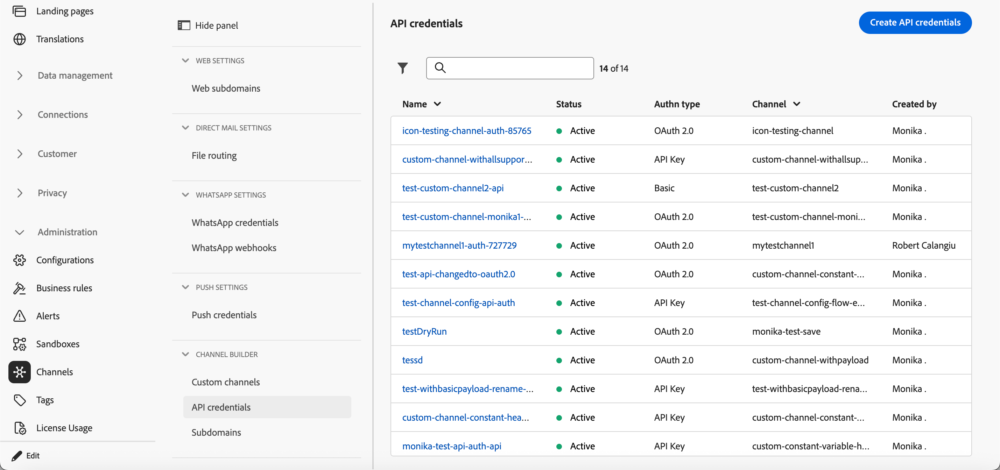

# API資格情報の管理 {#api-credentials}

**None**&#x200B;以外の認証タイプでカスタムチャネルを作成すると、チャネルがアクティブ化されたときに、最初のAPI資格情報のセットが自動的に生成されます。

資格情報は、**[!UICONTROL 管理]** > **[!UICONTROL チャネル]** > **[!UICONTROL チャネルビルダー]** > **[!UICONTROL API資格情報]**&#x200B;から表示、管理、編集できます。

{width="100%"}

同じチャネルに複数の資格情報を持つことで、チャネル定義を複製することなく、異なるチャネル設定（異なるブランドやユースケースなど）に異なる認証値を割り当てることができます。

既存の資格情報のセットを編集するには、インベントリ リストから項目をクリックします。 すべてのフィールドは編集可能です。

同じチャネルに対して追加の資格情報を作成するには、次の手順に従います。

1. **[!UICONTROL API資格情報]**&#x200B;のリストから、**[!UICONTROL API資格情報の作成]**&#x200B;をクリックします。

1. 名前と説明を入力します。

   {width="100%"}

1. 資格情報を作成する&#x200B;**[!UICONTROL チャネル]**&#x200B;を選択します。

   >[!NOTE]
   >
   >**なし**&#x200B;以外の認証タイプを持つアクティブ化されたカスタムチャネルのみが、ドロップダウンリストに表示されます。

1. リストから&#x200B;**[!UICONTROL 認証タイプ]**&#x200B;を選択します。
1. 認証固有のフィールドに入力します。
   * **[!UICONTROL API キー]** - キー名、値、場所（クエリパラメーターまたはヘッダー）を指定します。
   * **[!UICONTROL 基本認証]** - ユーザー名とパスワードを入力します。
   * **[!UICONTROL OAuth 2.0]** - OAuth 2.0認証用のペイロードを設定します。
1. 「**[!UICONTROL 保存]**」をクリックします。

## 次の手順 {#next-steps}

* [&#x200B; サブドメインをデリゲート &#x200B;](custom-channel-subdomains.md) （オプション – リンクトラッキングに必要）
* [チャネル設定の作成](custom-channel-configuration.md)
