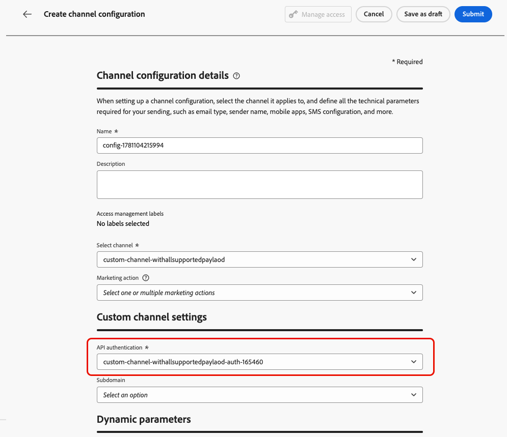
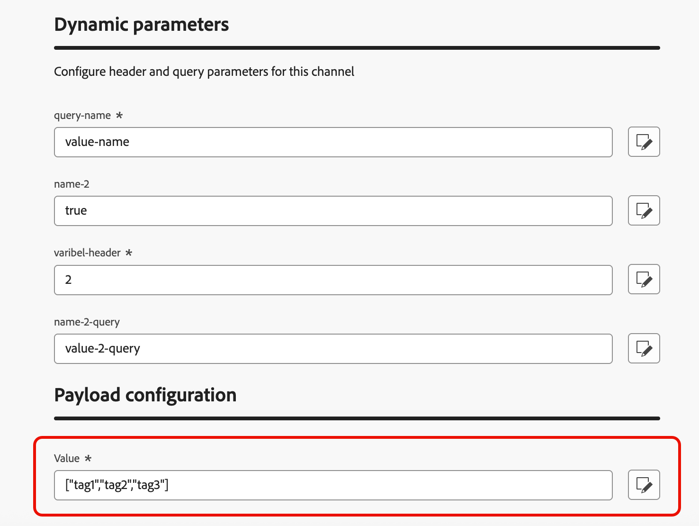
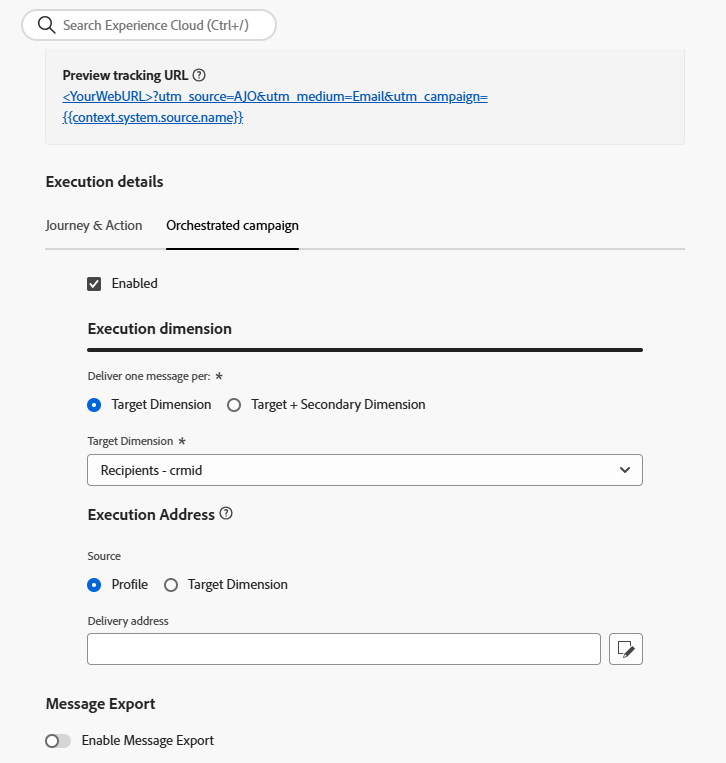

# チャネル設定の作成 {#create-channel-config}

チャネル設定は、カスタムチャネルを、マーケターがキャンペーンやジャーニーを構築する際に選択する、名前付きの再利用可能なプリセットにリンクします。

カスタムチャネルのチャネル設定を作成するには、次の手順に従います。

1. **[!UICONTROL 管理]** > **[!UICONTROL チャネル]** > **[!UICONTROL チャネル設定]**&#x200B;に移動し、**[!UICONTROL チャネル設定の作成]**&#x200B;をクリックします。 [ チャネル設定の作成](../configuration/channel-surfaces.md)について詳しく説明します。

1. 「**[!UICONTROL チャネルを選択]**」ドロップダウンリストから、アクティブ化されたカスタムチャネルのいずれかを選択します。

   {width="100%"}

1. 選択したチャネルで認証を使用している場合（タイプが&#x200B;**None**&#x200B;でない場合）、**[!UICONTROL API資格情報]** フィールドが表示されます。 この設定に使用する資格情報を選択します。 [API資格情報の詳細](custom-channel-api-credentials.md)

   {width="100%"}

1. [!DNL Journey Optimizer]でカスタムチャネルのサブドメインを設定している場合は、この設定のペイロードに存在するトラッキングリンクに使用するデリゲートされたサブドメインを選択できます。 [ サブドメインをデリゲートする方法を学ぶ](custom-channel-subdomains.md)

1. 選択したチャネルに、エンドポイント URLの変数](create-custom-channel.md#endpoint-configuration)として定義されたヘッダーまたはクエリパラメーター[がある場合、**[!UICONTROL 動的パラメーター]** セクションが表示されます。

   各パラメーターの値を入力します。 パーソナライゼーションエディターを使用して、動的な値（プロファイルから解決されたユーザー識別子など）を挿入できます。 これにより、プロファイルデータに基づいて、各受信者のリクエストをカスタマイズできます。

   {width="100%"}

1. カスタムチャネルで「**[!UICONTROL チャネル設定]**」チェックボックスが有効になっているペイロードフィールドがある場合、これらのフィールドは「**[!UICONTROL ペイロード設定]**」セクションに表示されます。 [詳細情報](create-custom-channel.md#payload-configuration)

   {width="100%"}

   この設定に応じて、各フィールドの値を設定します。 これは、キャンペーンやジャーニーのコンテキストに応じて異なる可能性のあるフィールド（送信者情報やメッセージテンプレートなど）に役立ちます。

1. オーケストレーションされたキャンペーンの場合は、**[!UICONTROL 実行の詳細]** セクションを完了して、プロファイルディメンションをマッピングし、実行アドレスを指定します。

   {width="80%"}

1. 「**[!UICONTROL 送信]**」をクリックして、チャネル設定を保存してアクティブ化します。

<!--
>[!CAUTION]
>
>If your organization uses approval policies, you may need to request approval before activating journeys or campaigns that use this channel configuration. [Learn more](../test-approve/gs-approval.md)
-->

## 次の手順 {#next-steps}

これで、カスタムチャネルが完全に設定されました。 マーケターは、ヘッドレス CMSを使用して顧客体験を構築できます。

* [カスタムチャネルエクスペリエンスの構築](create-custom-experience.md)
* [カスタムチャネルのテスト](test-custom-channel.md)
* [カスタムチャネルの監視](configure-custom-channel.md)
