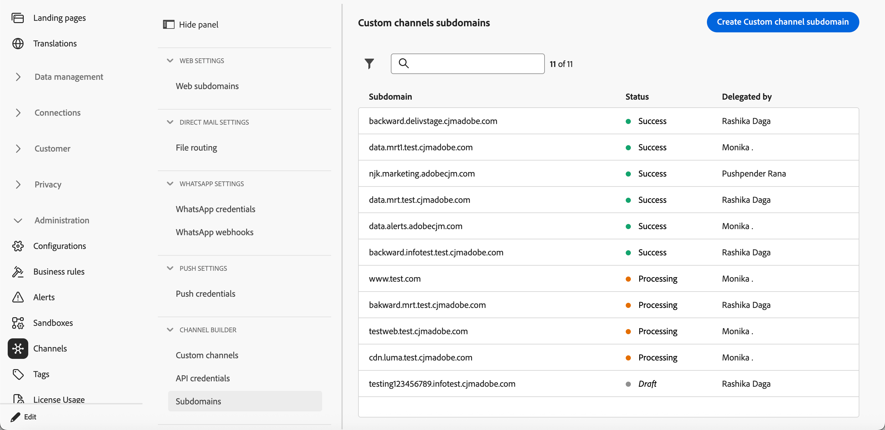
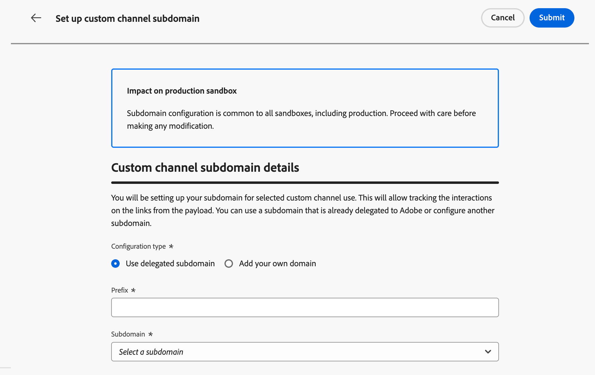
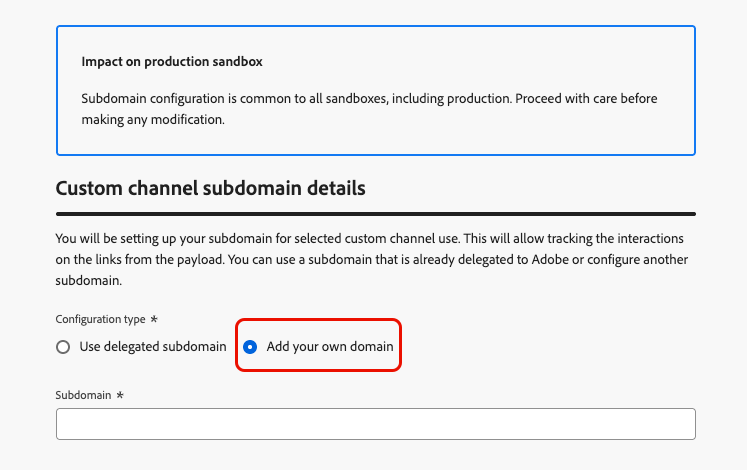

# カスタムチャネルサブドメインの設定 {#custom-channel-subdomains}

>[!BEGINSHADEBOX]

**このページでは、**&#x200B;既存のデリゲート サブドメインを使用するか、DNS レコードを使用して新しいサブドメインを設定することで、Adobe Journey Optimizerでカスタムチャネルサブドメインを設定し、メッセージでリンクトラッキングを有効にする方法を説明します。

>[!ENDSHADEBOX]

>[!CONTEXTUALHELP]
>id="ajo_admin_subdomain_custom_channel"
>title="カスタムチャネルサブドメインのデリゲート"
>abstract="カスタムチャネルメッセージに使用するサブドメインを設定する必要があります。カスタムチャネル設定を作成するには、このサブドメインが必要です。 既にアドビにデリゲートされているサブドメインを使用するか、新しいサブドメインを設定できます。"
>additional-url="https://experienceleague.adobe.com/en/docs/journey-optimizer/using/custom-channel/custom-channel-configuration" text="カスタムチャネルの設定"

>[!CONTEXTUALHELP]
>id="ajo_admin_config_custom_channel_subdomain"
>title="カスタムチャネルサブドメインの選択"
>abstract="カスタムチャネル設定を作成するには、サブドメイン名リストから選択する少なくとも1つのカスタムチャネルサブドメインを以前に設定していることを確認します。"
>additional-url="https://experienceleague.adobe.com/en/docs/journey-optimizer/using/custom-channel/custom-channel-configuration" text="カスタムチャネルの設定"

## カスタムチャネルサブドメインの基本を学ぶ {#gs-custom-channel-subdomains}

カスタムチャネルメッセージでリンクトラッキングを有効にするには、[ カスタムチャネル設定の作成時に選択するサブドメインを設定する必要があります](custom-channel-configuration.md#subdomain-delegation)。

既にアドビにデリゲートされているサブドメインを使用するか、別のサブドメインを設定できます。 サブドメインのアドビへのデリゲートについて詳しくは、[この節](../configuration/delegate-subdomain.md)を参照してください。

カスタムチャネルサブドメイン設定は、すべての環境間で共有されます。 したがって、カスタムチャネルサブドメインを変更すると、他の実稼動サンドボックスにも影響します。

<!--
TBC
>[!NOTE]
>
>To access and edit custom channel subdomains, you must have the **[!UICONTROL Manage Custom Channel Subdomains]** permission on the production sandbox. Learn more about permissions in [this section](../administration/high-low-permissions.md).
-->
## 既存のサブドメインの使用 {#custom-channel-use-existing-subdomain}

既にアドビにデリゲートされているサブドメインを使用するには、次の手順に従います。

1. **[!UICONTROL 管理]** > **[!UICONTROL チャネル]** メニューを参照し、**[!UICONTROL チャネルビルダー]** > **[!UICONTROL サブドメイン]**&#x200B;を選択します。

   {width="100%"}

1. 「**[!UICONTROL カスタムチャネルサブドメインを作成]**」をクリックします。

1. 「**[!UICONTROL 設定タイプ]**」セクションから「**[!UICONTROL デリゲートサブドメインを使用]**」を選択します。

   {width="100%"}

1. カスタムチャネル URLに表示されるプレフィックスを入力します。 英数字とハイフンのみが使用できます。

   接頭辞は、このカスタムチャネルの一意のサブドメインを作成するために使用されます。 例えば、`promo`と入力してサブドメイン `luma.com`を選択すると、結果のサブドメインは`promo.luma.com`になります。

   >[!CAUTION]
   >
   >`cdn` または `data` プレフィックスは内部使用のために予約されているので、使用しないでください。 `dmarc` や `spf` など、他の制限または予約済みのプレフィックスも使用を避ける必要があります。

1. リストからデリゲートされたサブドメインを選択します。

   既にカスタムチャネルサブドメインとして使用されているサブドメインを選択することはできません。

   >[!CAUTION]
   >
   >[CNAME メソッド](../configuration/delegate-subdomain.md#cname-subdomain-setup)を使用してアドビにデリゲートされたドメインを選択する場合、ホスティングプラットフォーム上に DNS レコードを作成する必要があります。 DNS レコードを生成するには、プロセスは、新しいカスタムチャネルサブドメインを設定する場合と同じです。 [この節](#custom-channel-configure-new-subdomain)の手順を参照してください。

1. 「**[!UICONTROL 送信]**」をクリックします。

1. 送信されると、サブドメインは&#x200B;**[!UICONTROL 処理中]**&#x200B;ステータスでリストに表示されます。 サブドメインのステータスについて詳しくは、[この節](../configuration/delegate-subdomain.md#access-delegated-subdomains)を参照してください。

   そのサブドメインを使用してメッセージを送信する前に、Adobeが必要なチェックを実行するまで待つ必要があります。これには&#x200B;**最大4時間**&#x200B;かかります。

1. チェックが正常に完了すると、サブドメインのステータスが「**[!UICONTROL 成功]**」になります。 カスタムチャネル設定の作成に使用できる状態になります。

## 新しいサブドメインを設定 {#custom-channel-configure-new-subdomain}

>[!CONTEXTUALHELP]
>id="ajo_admin_custom_channel_subdomain_dns"
>title="一致する DNS レコードを生成"
>abstract="新しいカスタムチャネルサブドメインを設定するには、Journey Optimizer インターフェイスに表示されているAdobe ネームサーバー情報をコピーし、ドメインホスティングソリューションに貼り付けて、一致するDNS レコードを生成する必要があります。 チェックが成功すると、サブドメインを使用してカスタムチャネル設定を作成する準備が整います。"

新しいサブドメインを設定するには、次の手順に従います。

1. **[!UICONTROL 管理]** > **[!UICONTROL チャネル]** メニューを参照し、**[!UICONTROL チャネルビルダー]** > **[!UICONTROL サブドメイン]**&#x200B;を選択します。

1. 「**[!UICONTROL カスタムチャネルサブドメインを作成]**」をクリックします。

1. 「 **[!UICONTROL 設定タイプ]** 」セクションから「**[!UICONTROL 独自のドメインを追加]**」を選択します。

   {width="70%"}

1. デリゲートするサブドメインを指定します。

   >[!CAUTION]
   >
   >* 既存のカスタムチャネルサブドメインは使用できません。
   >
   >* サブドメインでは大文字は使用できません。

   無効なサブドメインをアドビにデリゲートすることはできません。 組織が所有する有効なサブドメイン（marketing.yourcompany.com など）を入力してください。

   （同じ親ドメインの）複数レベルのサブドメインがサポートされます。 例えば、「custom.marketing.yourcompany.com」を使用できます。

1. DNS サーバーに配置するレコードが表示されます。 このレコードをコピーするか、CSV ファイルをダウンロードしてから、ドメインをホストするソリューションに移動し、一致する DNS レコードを生成します。

1. DNS レコードがドメインホスティングソリューションに生成されていることを確認します。 すべてが正しく設定されている場合は、「確認しました」チェックボックスをオンにし、「**[!UICONTROL 送信]**」をクリックします。

   

   新しいカスタムチャネルサブドメインを設定すると、常にCNAME レコードを指します。

1. サブドメインのデリゲーションが送信されると、そのサブドメインは「**[!UICONTROL 処理中]**」ステータスでリストに表示されます。 サブドメインのステータスについて詳しくは、[この節](../configuration/delegate-subdomain.md#access-delegated-subdomains)を参照してください。

サブドメインを使用してカスタムチャネルメッセージを送信する前に、Adobeが必要なチェックを実行するまで待つ必要があります。これには最大4時間かかる場合があります。 チェックが正常に完了すると、サブドメインのステータスが「**[!UICONTROL 成功]**」になります。 カスタムチャネル設定の作成に使用できる状態になります。

ホスティングソリューションで検証レコードを作成できなかった場合、サブドメインは「**[!UICONTROL 失敗]**」とマークされます。

<!--

Any specific guardrails to add? If so, can we link to email subdomain guardrails? journey-optimizer.en/help/using/configuration/delegate-subdomain.md#guardrails

Otherwise use the following from SMS subdomains?

## Guardrails {#guardrails}

Currently, the [!DNL Journey Optimizer] user interface does not support the deletion or undelegation of custom channel subdomains once they have been set up.

However, when testing features within [!DNL Journey Optimizer], it may be necessary to create a custom channel subdomain. Once the testing is complete, this can lead to cluttered environments with unnecessary configurations as the UI does not allow for removing or undelegating custom channel subdomains.

Here are some recommended steps and considerations:

* As a best practice, maintain a tidy environment by only creating necessary components and configurations.
* In situations where there is a business impact, contact your Adobe representative who may be able to assist with the removal/undelegation of the custom channel subdomain. [Learn more](#undelegate-subdomain)
* If further assistance is required, reach out to Adobe for guidance on managing your instance effectively.

## Undelegate a subdomain {#undelegate-subdomain}

If you wish to undelegate a custom channel subdomain, reach out to your Adobe representative with the subdomain you want to undelegate.

If the custom channel subdomain points to a CNAME record, you can delete the CNAME DNS record that you created for the custom channel subdomain from your hosting solution (but do not delete the original email subdomain if any).

>[!NOTE]
>
>A custom channel subdomain can point to a CNAME record because it was either an [existing subdomain](#custom-channel-use-existing-subdomain) delegated to Adobe using the [CNAME method](../configuration/delegate-subdomain.md#cname-subdomain-setup), or a [new custom channel subdomain](#custom-channel-configure-new-subdomain) that you configured.

After your request is handled by Adobe, the undelegated domain is no longer displayed on the subdomain inventory page.
-->

## 次の手順 {#next-steps}

* [ チャネル設定](custom-channel-configuration.md)を作成して、カスタムチャネルを、マーケターがキャンペーンやジャーニーで選択するサブドメイン、資格情報、およびペイロードのデフォルトにリンクします。
