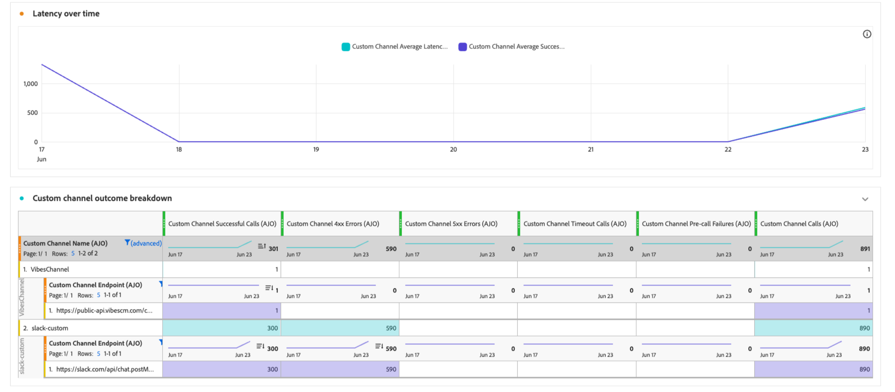

# カスタムチャネルの監視 {#monitor-custom-channel}

カスタムチャネルを作成してアクティブ化すると、[そのライフサイクルを管理](create-custom-channel.md#access-channel-builder)し、[!DNL Journey Optimizer] インターフェイスを通じて配信パフォーマンスを監視できます。

## キャンペーンとジャーニーのレポートの活用 {#reporting}

[!DNL Journey Optimizer]は、カスタムチャネル用のすぐに使用できるレポートを提供します。

ライブ （24時間）およびグローバル （CJA） レポートの両方で、カスタムチャネルに対して次の指標を使用できます。<!--TBC and add or replace with CJA link when available-->

| 指標 | 説明 |
|--------|-------------|
| **配信試行** | 外部エンドポイントに送信されたメッセージの合計数。 |
| **正常な配信** | エンドポイントがHTTP 2xx応答を返したメッセージ。 |
| **対象プロファイル** | 一意のプロファイルの数に達しました。 |
| **クリック数** | ペイロードで追跡されたリンククリック数。 カスタムチャネルにデリゲートされたサブドメインが必要です。 |
| **エラー/失敗** | 失敗した配信の試行回数（エラーの理由による内訳）。 |

[ ライブレポート ](../reports/live-report.md)および[ グローバルレポート ](../reports/report-gs-cja.md)の詳細をご覧ください。 レポート機能について詳しくは、[このドキュメント ](../reports/report-cja-manage.md)を参照してください。

<!--
### Journey reports {#journey-reports}

To view delivery data for a custom channel action in a journey:

1. Open the journey from the **[!UICONTROL Journeys]** list.
1. Click **[!UICONTROL View report]** in the top-right area.
   * **[!UICONTROL Live report]** – Data for the last 24 hours.
   * **[!UICONTROL All time]** – Full lifetime data via Customer Journey Analytics (CJA).

### Campaign reports {#campaign-reports}

To view delivery data for a custom channel campaign:

1. Open the campaign from the **[!UICONTROL Campaigns]** list.
1. Click **[!UICONTROL Reports]** in the top-right area.

The campaign report includes execution count, successful deliveries, errors, and click data (if link tracking is enabled).
-->

## 配信パフォーマンスの監視 {#monitoring}

[!DNL Journey Optimizer]には、キャンペーンとジャーニーレポートに加えて、専用のカスタムチャネル監視ダッシュボードが用意されています。 **[!UICONTROL 管理]** > **[!UICONTROL チャネル]** > **[!UICONTROL チャネルビルダー]** > **[!UICONTROL カスタムチャネル監視]**&#x200B;からアクセスできます。

{width="100%"}

このダッシュボードでは、カスタムチャネルメッセージを配信する際に、[!DNL Journey Optimizer]が外部エンドポイントに対して行うAPI呼び出しの信頼性とパフォーマンスを監視できます。 統合の問題、待ち時間、スロットリングの制限をすばやく特定するために使用します。

**[!UICONTROL カスタムチャネル監視]** ダッシュボードは、[!DNL Journey Optimizer]の他の常時レポートと同様に機能します。 時間範囲を選択し、チャネルまたはエンドポイントでフィルタリングし、ドリルダウンして、各カスタムチャネルに依存するキャンペーンとジャーニーを確認できます。 [詳細情報](../reports/report-cja-manage.md)

### カスタムチャネル指標 {#monitoring-kpis}

「**[!UICONTROL カスタムチャネル指標]**」セクションでは、カスタムチャネル呼び出しの運用上の健全性と信頼性の統合ビューを提供します。

{width="100%"}

+++ カスタムチャネル指標の詳細

* **[!UICONTROL 成功した呼び出し]**：エラーなしで有効な応答を返した HTTP 呼び出しの合計数。

* **[!UICONTROL 4xx／5xxエラー]**：クライアントサイド（4xx）またはサーバーサイド（5xx）のエラーにより失敗した呼び出しの数。設定の問題またはエンドポイントのエラーがハイライト表示されます。

* **[!UICONTROL タイムアウト呼び出し]**：最大応答時間を超えたために失敗した呼び出しの数。 これは、外部エンドポイントの待ち時間やパフォーマンスの問題を明らかにするのに役立ちます。

* **[!UICONTROL 事前呼び出しエラー]**:HTTP呼び出しが外部エンドポイントに行われるまでに失敗したカスタムチャネル送信の数。 これらのエラーは、外部システムではなく、[!DNL Journey Optimizer]独自のインフラストラクチャ層で発生します。 3つのカテゴリがあります。

  | カテゴリ | 説明 |
  |----------|-------------|
  | **認証エラー** （`AUTH_*`） | [!DNL Journey Optimizer]は、エンドポイントの呼び出しに必要なOAuth トークンまたは資格情報を取得または更新できませんでした。 チャネル設定にリンクされているAPI資格情報が有効で、有効期限が切れていないことを確認します。 |
  | **リクエスト生成エラー** （`REQUEST_GENERATION_ERROR`） | [!DNL Journey Optimizer]は、有効なHTTP リクエストを作成できませんでした。例えば、URL テンプレートを解決できなかったか、必須のパーソナライゼーションフィールドが見つからなかったなどです。 |
  | **HTTP解析エラー** （`HTTP_PARSE_ERROR`） | [!DNL Journey Optimizer]はエンドポイントから応答を受け取りましたが、それを使用可能な構造に解析できませんでした。 |

  >[!TIP]
  >
  >事前呼び出しエラーは、外部エンドポイントの問題ではなく、[!DNL Journey Optimizer]側またはチャネル設定の問題を示します。 API資格情報と必須ペイロードフィールドを確認して、トラブルシューティングを開始します。

* **[!UICONTROL 平均待ち時間]**：すべてのHTTP呼び出しに対するエンドツーエンドの平均応答時間（ミリ秒単位）です。これには、成功した呼び出し、エラー、タイムアウトが含まれます。

<!--
* **[!UICONTROL Capped calls]**: Number of calls that were blocked due to capping limits, ensuring downstream systems are not overloaded.

* **[!UICONTROL Average RPS]**: Number of requests per second processed by the custom channel over the selected time range.

* **[!UICONTROL Average successful latency]**: Average end-to-end response time (in milliseconds) for successful calls only, excluding failed requests and timeouts.

* **[!UICONTROL Average queue time]**: Average time (in milliseconds) calls spent waiting in the execution queue before being sent. This only applies to throttled endpoints, where [!DNL Journey Optimizer] queues calls when the throughput limit is reached.
-->

+++

### カスタムチャネルの長期的な成果 {#outcomes-overtime}

{width="100%"}

**[!UICONTROL カスタムチャネルの経時的な結果]** グラフは、選択した期間におけるHTTP呼び出しKPIの傾向を示しています。 時系列の精度は、選択した時間範囲によって異なります。

* 7日間のレポートの場合、各データポイントは1日のKPIを示します。
* 1日間の時間範囲の場合、グラフには1時間あたりのKPIが表示されます。
* 1時間の時間範囲の場合、グラフには1分あたりのKPIが表示されます。

### 時間の経過に伴う待ち時間 {#latency-overtime}

{width="100%"}

**[!UICONTROL 時間の遅延]** グラフは、選択した期間の遅延メトリックの傾向を視覚化します。 この時系列ビューでは、パフォーマンスパターンを追跡し、ピーク時の待ち時間を特定し、時間の経過に伴う最適化やシステムの変更の影響を監視することができます。

### カスタムチャネル結果の内訳 {#outcome-breakdown}

{width="100%"}

**[!UICONTROL カスタムチャネル成果分類]** テーブルは、HTTP呼び出し指標の階層的な内訳を提供します。上位レベルのエンドポイントごとの全体的な指標から、そのエンドポイントを使用するカスタムチャネルごとの指標、下位レベルでそれらを使用するキャンペーンやジャーニーに至るまで、HTTP呼び出し指標の階層的な内訳を示します。

### レイテンシの分類 {#latency-breakdown}

**[!UICONTROL レイテンシの内訳]** テーブルには、カスタムチャネル間のレイテンシ指標の詳細な内訳が表示されます。 このビューにより、パフォーマンスの問題が発生している特定のエンドポイントやチャネルを特定し、遅延のボトルネックを効果的に特定して対処できます。

### Insight Builder {#insight-builder}

**[!UICONTROL Insight Builder]**&#x200B;を使用して、カスタムチャネル指標に基づくカスタムビジュアライゼーションとダッシュボードを作成します。 このツールを利用することで、複数のKPIを組み合わせて、フィルターを適用し、モニタリングとレポートのニーズに合わせてカスタマイズされたビューを作成できます。 [詳細情報](../reports/report-cja-manage.md#insight-builder)

## トラブルシューティング {#troubleshooting}

カスタムチャネルで問題が発生した場合は、一般的な現象、考えられる原因、推奨される解決策を次の表に示します。

| 症状 | 考えられる原因 | 解決策 |
|---------|----------------|------------|
| **HTTP 401 / 403 エラー** | 認証エラー – 資格情報の有効期限が切れているか、正しくありません。 | **[!UICONTROL 管理]** / **[!UICONTROL チャネル]** / **[!UICONTROL API資格情報]**&#x200B;の資格情報を更新します。 |
| **HTTP 429 エラー** | 外部エンドポイントは[!DNL Journey Optimizer]からのリクエストをスロットリングしています。 | エンドポイントのレート制限を確認します。 Channel Builder ポリシー設定のスロットル設定を減らします。 |
| **HTTP 5xx エラー** | 外部システムがダウンしているか、サーバーエラーを返しています。 | 外部システムのヘルスダッシュボードを確認します。 ジャーニーアクションアクティビティでエラーパスを設定し、一時的なエラーを適切に処理します。 |
| **未解決のパーソナライズ トークン** | エクスプレッションは、プロファイルに存在しない属性を参照します。 | XDM属性のパスが正しいことを確認します。 デフォルト値フォールバックを追加します：`{{profile.person.name.firstName \| default("Valued Customer")}}`。 |
| **必須フィールド検証エラー** | 必要なペイロードフィールドは、オーサリング時に値がありません。 | すべての必須フィールドがコンテンツエディターに入力されていることを確認します。 または、フィールドが本当にオプションの場合は、チャネルビルダーで必要な制約を削除します。 |

<!--
## Related resources {#related}

* [Get started with custom channels](get-started-custom-channel.md)
* [Configure a custom channel](custom-channel-configuration.md)
* [Global report overview](../reports/report-gs-cja.md)
* [Journey live report](../reports/live-report.md
-->