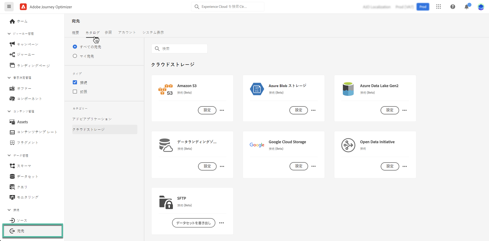
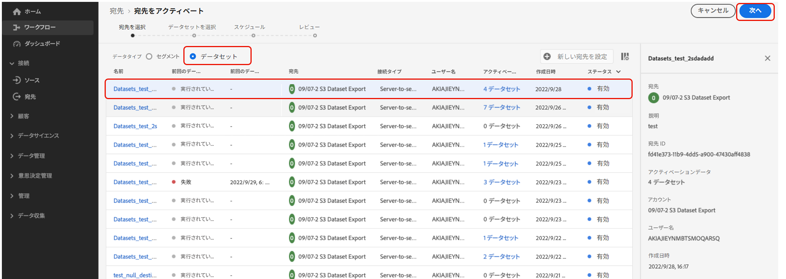
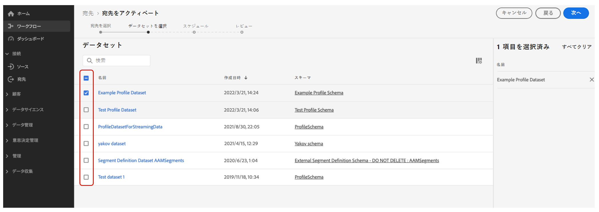

# クラウドストレージの場所へのデータセットの書き出し {#export-datasets}

Journey Optimizer では、データセットの内容を書き出すために、クラウドストレージの場所とのライブ接続を確立できます。

データを定期的に書き出すことで、顧客とのやり取りの完全で最新の記録を作成し、レポート、アーカイブ、データ分析の目的で容易に利用できるようにします。

## ご利用いただけるクラウドストレージの宛先 {#destinations}

「**[!UICONTROL カタログ]**」タブの&#x200B;**[!UICONTROL 宛先]**&#x200B;メニューからアクセスできる 6 つのクラウドストレージの宛先にデータセットを書き出すことができます。

各宛先について詳しくは、 Adobe Experience Platform のドキュメントを参照してください。

* [Amazon S3](https://experienceleague.adobe.com/docs/experience-platform/destinations/catalog/cloud-storage/amazon-s3.html?lang=ja)
* [Azure Blob](https://experienceleague.adobe.com/docs/experience-platform/destinations/catalog/cloud-storage/azure-blob.html?lang=ja)
* [Azure Data Lake Gen 2](https://experienceleague.adobe.com/docs/experience-platform/destinations/catalog/cloud-storage/adls-gen2.html?lang=ja)
* [Data Landing Zone](https://experienceleague.adobe.com/docs/experience-platform/destinations/catalog/cloud-storage/data-landing-zone.html?lang=ja)
* [Google Cloud Storage](https://experienceleague.adobe.com/docs/experience-platform/destinations/catalog/cloud-storage/google-cloud-storage.html?lang=ja)
* [SFTP](https://experienceleague.adobe.com/docs/experience-platform/destinations/catalog/cloud-storage/sftp.html?lang=ja)

## 書き出しに使用できるデータセット {#datasets}

以下の表から、書き出すJourney Optimizerデータセットについて理解します。

| データセット | 説明 |
| ------- | ------- | 
| AJO BCC フィードバックイベントデータセット | AJO BCC フィードバックイベントデータセット |
| AJO 分類データセット | 電子メールおよびプッシュアプリケーションのフィードバックイベントをJourney Optimizerから取り込むデータセット。 SDK を通じて作成されます。 |
| AJO 同意サービスデータセット | プロファイルの同意情報を保存します。 |
| AJO メールトラッキングエクスペリエンスイベントデータセット | E メールチャネルのインタラクションログ。レポートおよびオーディエンス作成の目的で使用されます。  |
| AJO エンティティデータセット | エンドユーザーに送信されるメッセージのエンティティメタデータを保存するデータセット。  |
| AJO 受信アクティビティイベントデータセット | 配信およびインタラクションイベント用のJourney Optimizer Web およびアプリ内チャネルのデータセット。 |
| AJO インタラクティブメッセージプロファイルデータセット | API トリガーキャンペーンをサポートするために作成されたプロファイルを保存します |
| AJO メッセージフィードバックイベントデータセット | メッセージ配信ログ。 レポートやオーディエンス作成を目的とした Journey Optimizer からのすべてのメッセージ配信に関する情報です。バウンスに関するメール ISP からのフィードバックも、このデータセットに記録されます。 |
| AJO プロファイルカウンター拡張機能 | counter_id でキー指定された counter_value と expiryDate を含むオブジェクトのマップを保持します。 |
| AJO プッシュプロファイルデータセット | プロファイルのプッシュトークンを格納します。 |
| AJO プッシュトラッキングエクスペリエンスイベントデータセット | レポートおよびオーディエンス作成の目的で使用されるプッシュチャネルのインタラクションログ。  |
| AJO サーフェスデータセット | Journey Optimizer Inbound Surfaces スキーマに関連する空のデータセット |
| AOutputForUPSDataset | UPS に書き戻す AO オーディエンスメンバーシップをすべて含む |
| Audience Orchestration プロファイルデータセット | オーディエンス構成オーディエンス用のオーディエンス構成によって生成されます。 すべてのオーディエンス構成オーディエンス、その属性、エンリッチメントデータを含みます |
| 判定オブジェクトリポジトリ — アクティビティ | ユーザーインターフェイスでは「決定」とも呼ばれます。 ただし、これらはユーザーが作成するオブジェクトで、決定ロジックを含むすべての構成要素をまとめたものです。例えば、考慮する必要のある特定の配置（場所）の場合（オファーコレクション）と、それらのオファーで使用するランキング方法。 |
| 判定オブジェクトリポジトリ — フォールバックオファー | これは、ユーザーが作成する他のタイプのオファーのリポジトリです。 具体的には、パーソナライズされたオファーを閲覧する資格がなく、何かを見る必要がある場合は、少なくともフォールバックオファーが表示されます。このデータセットには、このタイプのオファーの属性が含まれています |
| 決定オブジェクトリポジトリ — パーソナライズされたオファー | これは、ユーザーが作成するタイプのオファーのリポジトリです。 したがって、このデータセットには、このタイプのオファーに関する属性が含まれます | Ultimate |
| 決定オブジェクトリポジトリ — 配置 | これは、オファーを表示する場所を定義するオブジェクトのリポジトリです。 |
| ジャーニーステップイベント | Journey Optimizerから生成され、ジャーニーなどのサービスで使用されるすべてのレポートステップエクスペリエンスイベントをキャプチャします。 |
| ジャーニー | ジャーニーの各ステップの情報を格納するメタデータデータセット |
| ODE DecisionEvents - prod decisioning | リクエストに基づいて決定を下すたびに、それを決定イベントとしてカウントします |

## 前提条件 {#prerequisites}

データセットを書き出すには、 [アクセス制御権限](https://experienceleague.adobe.com/docs/experience-platform/access-control/home.html?lang=ja#permissions){target="_blank"} listed below. Read the [access control overview](https://experienceleague.adobe.com/docs/experience-platform/access-control/ui/overview.html?lang=ja){target="_blank"} または製品管理者に問い合わせて、必要な権限を取得してください。

| カテゴリ | 権限 |
|--|--|
| 宛先 | データセット宛先の管理とアクティブ化 |
| データ管理 | データセットの表示 |
| 宛先 | 宛先の表示 |

## データセットを書き出すための主な手順 {#main-steps}

データセットをクラウドストレージの場所に書き出す主な手順を以下に示します。

各手順の詳細については、 [Adobe Experience Platformドキュメント](https://experienceleague.adobe.com/docs/experience-platform/destinations/ui/activate/export-datasets.html?lang=ja){target="_blank"}.

1. **クラウドストレージの宛先を設定します**。まだ行っていない場合は、宛先カタログからクラウドストレージの宛先に接続します。で新しい宛先接続を作成する方法を説明します。 [Adobe Experience Platformドキュメント](https://experienceleague.adobe.com/docs/experience-platform/destinations/ui/connect-destination.html?lang=ja#setup){target="_blank"}.

   <!---->

1. データセットを書き出す&#x200B;**クラウドストレージの宛先を選択**&#x200B;します。宛先カタログで、目的のカードにある「**[!UICONTROL データセットを書き出し]**」ボタンをクリックし、使用する接続を選択します。

   <!---->

   >[!NOTE]
   >
   >Adobe Journey Optimizerをリアルタイム顧客プロファイルと共に使用している場合、宛先カードには **有効化** ボタンをクリックし、有効にした権限に応じて、データセットを書き出したり、この宛先のオーディエンスをアクティブ化したりできます。

1. 選択した宛先に書き出す&#x200B;**データセットを選択**&#x200B;します。[書き出しに使用できる Journey Optimizer データセットの詳細情報](#datasets)

   <!---->

1. データセットの&#x200B;**書き出しをスケジュール**&#x200B;します。書き出しを開始するタイミングと実行する頻度を指定します。

   <!---->

1. 設定の最後に表示される概要を確認して、**書き出しをレビューして確認**&#x200B;します。

   <!---->

書き出しが完了すると、設定したスケジュールに従って、データセットの内容がクラウドストレージの場所に保存されます。[データセットの書き出しが成功したことを確認する方法を説明します。](https://experienceleague.adobe.com/docs/experience-platform/destinations/ui/activate/export-datasets.html?lang=ja#verify){target="_blank"}.
