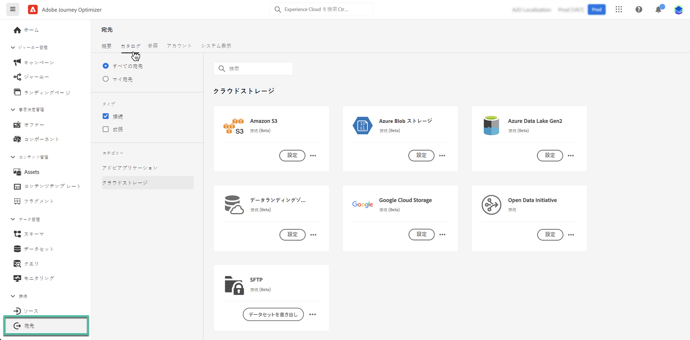
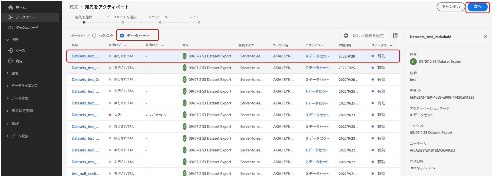
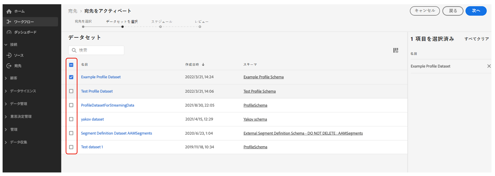
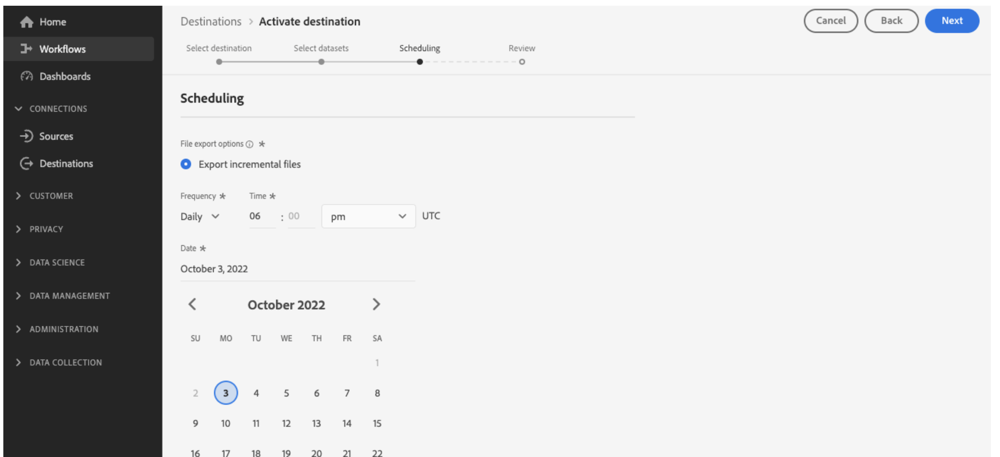
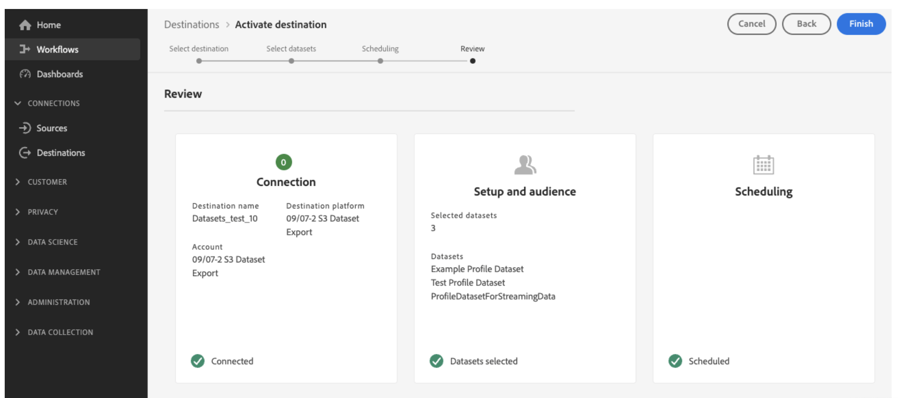

# クラウドストレージの場所へのデータセットのエクスポート {#export-datasets}

Journey Optimizer では、データセットの内容をエクスポートするために、クラウドストレージの場所とのライブ接続を確立できます。

データを定期的にエクスポートすることで、顧客とのやり取りの完全で最新の記録を作成し、レポート、アーカイブ、データ分析の目的で容易に利用できるようにします。

## ご利用いただけるクラウドストレージの宛先 {#destinations}

「**[!UICONTROL カタログ]**」タブの&#x200B;**[!UICONTROL 宛先]**&#x200B;メニューからアクセスできる 6 つのクラウドストレージの宛先にデータセットをエクスポートできます。

各宛先について詳しくは、Adobe Experience Platform のドキュメントを参照してください。

* [Amazon S3](https://experienceleague.adobe.com/docs/experience-platform/destinations/catalog/cloud-storage/amazon-s3.html?lang=ja){target="_blank"}
* [Azure Blob](https://experienceleague.adobe.com/docs/experience-platform/destinations/catalog/cloud-storage/azure-blob.html?lang=ja){target="_blank"}
* [Azure Data Lake Gen 2](https://experienceleague.adobe.com/docs/experience-platform/destinations/catalog/cloud-storage/adls-gen2.html?lang=ja){target="_blank"}
* [Data Landing Zone](https://experienceleague.adobe.com/docs/experience-platform/destinations/catalog/cloud-storage/data-landing-zone.html?lang=ja){target="_blank"}
* [Google Cloud Storage](https://experienceleague.adobe.com/docs/experience-platform/destinations/catalog/cloud-storage/google-cloud-storage.html?lang=ja){target="_blank"}
* [SFTP](https://experienceleague.adobe.com/docs/experience-platform/destinations/catalog/cloud-storage/sftp.html?lang=ja){target="_blank"}

## 前提条件 {#prerequisites}

データセットをエクスポートするには、以下に示す[アクセス制御権限](https://experienceleague.adobe.com/docs/experience-platform/access-control/home.html?lang=ja#permissions){target="_blank"}が必要です。 [アクセス制御の概要](https://experienceleague.adobe.com/docs/experience-platform/access-control/ui/overview.html?lang=ja){target="_blank"}を参照するか、製品管理者に問い合わせて必要な権限を取得してください。

| カテゴリ | 権限 |
|--|--|
| 宛先 | データセット宛先の管理とアクティブ化 |
| データ管理 | データセットの表示 |
| 宛先 | 宛先の表示 |

## データセットをエクスポートする主な手順 {#main-steps}

データセットをクラウドストレージの場所にエクスポートする主な手順を以下に示します。

各手順について詳しくは、[Adobe Experience Platform ドキュメント](https://experienceleague.adobe.com/docs/experience-platform/destinations/ui/activate/export-datasets.html?lang=ja){target="_blank"}を参照してください。

1. **クラウドストレージの宛先を設定します**。 まだ行っていない場合は、宛先カタログからクラウドストレージの宛先に接続します。 新規宛先接続を作成する方法について詳しくは、[Adobe Experience Platform ドキュメント](https://experienceleague.adobe.com/docs/experience-platform/destinations/ui/connect-destination.html?lang=ja#setup){target="_blank"}を参照してください。

   <!---->

1. データセットをエクスポートする&#x200B;**クラウドストレージの宛先を選択**&#x200B;します。 宛先カタログで、目的のカードにある「**[!UICONTROL データセットをエクスポート]**」ボタンをクリックし、使用する接続を選択します。

   <!---->

   >[!NOTE]
   >
   >Adobe Journey Optimizer をリアルタイム顧客プロファイルと共に使用している場合、宛先カードに&#x200B;**「アクティベート」**&#x200B;ボタンが表示され、有効にした権限に応じて、データセットのエクスポートとこの宛先に対するオーディエンスのアクティベートの両方が可能になります。

1. 選択した宛先にエクスポートする&#x200B;**データセットを選択**&#x200B;します。 [エクスポートに使用できる Journey Optimizer データセットについての詳細情報](#datasets)

   <!---->

1. データセットの&#x200B;**エクスポートをスケジュール**&#x200B;します。 エクスポートを開始するタイミングと実行する頻度を指定します。

   <!---->

1. 設定の最後に表示される概要を確認して、**エクスポートをレビューして確認**&#x200B;します。

   <!---->

エクスポートが完了すると、設定したスケジュールに従って、データセットの内容がクラウドストレージの場所に保存されます。 [データセットのエクスポートが成功したことを確認する方法の詳細情報](https://experienceleague.adobe.com/docs/experience-platform/destinations/ui/activate/export-datasets.html?lang=ja#verify){target="_blank"}

## エクスポートに使用できるデータセット {#datasets}

以下の表から、エクスポートする Journey Optimizer データセットについて理解します。

| データセット | 説明 |
| ------- | ------- |
| AJO 分類データセット | メールおよびプッシュアプリケーションのフィードバックイベントを Journey Optimizer から取り込むデータセット。 SDK を通じて作成。 |
| AJO 同意サービスデータセット | プロファイルの同意情報を保存。 |
| AJO メールトラッキングエクスペリエンスイベントデータセット | レポートやオーディエンス作成のために使用されるメールチャネルのインタラクションログ。  |
| AJO エンティティデータセット | エンドユーザーに送信されるメッセージのエンティティメタデータを保存するデータセット。  |
| AJO 受信アクティビティイベントデータセット | 配信およびインタラクションイベント用の Journey Optimizer web およびアプリ内チャネルのデータセット。 |
| AJO インタラクティブメッセージプロファイルデータセット | API トリガーのキャンペーンをサポートするために作成されたプロファイルを保存します |
| AJO メッセージフィードバックイベントデータセット | メッセージ配信ログ。 レポートやオーディエンス作成を目的とした Journey Optimizer からのすべてのメッセージ配信に関する情報です。 バウンスに関するメール ISP からのフィードバックも、このデータセットに記録されます。 このデータセットには、電子メール、SMS/RCS/MMS、ダイレクトメールなど、すべてのチャネルのイベントが含まれます。**このデータセットは、バッチ取り込みを使用します。データの遅延は最大2時間になると予想されます。** |
| AJO メッセージ書き出しデータセット | 送信された電子メールとSMS メッセージのコンテンツを保存します。これらのコンテンツは、書き出し用にマークされています。 データは、取り込みから7日間にわたって保持されます。 |
| AJO プロファイルカウンター拡張機能 | counter_id でキー指定された counter_value と expiryDate を含むオブジェクトのマップを保持します |
| AJO プッシュプロファイルデータセット | プロファイルのプッシュトークンを保存します。 |
| AJO プッシュトラッキングエクスペリエンスイベントデータセット | レポートやオーディエンス作成のために使用されるプッシュチャネルのインタラクションログ。  |
| セカンダリ受信者フィードバックイベントデータセット | BCC アーカイブが有効になっている場合は、BCC （セカンダリ受信者）イベントに電子メールを送信します。 クエリと、送信されたメールとの紐付けを行います。 |
| AJO サーフェスデータセット | Journey Optimizer Inbound Surfaces スキーマに関連する空のデータセット |
| AOOutputForUPSDataset | 統合プロファイルサービスに書き戻される AO オーディエンスメンバーシップをすべて含みます |
| オーディエンスオーケストレーションプロファイルデータセット | オーディエンス構成オーディエンス用のオーディエンス構成によって生成されます。 すべてのオーディエンス構成オーディエンス、その属性、エンリッチメントデータを含みます |
| 決定オブジェクトリポジトリ - アクティビティ | ユーザーインターフェイスでは「決定」とも呼ばれます。 ただし、これらはユーザーが作成するオブジェクトで、決定ロジックを含むすべての構成要素をまとめたものです。 例えば、特定のプレースメント（場所）について、考慮する必要があるオファー（オファーのコレクション）と、それらのオファーで使用するランキング方法などです。 |
| 決定オブジェクトリポジトリ - フォールバックオファー | これは、ユーザーが作成する、別のタイプのオファーのリポジトリです。 具体的には、パーソナライズされたオファーを閲覧する資格がなく、何かを見る必要がある場合でも、少なくともフォールバックオファーは表示されます。 このデータセットには、このタイプのオファーの属性が含まれます |
| 決定オブジェクトリポジトリ - パーソナライズされたオファー | ユーザーが作成するタイプのオファーのリポジトリ。 したがって、このデータセットには、このタイプのオファーに関する属性が含まれます。 |
| 決定オブジェクトリポジトリ - プレースメント | オファーを表示する場所を定義するオブジェクトのリポジトリ。 |
| エクスペリエンス決定オブジェクトリポジトリ - パーソナライズされたオファー項目 | クロスチャネルのパーソナライゼーションとレポートをサポートするために、あらゆる属性やライフサイクルステータスを含む、あらゆるオファー項目を保存します。  オファー項目スキーマに新しいカスタム属性フィールドを追加した後、これらの新しい属性がデータセットに表示されるまでに最大1時間の遅延が発生する場合があります。 潜在的なデータ損失や不整合を回避するために、新しく追加した属性に依存する変更や更新を行う前に、少なくとも 1 時間待機することをお勧めします。 |
| ジャーニーステップイベント | Journey Optimizer から生成され、レポートなどのサービスで使用されるすべてのジャーニーステップエクスペリエンスイベントをキャプチャします。 |
| ジャーニー | ジャーニーの各ステップの情報を格納するメタデータのデータセット |
| ODE DecisionEvents - 製品決定 | リクエストに基づいて決定を下すたびに、それを決定イベントとしてカウントします |