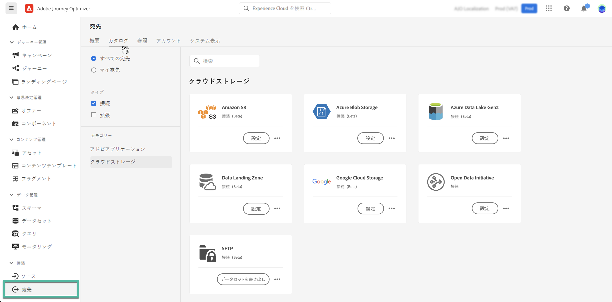

# クラウドストレージの場所にデータセットを書き出す {#export-datasets}

>[!AVAILABILITY]
>
>データセット書き出し機能は、現在ベータ版で、すべてのAdobe Journey Optimizerユーザーが利用できます。 アクセス権がない場合は、Adobe担当者に相談して、宛先へのアクセス権を取得してください。

Journey Optimizerでは、クラウドストレージの場所とのライブ接続を確立して、データセットの内容を書き出すことができます。

データを定期的にエクスポートすることで、顧客とのやり取りの完全で最新の記録を確保し、この情報をレポートや分析の目的で使用し、法的要件への準拠を維持できます。

## 使用可能なクラウドストレージの宛先 {#destinations}

データセットを、 **[!UICONTROL 宛先]** メニュー、 **[!UICONTROL カタログ]** タブをクリックします。

>[!AVAILABILITY]
>
>これらの宛先はすべてベータ版で利用でき、変更される場合があります。

各宛先に関する詳細については、 Adobe Experience Platformのドキュメントを参照してください。

* [Amazon S3](https://experienceleague.adobe.com/docs/experience-platform/destinations/catalog/cloud-storage/amazon-s3.html)
* [Azure Blob](https://experienceleague.adobe.com/docs/experience-platform/destinations/catalog/cloud-storage/azure-blob.html)
* [Azure Data Lake Gen 2](https://experienceleague.adobe.com/docs/experience-platform/destinations/catalog/cloud-storage/adls-gen2.html)
* [Data Landing Zone](https://experienceleague.adobe.com/docs/experience-platform/destinations/catalog/cloud-storage/data-landing-zone.html)
* [Google Cloud Storage](https://experienceleague.adobe.com/docs/experience-platform/destinations/catalog/cloud-storage/google-cloud-storage.html)
* [SFTP](https://experienceleague.adobe.com/docs/experience-platform/destinations/catalog/cloud-storage/sftp.html)

## 前提条件 {#prerequisites}

データセットの書き出しを開始する前に、次の前提条件を確認します。

* データセットを書き出すには、**宛先の管理**、**宛先の表示**、**宛先のアクティブ化**、**データセット宛先の管理とアクティブ化**&#x200B;の各[アクセス制御権限](https://experienceleague.adobe.com/docs/experience-platform/access-control/home.html#permissions)が必要です。 必要な権限を取得するには、[アクセス制御の概要](https://experienceleague.adobe.com/docs/experience-platform/access-control/ui/overview.html)を参照するか、製品管理者に問い合わせてください。

* この機能では、第 1 世代のデータ ( [Real-time Customer Data Platform製品説明](https://helpx.adobe.com/jp/legal/product-descriptions/real-time-customer-data-platform-b2c-edition-prime-and-ultimate-packages.html). 書き出すデータセットに、第 2 世代のデータが含まれていないことを確認してください。

## データセットを書き出す主な手順 {#main-steps}

データセットをクラウドストレージの場所に書き出す主な手順は次のとおりです。

各手順の詳細については、 Adobe Experience Platformのドキュメントを参照してください。 [クラウドストレージの宛先へのデータセットの書き出し](https://experienceleague.adobe.com/docs/experience-platform/destinations/ui/activate/export-datasets.html?lang=en).

1. **クラウドストレージの宛先の設定**. まだ接続していない場合は、宛先カタログからクラウドストレージの宛先に接続します。 [新しい宛先接続を作成する方法を説明します](https://experienceleague.adobe.com/docs/experience-platform/destinations/ui/connect-destination.html?lang=en#setup)

   <!---->

1. **クラウドストレージの宛先を選択** データセットを書き出す場所。 宛先カタログで、 **[!UICONTROL データセットを書き出し]** ボタンをクリックし、使用する接続を選択します。

   <!---->

   >[!NOTE]
   >
   >Adobe Journey Optimizerをリアルタイム顧客プロファイルと共に使用している場合、宛先カードには「アクティブ化」ボタンが表示され、有効にした権限に応じて、データセットの書き出しとこの宛先のセグメントのアクティブ化の両方が可能です。

1. **データセットを選択** を選択します。

   <!---->

1. **エクスポートのスケジュール** 」で指定します。 エクスポートを開始するタイミングと実行する頻度を指定します。

   <!---->

1. **エクスポートを確認して確定します** 設定の最後に表示される概要を確認する。

   <!---->

エクスポートが完了すると、設定したスケジュールに従って、データセットの内容がクラウドストレージの場所に保存されます。 [データセットの書き出しが成功したことを確認する方法を説明します。](https://experienceleague.adobe.com/docs/experience-platform/destinations/ui/activate/export-datasets.html#verify)
