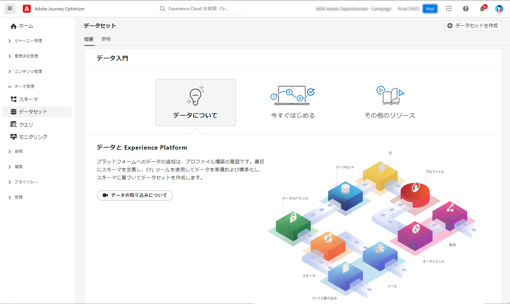
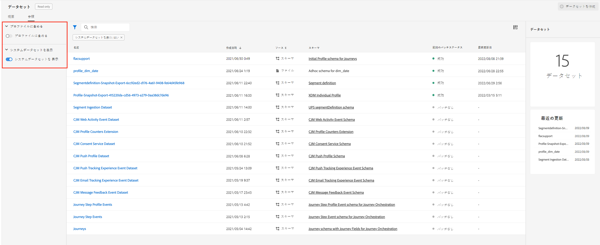
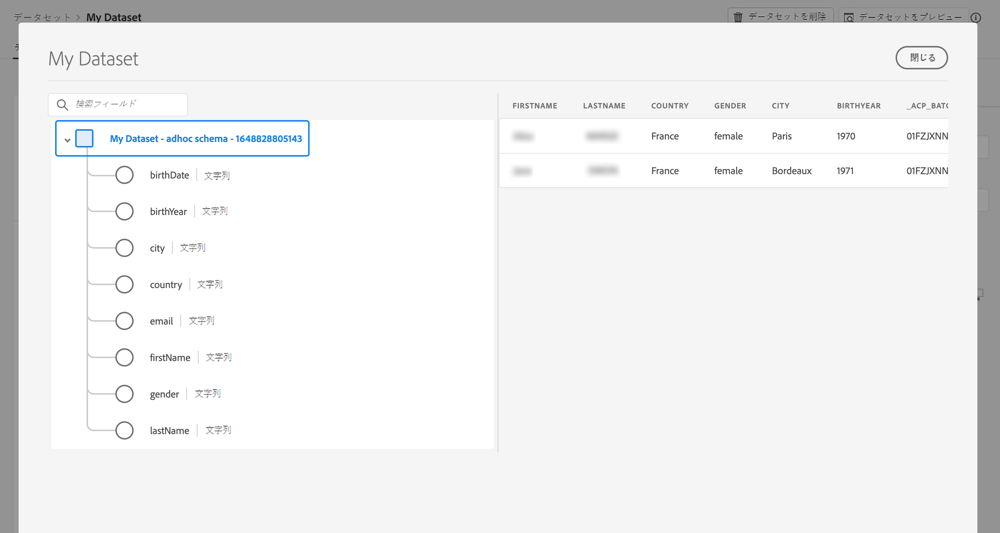

# データセットの基本を学ぶ {#datasets-gs}

Adobe Experience Platform に取り込まれたすべてのデータは、データレイク内にデータセットとして保持されます。データセットは、スキーマ（列）とフィールド（行）を含んだデータコレクション（通常はテーブル）のストレージおよび管理用の構成体です。

## データセットへのアクセス{#access-datasets}

[!DNL Adobe Journey Optimizer] ユーザーインターフェイスの&#x200B;**データセット**&#x200B;ワークスペースを使用すると、データの調査とデータセットの作成を行えます。

左側のナビゲーションで&#x200B;**データセット**&#x200B;を選択し、データセットダッシュボードを開きます。

[!DNL Adobe Experience Platform] にデータを追加することは、プロファイルを作成するための基盤となります。そうすれば、[!DNL Adobe Journey Optimizer] でプロファイルを活用できるようになります。まず、スキーマを定義し、ETL ツールを使用してデータを準備および標準化したあと、スキーマに基づいてデータセットを作成します。

「**参照**」タブを選択し、組織で使用可能なすべてのデータセットのリストを表示します。リストに表示された各データセットに関する詳細（名前、データセットが適用されるスキーマ、最新の取得実行のステータスなど）が表示されます。

デフォルトでは、取り込んだデータセットのみが表示されます。システム生成データセットを表示する場合は、フィルターの「**システムデータセットを表示**」切り替えスイッチをオンにします。

>[!NOTE]
>
>2024 年11月1日（PT）以降、ストリーミングセグメント化では、Journey Optimizer のトラッキングデータセットとフィードバックデータセットからの送信イベントとオープンイベントの使用をサポートしなくなります。さらに、2025年2月以降、Journey Optimizer システム生成データセットに対して、有効期間（TTL）ガードレールがロールアウトされます。[詳細情報](datasets-ttl.md)

データセットの名前を選択して、そのデータセットのアクティビティ画面にアクセスし、選択したデータセットの詳細を確認します。「アクティビティ」タブには、消費されるメッセージの割合を視覚化したグラフと、成功および失敗したバッチのリストが含まれます。

Adobe Journey Optimizer のシステムデータセットを以下に示します。

>[!CAUTION]
>
> システムデータセットは&#x200B;**変更できません**。製品が更新されるたびに、変更は自動的に元に戻されます。

**レポート**

* _レポート - メッセージフィードバックイベントデータセット_：メッセージ配信ログ。 レポートやオーディエンス作成を目的とした Journey Optimizer からのすべてのメッセージ配信に関する情報です。バウンスに関するメール ISP からのフィードバックも、このデータセットに記録されます。
* _レポート - メールトラッキングエクスペリエンスイベントデータセット_：レポートやオーディエンス作成のために使用されるメールチャネルのインタラクションログ。エンドユーザーがメールで実行したアクション（開封やクリックなど）に関する情報が保存されます。
* _レポート - プッシュトラッキングエクスペリエンスイベントデータセット_：レポートやオーディエンス作成のために使用されるプッシュチャネルのインタラクションログ。プッシュ通知時にエンドユーザーが実行したアクションに関する情報が保存されます。
* _レポート - ジャーニーステップイベント_：Journey Optimizer から生成され、レポーティングなどのサービスで使用されるすべてのジャーニーステップエクスペリエンスイベントをキャプチャします。また、YoY 分析用に Customer Journey Analytics でレポートを作成する場合にも重要です。ジャーニーメタデータに関連付けます。
* _レポート - ジャーニー_：ジャーニーの各ステップの情報を格納するメタデータのデータセット。
* _レポート - BCC_：BCC メールの配信ログを保存するフィードバックイベントのデータセット。レポート目的で使用されます。

**同意**

* _同意サービスデータセット_：プロファイルの同意情報を保存します。

**インテリジェントサービス**

* _送信時間の最適化スコア／エンゲージメントスコア_：ジャーニー AI の出力スコア。

各スキーマのフィールドと属性の完全なリストを表示するには、[Journey Optimizer スキーマ辞書](https://experienceleague.adobe.com/tools/ajo-schemas/schema-dictionary.html?lang=ja){target="_blank"}を参照してください。

## データセットをプレビュー{#preview-datasets}

データセットアクティビティ画面で、画面の右上隅付近の「**データセットをプレビュー**」を選択し、このデータセットで成功した最新のバッチをプレビューします。データセットが空の場合、プレビューリンクは非アクティブになります。

## データセットの作成{#create-datasets}

新しいデータセットを作成するには、まず、データセットダッシュボードの「**データセットを作成**」を選択します。

実行できる操作は、次のとおりです。

* スキーマからのデータセットの作成。[詳しくは、このドキュメントを参照してください](https://experienceleague.adobe.com/docs/experience-platform/catalog/datasets/user-guide.html?lang=ja#schema)。{target="_blank"}
* CSV ファイルからのデータセットを作成します。[詳しくは、このドキュメントを参照してください](https://experienceleague.adobe.com/docs/experience-platform/ingestion/tutorials/map-a-csv-file.html?lang=ja)。{target="_blank"}

データセットの作成、スキーマへのマッピング、データの追加、データの取り込み確認の方法についてこのビデオで説明しています。

>[!VIDEO](https://video.tv.adobe.com/v/334293?quality=12)

## データガバナンス

データセットで、「**データガバナンス**」タブを参照し、データセットレベルとフィールドレベルでラベルを確認します。データガバナンスは、適用されるポリシーのタイプに従ってデータを分類します。

[!DNL Adobe Experience Platform] の主な機能の 1 つは、複数の企業システムのデータを統合して、マーケターが顧客を識別かつ理解し、惹きつけられるようにすることです。このデータは、組織または法規制によって定義された使用制限の対象となる場合があります。したがって、データ操作が、データ使用ポリシーを確実に準拠できるようにすることが重要です。

 [!DNL Adobe Experience Platform Data Governance] を使用すると、顧客データを管理し、データの使用に適用される規制、制限、ポリシーへのコンプライアンスを確保できます。Experience Platform 内の様々なレベルで重要な役割を果たします（例えば、カタログ化、データ系列、データ使用ポリシー、マーケティングアクションのデータに関するアクセス制御など）。

データガバナンスとデータ使用ラベルについて詳しくは、[データガバナンスドキュメント](https://experienceleague.adobe.com/docs/experience-platform/data-governance/labels/user-guide.html?lang=ja){target="_blank"}を参照してください

## サンプルとユースケース{#uc-datasets}

スキーマとデータセットを作成し、データを取り込んで、Adobe Journey Optimizer にテストプロファイルを追加する方法について、[このエンドツーエンドのサンプル](../audience/creating-test-profiles.md)で説明します。

データセットの作成について詳しくは、[Adobe Experience Platform ドキュメント](https://experienceleague.adobe.com/docs/experience-platform/catalog/datasets/overview.html?lang=ja){target="_blank"}を参照してください。

データセット UI の使用方法については、[データ取り込みの概要ドキュメント](https://experienceleague.adobe.com/docs/experience-platform/ingestion/home.html?lang=ja){target="_blank"}を参照してください。

クエリの例を含むユースケースのリストは、[こちら](../data/datasets-query-examples.md)から入手できます。

>[!MORELIKETHIS]
>
>* [ストリーミングインジェストの概要](https://experienceleague.adobe.com/docs/experience-platform/ingestion/streaming/overview.html?lang=ja){target="_blank"}
>* [Adobe Experience Platform へのデータの取得](https://experienceleague.adobe.com/docs/experience-platform/ingestion/tutorials/ingest-batch-data.html?lang=ja){target="_blank"}
