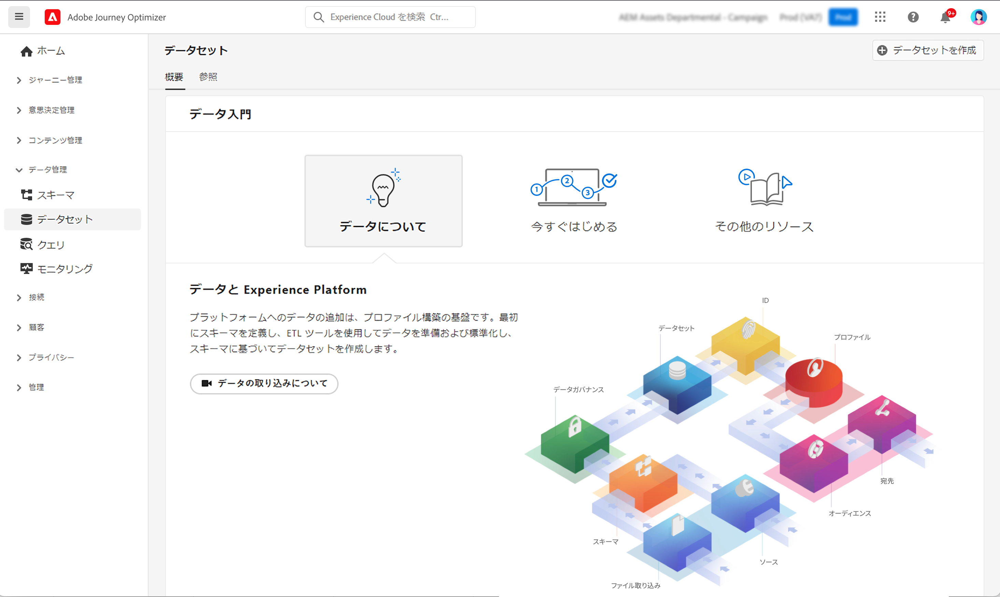
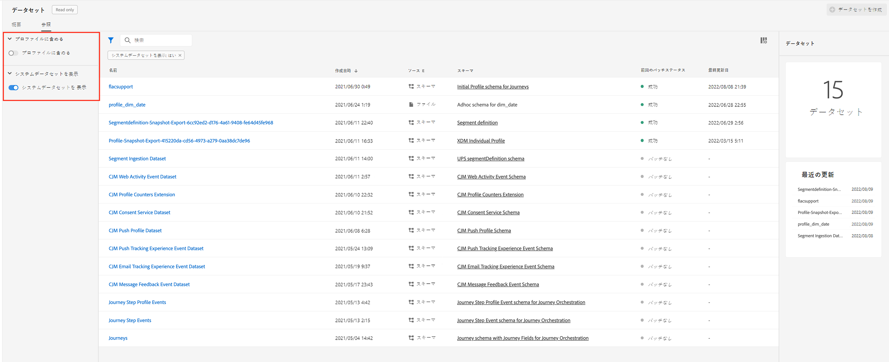
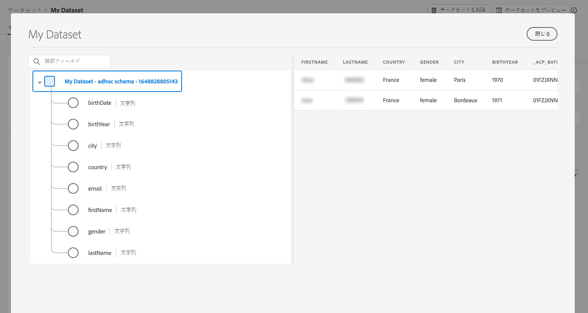

# データセットの基本を学ぶ {#datasets-gs}

>[!BEGINSHADEBOX]

**このページ：** Adobe Journey Optimizerでジャーニー、キャンペーン、レポートを強化するデータを保存して調べることができるように、Adobe Experience Platform データセットにアクセスし、作成および管理する方法を説明します。

>[!ENDSHADEBOX]

Adobe Experience Platform に取り込まれたすべてのデータは、データレイク内にデータセットとして保持されます。 データセットは、スキーマ（列）とフィールド（行）を含んだデータコレクション（通常はテーブル）のストレージおよび管理用の構成体です。

## ガードレールと制限

* 2024年11月1日（PT）以降、ストリーミングセグメント化では、[!DNL Journey Optimizer] のトラッキングデータセットとフィードバックデータセットからの送信イベントと開封イベントがサポートされなくなります。 フリークエンシーキャップや疲労管理を実装する場合は、代わりにビジネスルールを使用してください。 詳しくは、[この節](../conflict-prioritization/rule-sets.md)を参照してください。毎日のキャップに関するユースケースの説明などについて詳しくは、[こちら](https://experienceleaguecommunities.adobe.com/t5/journey-optimizer-blogs/elevate-customer-experience-with-daily-frequency-capping-in-ajo/ba-p/761510?profile.language=ja){target="_blank"}を参照してください。

* 2025年2月以降、Journey Optimizer システム生成データセットに対して、有効期間（TTL）ガードレールがロールアウトされます。 [詳細情報](datasets-ttl.md)

## データセットへのアクセス {#access}

[!DNL Adobe Journey Optimizer] ユーザーインターフェイスの&#x200B;**データセット**&#x200B;ワークスペースを使用すると、データの調査とデータセットの作成ができます。 データセットダッシュボードを開くには、左側のナビゲーションで「**データセット**」を選択します。

「**参照**」タブを選択し、組織で使用可能なすべてのデータセットのリストを表示します。 リストに表示された各データセットに関する詳細（名前、データセットが適用されるスキーマ、最新の取り込み実行のステータスなど）が表示されます。 デフォルトでは、取り込んだデータセットのみが表示されます。 システム生成データセットを表示する場合は、フィルターの「**システムデータセットを表示**」切替スイッチをオンに切り替えます。

データセットの名前を選択して、そのデータセットのアクティビティ画面にアクセスし、選択したデータセットの詳細を確認します。 「アクティビティ」タブには、消費されるメッセージの割合を視覚化したグラフと、成功および失敗したバッチのリストが含まれます。

データセットをプレビューするには、画面の右上隅付近の「**データセットをプレビュー**」を選択し、このデータセットで成功した最新のバッチをプレビューします。 データセットが空の場合、プレビューリンクは非アクティブになります。

## [!DNL Journey Optimizer] システムデータセット {#system-datasets}

この節では、[!DNL Journey Optimizer] で使用されるシステムデータセットの一覧を示します。 各スキーマのフィールドと属性の完全なリストを表示するには、[Journey Optimizer スキーマ辞書](https://experienceleague.adobe.com/tools/ajo-schemas/schema-dictionary.html?lang=ja){target="_blank"}を参照してください。

>[!CAUTION]
>
> システムデータセットは&#x200B;**変更できません**。 製品が更新されるたびに、変更は自動的に元に戻されます。

* レポート

   * _レポート - メッセージフィードバックイベントデータセット_：メッセージ配信ログ。 レポートやオーディエンス作成を目的とした Journey Optimizer からのすべてのメッセージ配信に関する情報です。 バウンスに関するメール ISP からのフィードバックも、このデータセットに記録されます。 **このデータセットでは、バッチ取り込みが使用されています。最大2時間のデータ待ち時間が必要です。**
   * _レポート – メールトラッキングエクスペリエンスイベントデータセット_: メールチャネルのインタラクションログと、`whatsAppChannelContext` フィールドグループの下のWhatsApp チャネルコンテキストデータ。 レポートとオーディエンスの作成に使用されます。 保存される情報には、電子メールでエンドユーザーが実行したアクション（開封数、クリック数など）が含まれます。 WhatsAppとのやり取り。
   * _レポート - プッシュトラッキングエクスペリエンスイベントデータセット_：レポートやオーディエンス作成のために使用されるプッシュチャネルのインタラクションログ。 プッシュ通知時にエンドユーザーが実行したアクションに関する情報が保存されます。
   * _レポート - ジャーニーステップイベント_：Journey Optimizer から生成され、レポーティングなどのサービスで使用されるすべてのジャーニーステップエクスペリエンスイベントをキャプチャします。 また、YoY 分析用に Customer Journey Analytics でレポートを作成する場合にも重要です。 ジャーニーメタデータに関連付けます。
   * _レポート - ジャーニー_：ジャーニーの各ステップの情報を格納するメタデータのデータセット。
   * _レポート - BCC_：BCC メールの配信ログを保存するフィードバックイベントのデータセット。 レポート目的で使用されます。

* 同意

  _同意サービスデータセット_：プロファイルの同意情報を保存します。

* メッセージのエクスポート

  _AJO メッセージエクスポートデータセット_：エクスポート用に送信されたメールと SMS メッセージのコンテンツを保存します。 レコードは、取り込みから 7 日間保持されます。 メッセージのエクスポートのアドオンを購入した組織でのみ使用できます。 [詳細情報](../configuration/message-export.md)

* インテリジェントサービス

  _送信時間の最適化スコア／エンゲージメントスコア_：ジャーニー AI の出力スコア。

* インバウンド

  _AJO Inbound Activity Event Dataset_: [!DNL Journey Optimizer]で受信した着信メッセージのインバウンドアクティビティイベントを保存します。

>[!NOTE]
>
>受信メッセージがこのデータセットに取り込まれる前に、プロファイルに[!DNL Journey Optimizer]から送信されたメッセージが少なくとも1つ必要です。

## データセットの作成{#create-datasets}

[!DNL Adobe Experience Platform] にデータを追加することは、プロファイルを作成するための基盤となります。 そうすれば、[!DNL Adobe Journey Optimizer] でプロファイルを活用できるようになります。 まず、スキーマを定義し、ETL ツールを使用してデータを準備および標準化したあと、スキーマに基づいてデータセットを作成します。

スキーマまたは CSV ファイルからデータセットを作成できます。 データセットの作成方法について詳しくは、次の [!DNL Adobe Experience Platform] ドキュメントを参照してください。

* [既存スキーマからのデータセットの作成](https://experienceleague.adobe.com/ja/docs/experience-platform/catalog/datasets/user-guide#schema){target="_blank"}
* [既存の XDM スキーマへの CSV ファイルのマッピング](https://experienceleague.adobe.com/ja/docs/experience-platform/ingestion/tutorials/map-csv/existing-schema){target="_blank"}

このビデオでは、データセットの作成、スキーマへのマッピング、データの追加、データの取り込み確認の方法について説明しています。

>[!VIDEO](https://video.tv.adobe.com/v/3416782?captions=jpn&quality=12)

## データガバナンス

データセットで、「**データガバナンス**」タブを参照し、データセットレベルとフィールドレベルでラベルを確認します。 データガバナンスは、適用されるポリシーのタイプに従ってデータを分類します。

[!DNL Adobe Experience Platform] の主な機能の 1 つは、複数の企業システムのデータを統合して、マーケターが顧客を識別かつ理解し、惹きつけられるようにすることです。 このデータは、組織または法規制によって定義された使用制限の対象となる場合があります。 したがって、データ操作が、データ使用ポリシーを確実に準拠できるようにすることが重要です。

[!DNL Adobe Experience Platform Data Governance] を使用すると、顧客データを管理し、データの使用に適用される規制、制限、ポリシーへのコンプライアンスを確保できます。 Experience Platform 内の様々なレベルで重要な役割を果たします（例えば、カタログ化、データ系列、データ使用ポリシー、マーケティングアクションのデータに関するアクセス制御など）。

データガバナンスとデータ使用ラベルについて詳しくは、[データガバナンスドキュメント](https://experienceleague.adobe.com/docs/experience-platform/data-governance/labels/user-guide.html?lang=ja){target="_blank"}を参照してください

## サンプルとユースケース {#samples}

* [チュートリアル - Adobe Experience Platform へのデータの取り込み](https://experienceleague.adobe.com/docs/experience-platform/ingestion/tutorials/ingest-batch-data.html?lang=ja){target="_blank"}
* [エンドツーエンドのユースケース](../audience/creating-test-profiles.md) - スキーマ、データセットの作成とデータの取り込みによる [!DNL Adobe Journey Optimizer] へのテストプロファイルの追加
* [クエリ例](../data/datasets-query-examples.md) - [!DNL Adobe Journey Optimizer] データセットと関連するユースケース。

>[!MORELIKETHIS]
>
>* [Journey Optimizer におけるデータ管理の基本を学ぶ](gs-data.md)
>* [データセットのドキュメント](https://experienceleague.adobe.com/docs/experience-platform/catalog/datasets/overview.html?lang=ja){target="_blank"}
>* [データ取り込みのドキュメント](https://experienceleague.adobe.com/docs/experience-platform/ingestion/home.html?lang=ja){target="_blank"}
>* [データ管理ライセンス使用権限のベストプラクティス](https://experienceleague.adobe.com/ja/docs/experience-platform/landing/license/data-management-best-practices#data-management-best-practices){target="_blank"}
