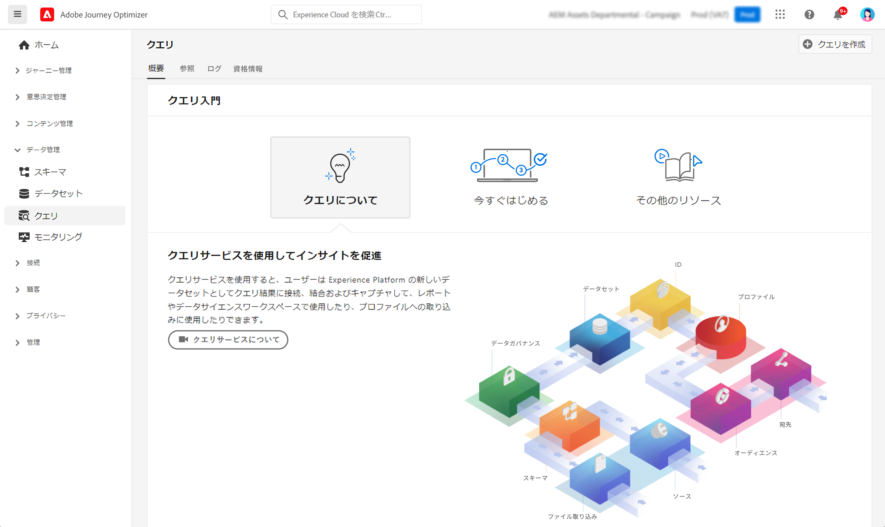

# クエリの基本を学ぶ {#queries-gs}

クエリエディターは、Adobe Experience Platform クエリサービスから提供されるインタラクティブなツールで、これを使用すれば、[!DNL Adobe Journey Optimizer] ユーザーインターフェイス内で顧客体験データのクエリを記述、検証および実行できます。

クエリエディターでは、分析およびデータ調査のためのクエリを作成できます。また、開発目的でインタラクティブクエリを実行できるほか、非インタラクティブクエリを実行して[データセット](get-started-datasets.md)に入力することもできます。

でのクエリエディターの使用方法を説明します。 [このドキュメント](https://experienceleague.adobe.com/docs/experience-platform/query/ui/user-guide.html?lang=ja){target="_blank"}.

**関連トピック**

* [クエリサービスドキュメント](https://experienceleague.adobe.com/docs/experience-platform/query/home.html?lang=ja){target="_blank"}
* [クエリサービスの概要ビデオ](https://experienceleague.adobe.com/docs/platform-learn/tutorials/queries/understanding-query-service.html?lang=ja){target="_blank"}
