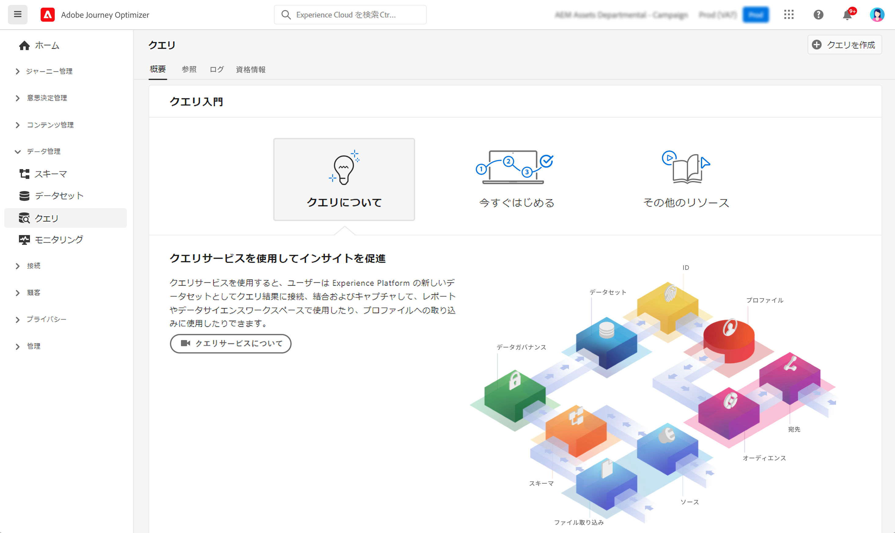

# クエリの基本を学ぶ {#queries-gs}

>[!BEGINSHADEBOX]

**このページ：** Adobe Experience Platform Query Serviceを搭載したクエリ エディターを使用して、Adobe Journey Optimizer内で分析とデータ探索のために顧客体験データに対するクエリを作成、検証、実行できます。

>[!ENDSHADEBOX]

クエリエディターは、Adobe Experience Platform クエリサービスから提供されるインタラクティブなツールで、これを使用すれば、[!DNL Adobe Journey Optimizer] ユーザーインターフェイス内で顧客体験データのクエリを記述、検証および実行できます。

クエリエディターでは、分析およびデータ調査のためのクエリを作成できます。また、開発目的でインタラクティブクエリを実行できるほか、非インタラクティブクエリを実行して[データセット](get-started-datasets.md)に入力することもできます。

クエリエディターの使用方法について詳しくは、[このドキュメント](https://experienceleague.adobe.com/docs/experience-platform/query/ui/user-guide.html?lang=ja){target="_blank"}を参照してください。

>[!MORELIKETHIS]
>
>* [クエリサービスのドキュメント](https://experienceleague.adobe.com/docs/experience-platform/query/home.html?lang=ja){target="_blank"}
>* [クエリサービスの概要動画](https://experienceleague.adobe.com/docs/platform-learn/tutorials/queries/understanding-query-service.html?lang=ja){target="_blank"}
