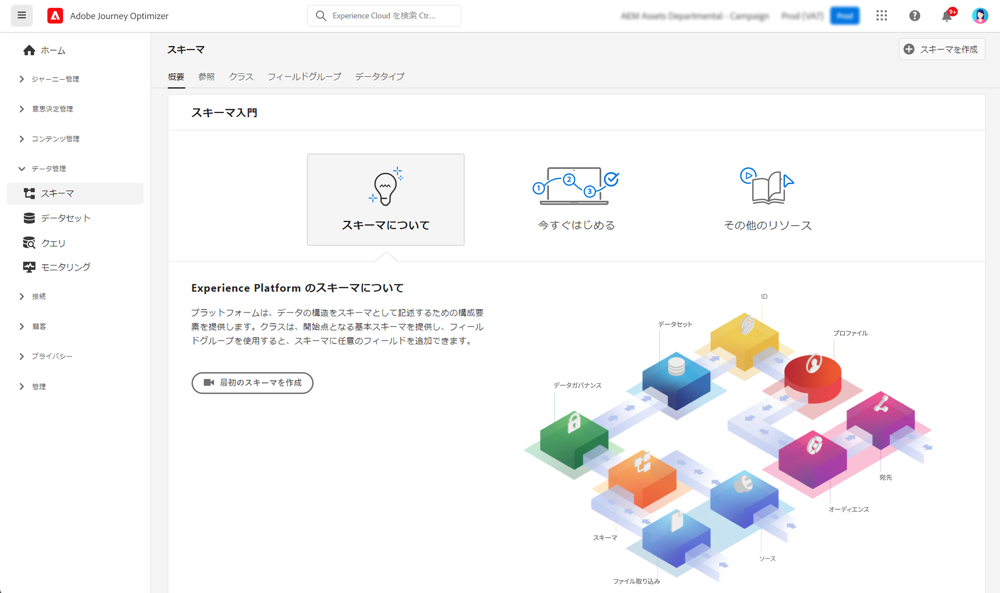

# スキーマの基本を学ぶ {#schemas-gs}

スキーマは Experience Platform での標準的なデータ記述方法で、スキーマに適合するすべてのデータを組織間で競合なく再利用可能にし、さらに複数の組織間で共有できるようになります。

➡️[ このビデオでスキーマの作成および設定方法を説明します ](#video-schema) （ビデオ）

スキーマは、データの構造と形式を表現し検証する一連のルールです。スキーマは、概要レベルで実世界のオブジェクト（人など）の抽象的な定義を提供し、そのオブジェクトの各インスタンスに含めるデータ（名、姓、生年月日など）の概要を示します。

スキーマの作成方法については、[ このドキュメント ](https://experienceleague.adobe.com/docs/experience-platform/xdm/schema/composition.html?lang=ja){target="_blank"} を参照してください。

[!DNL Adobe Journey Optimizer] ユーザーインターフェイスの&#x200B;**スキーマ**&#x200B;ワークスペースを使用すると、スキーマ、クラス、スキーマフィールドグループ、データタイプなどの Experience Data Model（XDM）リソースを管理できます。アドビから提供されるコアリソースを表示および調査し、組織のカスタムリソースおよびスキーマを作成できます。

スキーマユーザーインターフェイスの使用方法については、[ このドキュメント ](https://experienceleague.adobe.com/docs/experience-platform/xdm/ui/overview.html?lang=ja){target="_blank"} を参照してください

スキーマエディターを使用してスキーマを作成する手順については、[Adobe Experience Platform ドキュメント ](https://experienceleague.adobe.com/docs/experience-platform/xdm/tutorials/create-schema-ui.html?lang=ja){target="_blank"} を参照してください。

各スキーマのフィールドと属性の完全なリストを表示するには [&#128279;](https://experienceleague.adobe.com/tools/ajo-schemas/schema-dictionary.html?lang=ja){target="_blank"}Journey Optimizer スキーマ辞書 &rbrace; を参照してください。

## チュートリアルビデオ{#video-schema}

スキーマの作成、フィールドグループの追加、カスタムフィールドグループの作成および設定の方法について説明します。

>[!VIDEO](https://video.tv.adobe.com/v/334461?quality=12)

>[!MORELIKETHIS]
>
>* [スキーマとデータセットの作成およびデータの取り込みによる Journey Optimizer へのテストプロファイルの追加](../audience/creating-test-profiles.md)
>* [XDM システムの概要](https://experienceleague.adobe.com/docs/experience-platform/xdm/home.html?lang=ja){target="_blank"}
>* [ データモデリングのベストプラクティス ](https://experienceleague.adobe.com/docs/experience-platform/xdm/schema/best-practices.html?lang=ja){target="_blank"}
>* [Schema Registry API を使用したスキーマの作成 ](https://experienceleague.adobe.com/docs/experience-platform/xdm/tutorials/create-schema-api.html?lang=ja){target="_blank"}
>* [ スキーマエディターを使用した 2 つのスキーマ間の関係の定義 ](https://experienceleague.adobe.com/docs/experience-platform/xdm/tutorials/relationship-ui.html?lang=ja){target="_blank"}
