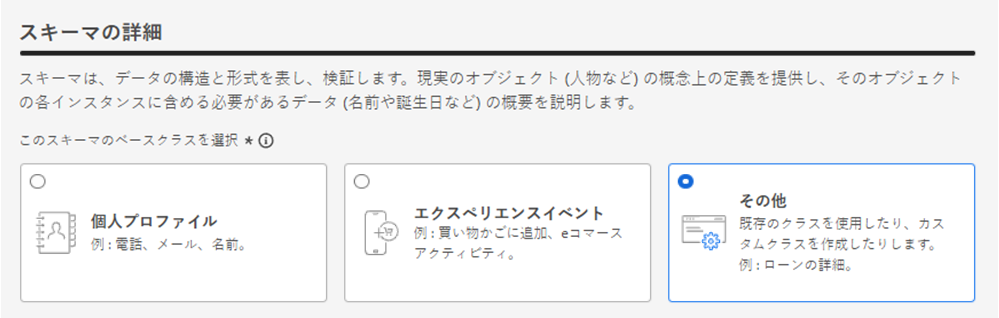
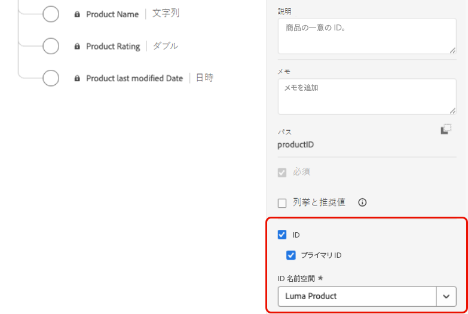
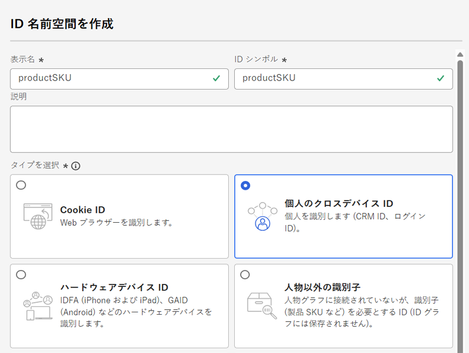
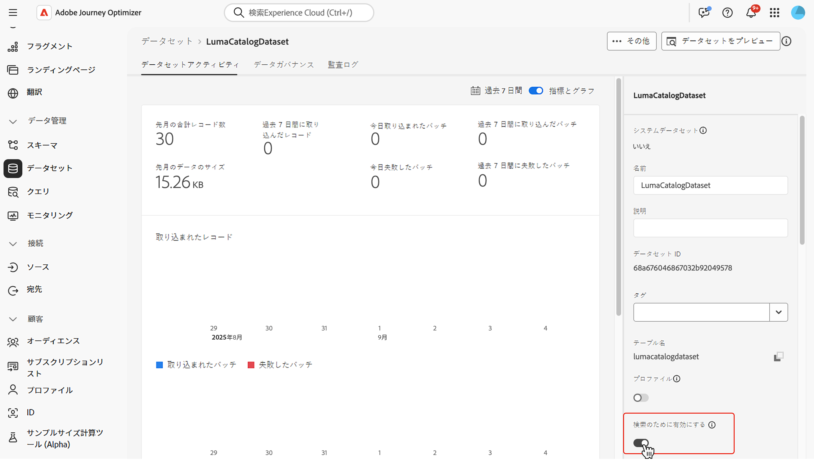
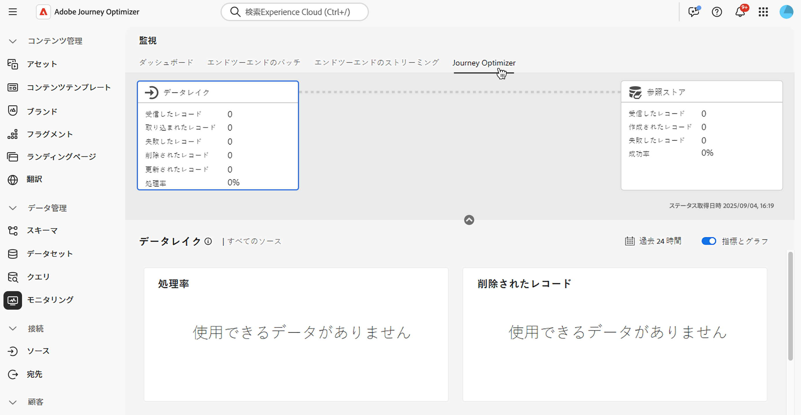

# Adobe Experience Platform データの使用 {#aep-data}

>[!CONTEXTUALHELP]
>id="lookup-aep-data"
>title="参照のために有効にする"
>abstract="データセットの参照を有効にすると、Journey Optimizer のパーソナライゼーション、決定、ジャーニーオーケストレーション機能内でそのデータを活用できます。"

Journey Optimizer を使用すると、パーソナライゼーション、決定、ジャーニーオーケストレーション機能を使用して、Adobe Experience Platform のデータを活用できます。これを行うには、まず、以下で説明するように、参照パーソナライゼーションに必要なレコードベースのデータセットを参照サービスに対して有効にする必要があります。

## 必読

### ガードレールとガイドライン {#guidelines}

開始する前に、次の制限事項とガイドラインを確認してください。

* **データセットに PII を含めない** - 参照が有効になっているデータセットに、個人を特定できる情報（PII）を含めることはできません。

* &#x200B;
   * **削除のリスク** - パーソナライゼーションで使用されるデータセットは、削除から保護されません。 どのデータセットが使用されているかを追跡して、削除されないようにする必要があります。

* **スキーマタイプ** - データセットは、プロファイルタイプまたはイベントタイプでは&#x200B;**ない**&#x200B;スキーマに関連付ける必要があります。

* **参照の切り替えをオンのままにする** - データセットを繰り返しオン/オフに切り替えないようにします。 繰り返し切り替えると、予期しないインデックス作成動作につながる可能性があります。 ベストプラクティスは、参照に使用する予定がある限り、データセットを有効のままにしておくことです。

* **データ削除のバッチ** - データセットからデータのバッチを削除すると、一致するすべてのキーがルックアップサービスから完全に削除されます。 例：

  **バッチ 1**：Sku1、Sku2、Sku3\
  **バッチ 2**：Sku1、Sku2、Sku3、Sku4、Sku5、Sku6\
  **バッチ 3**：Sku7、Sku8、Sku9、Sku10

  **バッチ 1** を削除すると、Sku1、Sku2、Sku3 が検索ストアから削除されます。結果として生成される参照データには、Sku4、Sku5、Sku6、Sku7、Sku8、Sku9、Sku10 が含まれます。

### 参照サービスの使用権限

| 機能コンポーネント | 制限 | メモ |
| ------- | ------- | ------- |
| 有効な参照データセット | 組織あたり最大 10 個 | 特定の時点で参照用に設定できるデータセットの最大数。この制限は、顧客インスタンス内の実稼動サンドボックスと開発サンドボックスの両方をまたいだ参照データセットの合計数に適用されます。 |
| データセットレコード数 | データセットあたり最大 200 万レコード | 単一のデータセットで許可されるレコードの最大数。そのデータセット内のすべてのバッチをまたいだ合計数として計算されます。 |
| レコードサイズ | レコードあたり最大 2 KB | デフォルトの最大レコードサイズがサポートされます。 |
| データセットサイズ | 最大 4 GB | サンドボックス内のすべてのデータセットの合計サイズではなく、個々のデータセットの最大サイズ。レコード数とデータセットのサイズ制限は、独立したガードレールで、両方とも満たす必要があります。 |
| データセット頻度の更新 | データセットあたり 1 日最大 5 回の更新 | 1 日あたり 1 つのデータセットに対して許可される更新操作の最大頻度。 |

>[!NOTE]
>
>上記のガードレールを超える追加のボリュームが必要な場合は、アドビ担当者にお問い合わせください。

## データ参照用データセットの有効化 {#enable}

データセットのデータをパーソナライゼーションに活用するには、参照用データセットを有効にする必要があります。

### 前提条件 {#prerequisites-enable}

参照を有効にするデータセットに関連付けられたスキーマは、レコードタイプにする必要があります。スキーマをプロファイルまたはイベントクラスにすることはできません。

+++例



+++

スキーマにはプライマリ ID が定義されている必要があります。

+++例



+++

カスタム名前空間がまだ定義されていない場合は、ID がユーザー以外の識別子であることを確認します。

+++例



+++

### データセット管理インターフェイスで参照用データセットを有効にする

データセット管理ユーザーインターフェイスで、切替スイッチを使用して、参照用データセットを有効にします。



>[!NOTE]
>
>データセットをプロファイルに対しても有効にしないことをお勧めします。有効にすると、プロファイルリッチネスが増加する可能性があり、参照の実行には必要なくなるからです。

### API メソッド

[このドキュメント](https://developer.adobe.com/journey-optimizer-apis/references/authentication/)で説明されている手順に従って、API コマンドを送信するように環境を設定します。

#### 前提条件

* 開発者プロジェクトには、Adobe Journey Optimizer と Adobe Experience Platform API がプロジェクトに追加されている必要があります。

  

* 役割の一部としてデータセットの管理権限が必要です。

* データセットの基となるスキーマには、参照キーとして機能するプライマリ ID が含まれている必要があります。

#### API 呼び出し構造

```shell
curl -s -XPATCH "https://platform.adobe.io/data/core/entity/lookup/dataSets/${DATASET_ID}/${ACTION}" \ -H "Authorization: Bearer ${ACCESS_TOKEN}" \ -H "x-api-key: ${API_KEY}" \ -H "x-gw-ims-org-id: ${IMS_ORG}" \ -H "x-sandbox-name: ${SANDBOX_NAME}" 
```

次のとおりです。

* URL は `https://platform.adobe.io/data/core/entity/lookup/dataSets/${DATASET_ID}/${ACTION}` です。
* データセット ID は、有効にするデータセットです。
* アクションは、有効または無効です。
* アクセストークンは、Developer Console から取得できます。
* API キーは、Developer Console から取得できます。
* IMS 組織 ID は Adobe 組織です。
* サンドボックス名は、データセットが含まれるサンドボックス名です（実稼動、開発など）。

>[!NOTE]
>
>データセットの有効化に API 呼び出しを試行した際に以下のエラーが発生した場合は、Developer Console プロジェクトから Adobe Journey Optimizer API を削除してから、再度追加します。
>
>`"error_code": "403003",`
>`"message": "Api Key is invalid"`

## データセットの監視

参照用データセットが有効になったら、**[!UICONTROL モニタリング]**&#x200B;メニューに移動して「**[!UICONTROL Journey Optimizer]**」タブを選択し、参照サービスへの取り込みステータスを確認できます。

このプロセスインジケーターは、参照サービスで新しいデータのバッチが使用可能なタイミングを理解するのに役立ちます。



## 次の手順

API 呼び出しを使用して参照用データセットを有効にすると、そのデータを [!DNL Journey Optimizer] のパーソナライゼーションと決定機能で使用できます。詳しくは、次の節を参照してください。

* [Adobe Experience Platform データをパーソナライゼーションに使用](../personalization/aep-data-perso.md)
* [Adobe Experience Platform データを決定に使用](../experience-decisioning/aep-data-exd.md)
* [Adobe Experience Platform データをジャーニーオーケストレーションに使用](../building-journeys/dataset-lookup.md)
