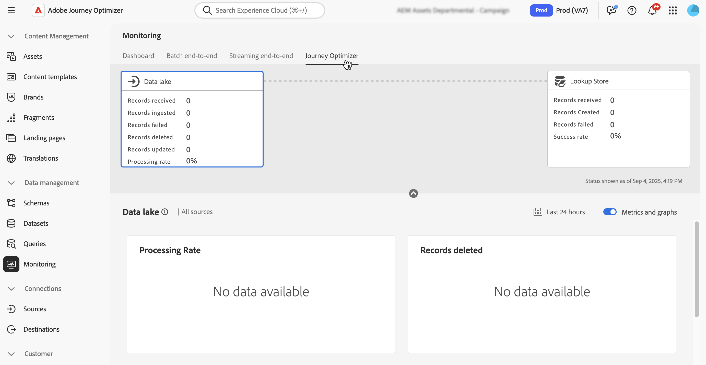

# Adobe Experience Platform データの使用 {#aep-data}

>[!CONTEXTUALHELP]
>id="lookup-aep-data"
>title="参照のために有効にする"
>abstract="ルックアップ用にデータセットを有効にすると、Journey Optimizerのパーソナライゼーションおよび判定機能でそのデータを活用できます。"

>[!AVAILABILITY]
>
>この機能は、現在、限定提供リリースとしてすべてのお客様が利用できます。

Journey Optimizerでは、パーソナライゼーションと意思決定の機能を使用して、Adobe Experience Platform データのデータを活用できます。 これを行うには、以下に示すように、参照パーソナライゼーションに必要なレコードベースのデータセットをまず参照サービスに対して有効にする必要があります。

## 必読

### ガードレールとガイドライン {#guidelines}

開始する前に、次の制限事項とガイドラインを確認してください。

* ルックアップが有効になっているデータセットに、個人を特定できる情報（PII）を含めることはできません。
* ルックアップが有効になっているデータセットやパーソナライゼーションで使用されているデータセットは、削除から保護されません。 パーソナライゼーションに使用されているデータセットを追跡し、データセット削除の有無を確認するのは、お客様の責任です。
* データセットは、プロファイル タイプまたはイベントタイプではないスキーマに関連付ける必要があります。
* スキーマにはプライマリ ID が必要です。 ルックアップに使用できるのは、単一のプライマリキーのみです。

### ルックアップサービスの使用権限

| 機能コンポーネント | 実稼動サンドボックスの制限 | メモ |
| ------- | ------- | ------- |
| 有効な参照データセット | 組織あたり最大 10 | 任意の時点で検索用に設定できるデータセットの最大数。 この制限は、顧客インスタンス内の実稼動サンドボックスと開発サンドボックスの両方で使用されるルックアップデータセットの合計数に適用されます。 |
| データセットレコード数 | 1 つのデータセットにつき最大 200 万件のレコード | 単一のデータセットで許可されるレコードの最大数。そのデータセット内のすべてのバッチの合計数として計算されます。 |
| レコードサイズ | レコードあたり最大 2 KB | デフォルトの最大レコードサイズがサポートされています。 |
| データセットサイズ | 最大 4 GB | サンドボックス内のすべてのデータセットの合計サイズではなく、個々のデータセットの最大サイズ。 レコード数とデータセットのサイズ制限は、独立したガードレールです。両方とも満たす必要があります。 |
| データセット頻度の更新 | 1 つのデータセットにつき最大 5 回の更新 | 1 日あたり 1 つのデータセットに許可される更新操作の最大頻度。 |

>[!NOTE]
>
>上記のガードレール以外にも必要なボリュームがある場合は、Adobeの担当者にお問い合わせください。

### その他のパフォーマンスに関する考慮事項

以下の推奨事項は、配信品質の遅延を回避するためのガイダンスです。

| 考慮事項 | 推奨される制限 | 説明 |
| ------- | ------- | ------- |
| 参照ごとの属性 | 最大 20 | 1 つの参照アクティビティでレコードごとに取得されるデータフィールドの数。 |
| ルックアップアクティビティ | ジャーニーあたり最大 5 つ | 各ジャーニーには、最大 5 つの個別のルックアップアクティビティを含めることができます。 各参照は、異なるデータセットをターゲットにすることができます。 |

## データ参照用データセットの有効化 {#enable}

データセットのデータをパーソナライゼーションに活用するには、データセットのルックアップを有効にする必要があります。

### 前提条件 {#prerequisites-enable}

参照を有効にするデータセットに関連付けられたスキーマは、レコードタイプである必要があります。 スキーマをプロファイルまたはイベントクラスにすることはできません。

+++例


+++

スキーマにはプライマリ ID が定義されている必要があります。

+++例


+++

カスタム名前空間がまだ定義されていない場合は、ID が人物以外の識別子であることを確認します。

+++例


+++

### データセット管理インターフェイスでのデータセットのルックアップを有効にする

データセット管理ユーザーインターフェイスで、切替スイッチを使用して、データセットをルックアップに有効にします。


>[!NOTE]
>
>データセットをプロファイルに対しても有効にしないことをお勧めします。これにより、プロファイルの充実度が向上する可能性があり、検索を実行する必要がないからです。

### API メソッド

[ このドキュメント ](https://developer.adobe.com/journey-optimizer-apis/references/authentication/) で説明されている手順に従って、API コマンドを送信するように環境を設定します。

#### 前提条件

* 開発者プロジェクトには、Adobe Journey Optimizer と Adobe Experience Platform API がプロジェクトに追加されている必要があります。

  

* 役割の一部としてデータセットの管理権限が必要です。

* データセットの基になるスキーマには、ルックアップキーとして機能するプライマリ ID が含まれている必要があります。

#### API 呼び出し構造

```shell
curl -s -XPATCH "https://platform.adobe.io/data/core/entity/lookup/dataSets/${DATASET_ID}/${ACTION}" \ -H "Authorization: Bearer ${ACCESS_TOKEN}" \ -H "x-api-key: ${API_KEY}" \ -H "x-gw-ims-org-id: ${IMS_ORG}" \ -H "x-sandbox-name: ${SANDBOX_NAME}" 
```

次のとおりです。

* URL が `https://platform.adobe.io/data/core/entity/lookup/dataSets/${DATASET_ID}/${ACTION}` です
* データセット ID は、有効にするデータセットです。
* アクションは有効または無効です。
* アクセストークンは、開発者コンソールから取得できます。
* API キーは、開発者コンソールから取得できます。
* IMS 組織 ID はAdobeの組織です。
* サンドボックス名は、データセットのサンドボックス名です（実稼働、開発など）。

>[!NOTE]
>
>データセットを有効にするための API 呼び出しで以下のエラーが発生した場合は、Developer Console プロジェクトからAdobe Journey Optimizer API を削除して、再度追加してみてください。
>
>`"error_code": "403003",`
>`"message": "Api Key is invalid"`

## データセットの監視

データセットで検索を有効にすると、**[!UICONTROL モニタリング]** メニューに移動し、「**[!UICONTROL Journey Optimizer]**」タブをクリックすることで、ルックアップサービスに取り込まれたステータスを確認できます。

このプロセスインジケーターは、ルックアップサービスで新しいデータのバッチが使用可能なタイミングを理解するのに役立ちます。



<!--Ivan Mironchuk
Note - we have a bug here currently. Will need to update screenshot once the lookup service will accurately reflect the progress.-->

## 次の手順

API 呼び出しを使用した検索に対してデータセットが有効になったら、パーソナライゼーションおよび判定機能でデータ [!DNL Journey Optimizer] 使用できます。 詳しくは、次の節を参照してください。

* [Adobe Experience Platform データをパーソナライゼーションに使用](../personalization/aep-data-perso.md)
* [Adobe Experience Platform データを決定に使用](../experience-decisioning/aep-data-exd.md)
