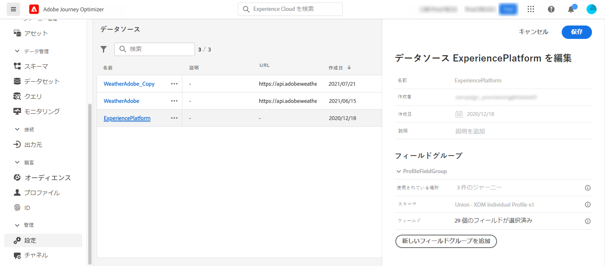
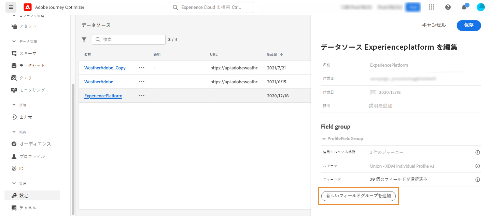

# Adobe Experience Platform のデータソース {#adobe-experience-platform-data-source}

Adobe Experience Platform のデータソースは、リアルタイム顧客プロファイルサービスへの接続を定義します。このデータソースは事前設定され、組み込まれているため、削除できません。このデータソースは、リアルタイム顧客プロファイルサービスからデータを取得して使用するように設計されています（例えば、ジャーニーにエントリした人物が女性かどうかを確認します）。プロファイルデータとエクスペリエンスイベントデータを使用できます。リアルタイム顧客プロファイルサービスの詳細については、[Adobe Experience Platform のドキュメント](https://experienceleague.adobe.com/docs/experience-platform/profile/home.html?lang=ja){target=&quot;_blank&quot;}を参照してください。

>[!NOTE]
>
>1 年以内に作成された最の 1,000 件のエクスペリエンスイベントを取得できます。

リアルタイム顧客プロファイルサービスへの接続を可能にするには、人物を特定するキーと、キーを説明する名前空間前を使用する必要があります。その結果、このデータソースは、ジャーニーが、キーと名前空間を含むイベントで開始する場合にのみ使用できます。[このページ](../building-journeys/journey.md)を参照してください。

「ProfileFieldGroup」という名前の事前設定済みフィールドグループを編集し、新しいグループを追加して、ドラフトまたはライブジャーニーで使用されていないフィールドグループを削除できます。[このページ](../datasource/configure-data-sources.md#define-field-groups)を参照してください。

組み込みデータソースにフィールドグループを追加する主な手順は次のとおりです。

1. データソースのリストから、組み込みの Adobe Experience Platform データソースを選択します。

   画面の右側にデータソース設定ペインが開きます。

   

1. 「**[!UICONTROL 新しいフィールドグループを追加]**」をクリックして、新しく取得する一連のフィールドを定義します。[このページ](../datasource/configure-data-sources.md#define-field-groups)を参照してください。

   

1. **[!UICONTROL スキーマ]**&#x200B;ドロップダウンからスキーマを選択します。このフィールドリストのプロファイルとエクスペリエンスのイベントスキーマは、Adobe Experience Platform で入手できます。[!DNL Journey Optimizer] ではスキーマの作成は実行されません。Adobe Experience Platformでおこなわれます
1. 使用するフィールドを選択します。
1. 「**[!UICONTROL 保存]**」をクリックします。

フィールドグループの名前にカーソルを置くと、右側に 2 つのアイコンが表示されます。これらのアイコンを使用すると、フィールドグループを削除および複製できます。**[!UICONTROL 削除]**&#x200B;アイコンは、フィールドグループがライブジャーニーまたはドラフトジャーニー（「**[!UICONTROL 使用されている場所]**」フィールドに表示される情報）で使用されていない場合にのみ使用できます。
