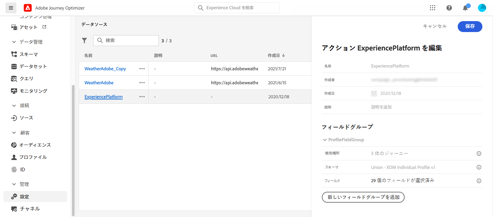
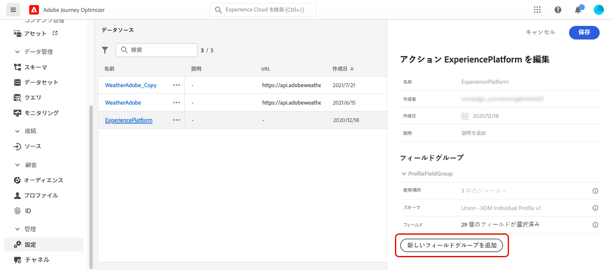

# Adobe Experience Platform のデータソース {#adobe-experience-platform-data-source}

>[!CONTEXTUALHELP]
>id="ajo_journey_data_source_built_in"
>title="Adobe Experience Platform のデータソース"
>abstract="Adobe Experience Platform のデータソースは、Adobe リアルタイム顧客プロファイルサービスへの接続を定義します。 このデータソースはビルトインで事前に設定されているので、削除できません。 これは、リアルタイム顧客プロファイルサービスからデータを取得して使用するように設計されています（例えば、ジャーニーにエントリしたユーザーが女性かどうかを確認します）。"

Adobe Experience Platform のデータソースは、Adobe リアルタイム顧客プロファイルサービスへの接続を定義します。 このデータソースはビルトインで事前に設定されているので、削除できません。 このデータソースは、リアルタイム顧客プロファイルサービスからデータを取得して使用するように設計されています（例えば、ジャーニーにエントリした人物が女性かどうかを確認します）。 アドビのリアルタイム顧客プロファイルサービスについて詳しくは、[Adobe Experience Platform ドキュメント](https://experienceleague.adobe.com/docs/experience-platform/profile/home.html?lang=ja){target="_blank"}を参照してください。

リアルタイム顧客プロファイルサービスへの接続を可能にするには、人物を特定するキーと、キーを説明する名前空間前を使用する必要があります。 その結果、このデータソースは、ジャーニーが、キーと名前空間を含むイベントで開始する場合にのみ使用できます。 [詳細情報](../building-journeys/journey.md)

「ProfileFieldGroup」という名前の事前設定済みフィールドグループを編集し、新しいグループを追加して、ドラフトまたはライブジャーニーで使用されていないフィールドグループを削除できます。 [詳細情報](../datasource/configure-data-sources.md#define-field-groups)。

>[!CAUTION]
>
>ジャーニーの式／条件でのエクスペリエンスイベントの使用はサポートされていません。 ユースケースでエクスペリエンスイベントを使用する必要がある場合は、別の方法を考慮します。 [詳細情報](../building-journeys/exp-event-lookup.md)

ビルトインデータソースにフィールドグループを追加する主な手順は次のとおりです。

1. データソースのリストから、ビルトインの **Adobe Experience Platform** データソースを選択します。

   画面の右側にデータソース設定ペインが開きます。

   

1. 「**[!UICONTROL 新しいフィールドグループを追加]**」を選択して、[新しく取得する一連のフィールド](../datasource/configure-data-sources.md#define-field-groups)を定義します。

   

1. **[!UICONTROL スキーマ]**&#x200B;ドロップダウンからスキーマを選択します。 スキーマの作成は、Adobe Journey Optimizer ではなく、Adobe Experience Platform で実行されます。

   >[!NOTE]
   >
   >[!DNL Journey Optimizer] Data Source設定では、XDM Individual Profile ベースのスキーマのみがサポートされています。 詳しくは、[XDM個人プロファイルクラス &#x200B;](https://experienceleague.adobe.com/ja/docs/experience-platform/xdm/classes/individual-profile){target="_blank"}を参照してください。

1. 使用するフィールドを選択し、変更を保存します。

>[!TIP]
>
>フィールドグループの名前にポインタを合わせると、右側に 2 つのアイコンが表示されます。 これらを使用して、フィールドグループを&#x200B;**複製**&#x200B;または&#x200B;**削除**&#x200B;します。 **[!UICONTROL 削除]**&#x200B;アイコンは、フィールドグループが&#x200B;**ライブ**&#x200B;ジャーニー、**ドラフト**&#x200B;ジャーニーまたは&#x200B;**完了した**&#x200B;ジャーニーで使用されていない場合にのみ使用できます。 該当するかどうかを確認するには、「**[!UICONTROL 使用場所]**」フィールドを参照してください。
