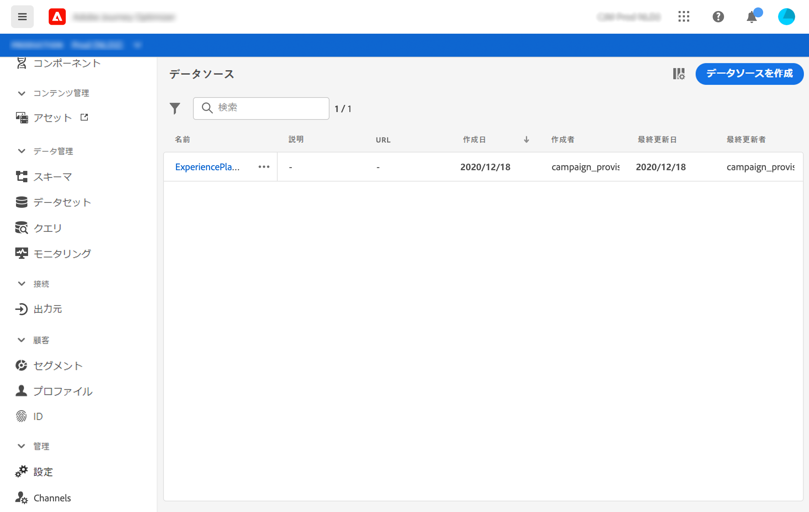
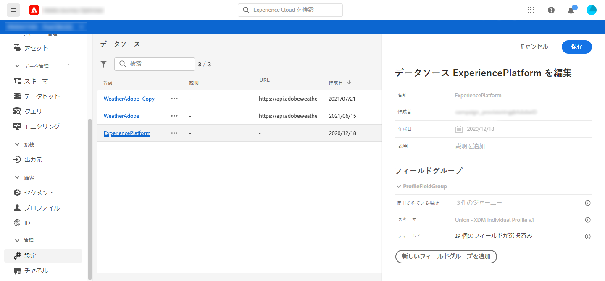

# データソースの設定{#configure-data-source}

主なデータソース設定手順は次のとおりです。

>[!NOTE]
>
>データソースの設定は、常に&#x200B;**技術ユーザー**&#x200B;が実行します。

1. **[!UICONTROL 管理者]** / **[!UICONTROL データソース]**&#x200B;メニューを選択します。

   データソースのリストが表示されます。インターフェイスの詳細は、[このページ](../user-interface.md)を参照してください。

   

1. 次に、組み込みデータソースにフィールドグループを追加する（「[このページ](../datasource/adobe-experience-platform-data-source.md)」を参照）か、新しい外部データソースを作成し（「[このページ](../datasource/external-data-sources.md)」を参照）、関連フィールドグループを作成します（「[このページ](../datasource/configure-data-sources.md#define-field-groups)」を参照）。

   

1. 「**[!UICONTROL 保存]**」をクリックします。

   データソースが設定され、ジャーニーで使用できる状態になります。

## フィールドグループの定義{#define-field-groups}

フィールドグループは、データソースから取得し、ジャーニーで使用できるフィールドのセットです。

各データソースに対して、複数のフィールドグループを定義できます。各フィールドグループには、特定のキャッシュ期間を指定できます。

例えば、電話番号、電子メール、名、プロファイルのアドレスを含むフィールドグループを作成できます。 その後、このデータをジャーニーで使用して条件を作成できます。 たとえば、プロファイルの電話番号が空でない場合に限り、SMSを送信することができます。 空の場合は、電子メールを送信できます。

デフォルト名は自動的に追加されますが、フィールドグループに名前を付けることをお勧めします。 実際、フィールドグループ名は[!DNL Journey Optimizer]内の他のユーザーに表示されます。 フィールドグループに適切な名前を付けることをお勧めします。

ジャーニーでデータソースフィールドを使用すると、そのフィールドグループに定義されているすべてのフィールドが取得されます。 したがって、ジャーニーに必要なフィールドのみを選択することをお勧めします。 これにより、ジャーニーーでの要求の待ち時間が短縮され、パフォーマンスが向上します。 後で、フィールドグループに簡単にフィールドを追加できます。

**[!UICONTROL キャッシュ]** 期間も重要で、パフォーマンスの最適化に役立ちます。キャッシュ期間とは、ジャーニー内で、フィールドグループのデータが1回取得された場合に、そのデータが一時的にキャッシュされることを意味します。 同じデータが同じジャーニーの後で必要になる場合、データソースに対して別のリクエストは行われません。 キャッシュ期間の設定は、使用事例ごとに適用する必要があります。 ホテルの予約状況、天気予報情報、忠誠度ポイント数などのリアルタイムデータを取得する必要がある場合は、これらのフィールドを含むフィールドグループを短いキャッシュ期間（1秒など）に関連付けます。 更新頻度が低いフィールド（名前、性別）の場合は、キャッシュ期間が長い2番目のフィールドグループ（5日など）を作成します。

フィールドグループを使用するジャーニーの数は、「**[!UICONTROL 使用場所]**」フィールドに表示されます。 「**[!UICONTROL 表示ジャーニー]**」ボタンをクリックすると、このフィールドグループを使用するジャーニーのリストを表示できます。

>[!NOTE]
>
>フィールドグループにフィールドがない場合は、式エディターに表示されません。

## フィールドグループのライフサイクル{#field-group-lifecycle}

ドラフトやライブジャーニーで使用されていないフィールドグループに対しては、フィールドの追加や削除を行うことができます。

1つ以上のドラフトまたはライブジャーニーで使用されているフィールドグループからは、フィールドを追加することはできますが、削除することはできません。 これにより、ジャーニーを無効にすることが避けられます。

1つ以上のジャーニーで使用されているフィールドグループからフィールドを削除するには、次の手順に従います。 「Field Group A」という名前のフィールドグループの例を使用します。

1. フィールドグループのリストで、「Field Group A」にカーソルを置き、右側にある&#x200B;**[!UICONTROL 重複]**&#x200B;アイコンをクリックします。 例えば、複製したフィールドグループに「Field Group B」という名前を付けます。
1. 「フィールドグループB」で、不要になったフィールドを削除します。
1. 「Field Group A」で、このフィールドグループが使用される場所を確認します。 この情報は、**[!UICONTROL 「]**&#x200B;で使用」フィールドに表示されます。
1. 「Field Group A」を使用するすべてのジャーニーを開きます。
1. これらの各ジャーニーの新しいバージョンを作成します。 「Field Group A」を使用してすべてのアクティビティを編集し、「Field Group B」を選択します。
1. 「フィールドグループA」を使用するジャーニーの古いバージョンを停止します。 その場合、「フィールドグループA」を使用するジャーニーは発生しません。
1. 「Field Group A」は使用されなくなったので、削除してください。
