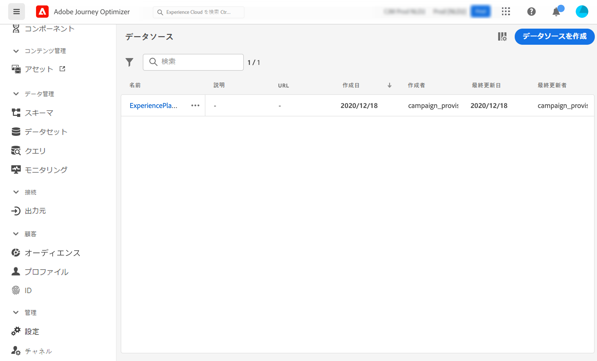
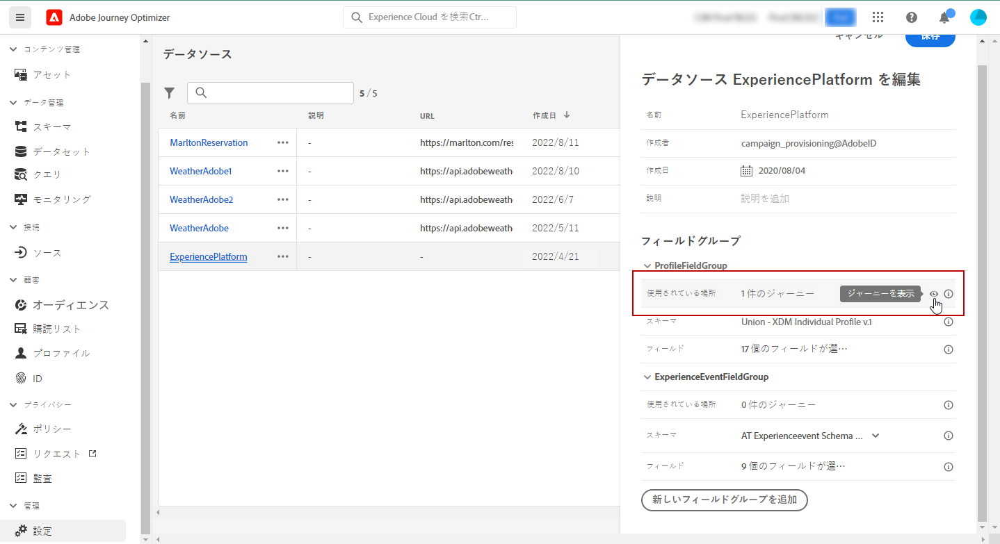

# データソースの設定 {#configure-data-source}

>[!NOTE]
>
>データソースの設定は、常に&#x200B;**技術ユーザー**&#x200B;が実行します。

データソースを設定するには、次の手順に従います。

1. 管理メニューセクションで、「**[!UICONTROL 設定]**」を選択します。「**[!UICONTROL データソース]**」セクションで、「**[!UICONTROL 管理]**」をクリックします。データソースのリストが表示されます。インターフェイスの詳細については、[このページ](../start/user-interface.md)を参照してください。

   

1. 次に、ビルトインデータソースにフィールドグループを追加するか（[このページ](../datasource/adobe-experience-platform-data-source.md)を参照）、新しい外部データソース（[このページ](../datasource/external-data-sources.md)を参照）および関連付けられたフィールドグループを作成する（[このページ](../datasource/configure-data-sources.md#define-field-groups)を参照）ことができます。

   

1. 「**[!UICONTROL 保存]**」をクリックします。

   データソースが設定され、ジャーニーで使用できる状態になります。

## フィールドグループの定義 {#define-field-groups}

フィールドグループは、データソースから取得し、ジャーニーで使用できるフィールドのセットです。

データソースごとに、複数のフィールドグループを定義できます。

例えば、電話番号、メール、名前、プロファイルのアドレスを使用してフィールドグループを作成できます。その後、このデータをジャーニーで使用して条件を作成できます。例えば、顧客がモバイルアプリケーションをインストールしている場合にのみプッシュ通知を送信するように指定できます。空の場合は、メールを送信できます。

デフォルト名は自動的に追加されますが、フィールドグループには名前を付けることをお勧めします。フィールドグループ名は、[!DNL Journey Optimizer] 内の他のユーザーに表示されます。フィールドグループに関連性の高い名前を付けることをお勧めします。

ジャーニーでデータソースフィールドを使用すると、システムはそのフィールドグループに定義されているすべてのフィールドを取得します。したがって、ジャーニーに必要なフィールドのみを選択することをお勧めします。これにより、ジャーニーでのリクエストの待ち時間が短縮され、パフォーマンスが向上します。フィールドグループには、後から簡単にフィールドを追加できます。

フィールドグループを使用するジャーニーの数は、「**[!UICONTROL 使用されている場所]**」フィールドに表示されます。「**[!UICONTROL ジャーニーを表示]**」ボタンをクリックすると、このフィールドグループを使用するジャーニーのリストが表示されます。

>[!NOTE]
>
>フィールドグループにフィールドがない場合は、式エディターに表示されません。

## フィールドグループのライフサイクル {#field-group-lifecycle}

ドラフトやライブジャーニーで使用されていないフィールドグループに対しては、フィールドの追加や削除を行うことができます。

フィールドグループを 1 つ以上のドラフトジャーニーまたはライブジャーニーで使用する場合、選択したスキーマから新しいフィールドを増分的に追加できますが、既に選択されているフィールドは選択解除／削除／変更できません。ドラフトジャーニーまたはライブジャーニーで既に使用されているスキーマの既存のフィールドを変更した場合（例えば、フィールドのデータタイプを変更した場合）、フィールドグループの更新は許可されません。これにより、ジャーニーが中断するのを回避します

1 つ以上のジャーニーで使用されているフィールドグループからフィールドを削除するには、次の手順に従います。例えば、「フィールドグループ A」という名前のフィールドグループがあるとします。

1. フィールドグループのリストで、「フィールドグループ A」にカーソルを置き、右側にある「**[!UICONTROL 複製]**」アイコンをクリックします。例えば、複製したフィールドグループに「フィールドグループ B」という名前を付けます。
1. 「フィールドグループ B」で、不要になったフィールドを削除します。
1. 「フィールドグループ A」で、このフィールドグループが使用される場所を確認します。この情報は、「**[!UICONTROL 使用場所]**」フィールドに表示されます。
1. 「フィールドグループ A」を使用するすべてのジャーニーを開きます。
1. これらのジャーニーそれぞれの新しいバージョンを作成します。「フィールドグループ A」を使用してすべてのアクティビティを編集し、「フィールドグループ B」を選択します。
1. 「フィールドグループA」を使用する、ジャーニーの古いバージョンを停止します。すると、「フィールドグループ A」を使用するジャーニーはなくなります。
1. 「フィールドグループ A」はもう使用しないので、削除します。
