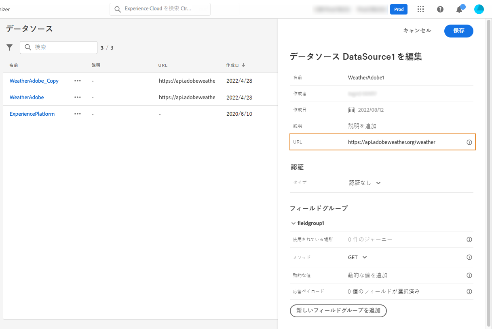
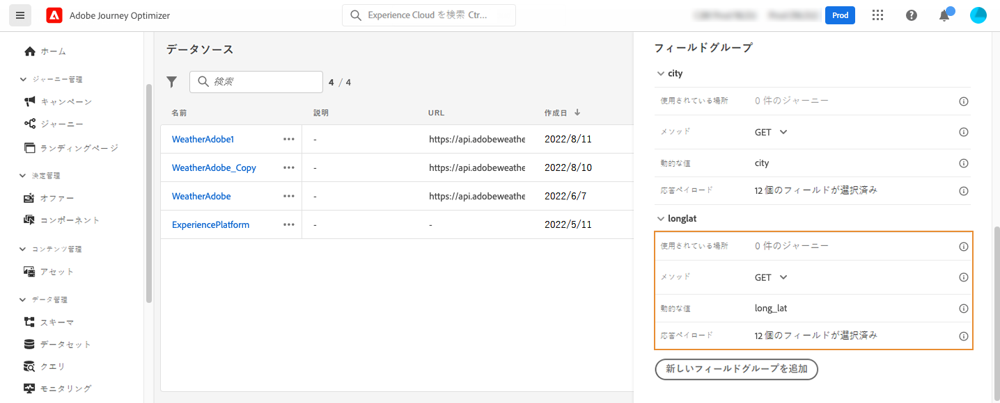
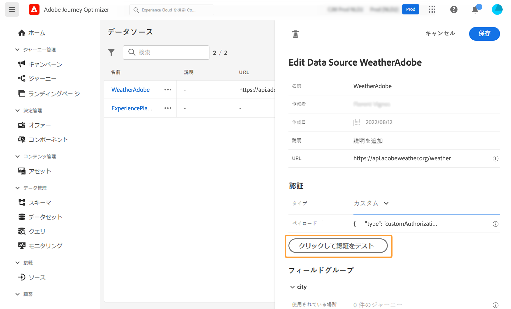

# 外部データソース {#external-data-sources}

>[!CONTEXTUALHELP]
>id="ajo_journey_data_source_custom"
>title="外部データソース"
>abstract="外部データソースを使用すると、サードパーティシステムへの接続を定義できます。例えば、ホテルの予約システムを使用して、部屋が登録されたかどうかを確認する場合などです。組み込みの Adobe Experience Platform データソースとは異なり、外部データソースは必要な分だけ作成できます。"

## 外部データソースの操作 {#gs-ext-data-sources}

外部データソースを使用すると、サードパーティシステムへの接続を定義できます。例えば、ホテルの予約システムを使用して、部屋が登録されたかどうかを確認する場合などです。組み込みの Adobe Experience Platform データソースとは異なり、外部データソースは必要な分だけ作成できます。

>[!NOTE]
>
>* 外部システムを操作する際のガードレールについて詳しくは、[このページ](../configuration/external-systems.md)を参照してください。
>
>* 応答がサポートされるようになったので、外部データソースのユースケースでは、データソースの代わりにカスタムアクションを使用する必要があります。応答について詳しくは、この[節](../action/action-response.md)を参照してください。

POST または GET を使用して JSON を返す REST API がサポートされています。API キー、基本およびカスタム認証モードがサポートされています。

リアルタイムの天気データに応じて、ジャーニーの動作をカスタマイズするために使用する、天気 API サービスの例を見てみましょう。

以下に API 呼び出しの例を 2 つ示します。

* _https://api.adobeweather.org/weather?city=London,uk&amp;appid=1234_
* _https://api.adobeweather.org/weather?lat=35&amp;lon=139&amp;appid=1234_

呼び出しにはメイン URL（_https://api.adobeweather.org/weather_）、2 つのパラメーターセット（都市の場合は「city」、緯度と経度の場合は「lat/long」）、および API キー（appid）が含まれます。

>[!TIP]
>
>有効期限の不一致や 401 エラーを回避するために、特にワークロードが大きい場合は、外部 API のトークンの有効期限と Journey Optimizer の [`cacheDuration` 設定](#custom-authentication-access-token)の間に 1 分以上のバッファーを残すことをお勧めします。

## 外部データソースの作成と設定 {#create-ext-data-sources}

新しい外部データソースを作成して設定する主な手順は次のとおりです。

1. データソースのリストで「**[!UICONTROL データソースを作成]**」をクリックして、新しい外部データソースを作成します。

   

   画面の右側にデータソース設定ペインが開きます。


   

1. データソースの名前を入力します。

英数字とアンダースコアのみが使用できます。最大長は 30 文字です。

1. データソースに説明を追加します。この手順はオプションです。
1. 外部サービスの URL を追加します。この例では、次のようになります。_https://api.adobeweather.org/weather_。

   >[!CAUTION]
   >
   >セキュリティ上の理由から、HTTPS の使用を強くお勧めします。また、公開されていないAdobe アドレスの使用や IP アドレスの使用は許可されていません。

   

1. 外部サービスの設定に応じて認証を&#x200B;**[!UICONTROL 認証なし]**、**[!UICONTROL 基本]**、**[!UICONTROL カスタム]**&#x200B;または **[!UICONTROL API キー]**&#x200B;に設定します。

   基本認証モードの場合は、ユーザー名とパスワードを入力する必要があります。

   >[!NOTE]
   >
   >* 認証呼び出しを実行すると、base64 でエンコードされた `<username>:<password>` 文字列が認証ヘッダーに追加されます。
   >
   >* Adobe Journey Optimizer では、カスタムアクションで定義された秘密鍵を自動的に暗号化します。各組織の暗号化キーは、その組織に関連付けられた専用のコンテナで安全に管理されます。資格情報をインターフェイスに表示する際、誤って公開されないように、デフォルトではマスクされます。


   カスタム認証モードについて詳しくは、[この節](../datasource/external-data-sources.md#custom-authentication-mode)を参照してください。この例では、以下のように API キー認証モードを選択します。

   * **[!UICONTROL タイプ]**：API キー
   * **[!UICONTROL 名前]**：&quot;appid&quot;（API キーのパラメーター名）
   * **[!UICONTROL 値]**：&quot;1234&quot;（API キーの値）
   * **[!UICONTROL 位置]**：「クエリパラメーター」（API キーは URL 内にあります）

     

1. 「**[!UICONTROL 新しいフィールドグループを追加]**」をクリックして、API パラメーターセットごとに新しいフィールドグループを追加します。フィールドグループ名には、英数字とアンダースコアのみを使用できます。最大長は 30 文字です。この例では、各パラメーターセット（都市と経度／緯度）ごとに 1 つずつ、2 つのフィールドグループを作成する必要があります。

「long/lat」パラメーターセットの場合、次の情報を含むフィールドグループを作成します。

* **[!UICONTROL 使用場所]**：フィールドグループを使用するジャーニーの数を表示します。**[!UICONTROL ジャーニーを表示]**&#x200B;アイコンをクリックし、このフィールドグループを使用するジャーニーのリストを表示できます。
* **[!UICONTROL メソッド]**：POST または GET メソッドを選択します。この場合は、GET メソッドを選択します。
* **[!UICONTROL 動的な値]**：この例では、「long,lat」というコンマで区切られた異なるパラメーターを入力します。パラメーター値は実行コンテキストに依存するので、ジャーニーで定義されます。[詳細情報](../building-journeys/expression/expressionadvanced.md)
* **[!UICONTROL 応答ペイロード]**：**[!UICONTROL ペイロード]**&#x200B;フィールド内でクリックし、呼び出しによって返されたペイロードの例をペーストします。この例では、天気 API の web サイトにあるペイロードを使用しました。フィールドタイプが正しいことを確認します。API が呼び出されるたびに、ペイロードの例に含まれるすべてのフィールドが取得されます。現在渡されているペイロードを変更する場合、「**[!UICONTROL 新しいペイロードをペースト]**」をクリックします。
* **[!UICONTROL 送信済みペイロード]**：このフィールドは、この例では表示されません。POST メソッドを選択した場合にのみ使用できます。サードパーティシステムに送信されるペイロードをペーストします。

GET 呼び出しにパラメーターが必要な場合は、「 **[!UICONTROL 動的な値]**」フィールドにパラメーターを入力すると、呼び出しの最後に自動的に追加されます。POST 呼び出しの場合は、次の操作が必要です。

* 呼び出し時に渡すパラメーターを「**[!UICONTROL 動的な値]**」フィールドにリストします（以下の例では「identifier」）。
* また、送信済みペイロードの本文で同じ構文を使用して指定します。そのためには、「&quot;param&quot;: &quot;パラメーター名&quot;」（以下の例では「identifier」）を追加する必要があります。次の構文に従います。

  ```json
  {"id":{"param":"identifier"}}
  ```

  


変更を保存すると、データソースが設定され、ジャーニーで使用できる状態になります。これで、状況に応じて、メールをパーソナライズできます。温度が 30°C を超える場合、特定のコミュニケーションを送信するようにできます。

## カスタム認証モード {#custom-authentication-mode}

>[!CONTEXTUALHELP]
>id="jo_authentication_payload"
>title="カスタム認証について"
>abstract="カスタム認証モードは、OAuth2 などの API ラッピングプロトコルを呼び出すための複雑な認証に使用されます。アクションの実行は 2 段階の手順で行われます。まず、エンドポイントへの呼び出しが実行されて、アクセストークンが生成されます。次に、アクセストークンがアクションの HTTP リクエストに挿入されます。"

カスタム認証モードは、複雑な認証に使用され、OAuth2 などの API ラッピングプロトコルの呼び出しに頻繁に使用されます。これにより、アクションの実際の HTTP リクエストに挿入するアクセストークンが取得されます。

カスタム認証を設定する場合は、「**[!UICONTROL クリックして認証を確認]**」ボタンを使用して、カスタム認証ペイロードが正しく設定されているかどうかを制御します。



テストに成功すると、ボタンが緑色に変わります。


この認証モードでは、アクションの実行は次の 2 つの手順で構成されます。

1. エンドポイントを呼び出して、アクセストークンを生成します。
1. アクセストークンを適切な方法で挿入して、REST API を呼び出します。


>[!NOTE]
>
>**この認証には 2 つの部分があります。**

### アクセストークンの生成時に呼び出されるエンドポイントの定義{#custom-authentication-endpoint}

* `endpoint`：エンドポイントの生成に使用する URL
* エンドポイントでの HTTP リクエストのメソッド（`GET` または `POST`）
* `headers`：必要に応じて、この呼び出しにヘッダーとして挿入されるキーと値のペア
* `body`：メソッドが POST の場合の呼び出しの本文を説明します。bodyParams（キーと値のペア）で定義された限定的な本文構造をサポートしています。bodyType は、呼び出しでの本文の形式とエンコーディングを記述します。
   * `form`：コンテンツタイプが application/x-www-form-urlencoded（文字セット UTF-8）で、キーと値のペアが key1=value1&amp;key2=value2&amp;... のようにシリアル化されることを意味します。
   * `json`：コンテンツタイプが application/json（文字セット UTF-8）で、キーと値のペアが JSON オブジェクトとして _{ &quot;key1&quot;: &quot;value1&quot;, &quot;key2&quot;: &quot;value2&quot;, ...}_ のようにシリアル化されることを意味します。

### アクションの HTTP リクエストにアクセストークンを挿入する方法の定義{#custom-authentication-access-token}

* **authorizationType**：生成されたアクセストークンをアクションの HTTP 呼び出しに挿入する方法を定義します。使用可能な値は次のとおりです。

   * `bearer`：_Authorization: Bearer &lt;access token>_ のように、アクセストークンを Authorization ヘッダーに挿入する必要があることを示します。
   * `header`：プロパティ `tokenTarget` で定義されたヘッダー名のヘッダーとして、アクセストークンを挿入する必要があることを示します。例えば、`tokenTarget` が `myHeader` の場合、アクセストークンは _myHeader: &lt;access token>_ のようにヘッダーとして挿入されます。
   * `queryParam`：プロパティ tokenTarget で定義されたクエリパラメーター名である queryParam として、アクセストークンを挿入する必要があることを示します。例えば、tokenTarget が myQueryParam の場合、アクション呼び出しの URL は _&lt;url>?myQueryParam=&lt;access token>_ のようになります。

* **tokenInResponse**：認証呼び出しからアクセストークンを抽出する方法を示します。このプロパティには次のようなものがあります。
   * `response`：HTTP 応答がアクセストークンであることを示します。
   * JSON 内のセレクター（応答が JSON であると仮定し、XML などの他の形式はサポートされません）。このセレクターの形式は _json://&lt;path to the access token property>_ です。例えば、呼び出しの応答が _{ &quot;access_token&quot;: &quot;theToken&quot;, &quot;timestamp&quot;: 12323445656 }_ の場合、tokenInResponse は _json: //access_token_ のようになります。

この認証の形式は次のとおりです。

```json
{
    "type": "customAuthorization",
    "endpoint": "<URL of the authentication endpoint>",
    "method": "<HTTP method to call the authentication endpoint, in 'GET' or 'POST'>",
    (optional) "headers": {
        "<header name>": "<header value>",
        ...
    },
    (optional, mandatory if method is 'POST') "body": {
        "bodyType": "<'form'or 'json'>,
        "bodyParams": {
            "param1": value1,
            ...
        }
    },
    "tokenInResponse": "<'response' or json selector in format 'json://<field path to access token>'",
    "cacheDuration": {
        (optional, mutually exclusive with 'duration') "expiryInResponse": "<json selector in format 'json://<field path to expiry>'",
        (optional, mutually exclusive with 'expiryInResponse') "duration": <integer value>,
        "timeUnit": "<unit in 'milliseconds', 'seconds', 'minutes', 'hours', 'days', 'months', 'years'>"
    },
    "authorizationType": "<value in 'bearer', 'header' or 'queryParam'>",
    (optional, mandatory if authorizationType is 'header' or 'queryParam') "tokenTarget": "<name of the header or queryParam if the authorizationType is 'header' or 'queryParam'>",
}
```

>[!NOTE]
>
>Encode64 は、認証ペイロードで使用できる唯一の関数です。

カスタム認証データソース用のトークンのキャッシュ時間を変更できます。次に、カスタム認証ペイロードの例を示します。キャッシュ時間は、`cacheDuration` パラメーターで定義されます。キャッシュ内の生成されたトークンの保持期間を指定します。単位はミリ秒、秒、分、時間、日、月、年です。

Bearer 認証タイプの例を次に示します。

```json
{
    "type": "customAuthorization",
    "endpoint": "https://<your_auth_endpoint>/epsilon/oauth2/access_token",
    "method": "POST",
    "headers": {
      "Authorization": "Basic EncodeBase64(<epsilon Client Id>:<epsilon Client Secret>)"
    },
    "body": {
      "bodyType": "form",
      "bodyParams": {
        "scope": "cn mail givenname uid employeeNumber",
        "grant_type": "password",
        "username": "<epsilon User Name>",
        "password": "<epsilon User Password>"
      }
    },
    "tokenInResponse": "json://access_token",
    "cacheDuration": {
      "duration": 5,
      "timeUnit": "minutes"
    },
  },
```

>[!NOTE]
>
>* 認証トークンは、ジャーニーごとにキャッシュされます。2 つのジャーニーが同じカスタムアクションを使用している場合、それぞれのジャーニーに独自のトークンがキャッシュされます。そのトークンは、これらのジャーニー間で共有されません。
>
>* キャッシュ時間を使用すると、認証エンドポイントへの呼び出しが多くなりすぎないようにすることができます。認証トークンの保持はサービスにキャッシュされ、永続性はありません。サービスを再起動した場合は、キャッシュがクリーンアップされた状態でサービスが開始されます。デフォルトのキャッシュ時間は 1 時間です。カスタム認証ペイロードでは、別の保持時間を指定することで調整することができます。
>

ヘッダー認証タイプの例を次に示します。

```json
{
  "type": "customAuthorization",
  "endpoint": "https://myapidomain.com/v2/user/login",
  "method": "POST",
  "headers": {
    "x-retailer": "any value"
  },
  "body": {
    "bodyType": "form",
    "bodyParams": {
      "secret": "any value",
      "username": "any value"
    }
  },
  "tokenInResponse": "json://token",
  "cacheDuration": {
    "expiryInResponse": "json://expiryDuration",
    "timeUnit": "minutes"
  },
  "authorizationType": "header",
  "tokenTarget": "x-auth-token"
} 
```

ログイン API 呼び出しの応答の例を次に示します。

```json
{
  "token": "xDIUssuYE9beucIE_TFOmpdheTqwzzISNKeysjeODSHUibdzN87S",
  "expiryDuration" : 5
}
```

>[!CAUTION]
>
>カスタムアクションのカスタム認証を設定する際、ネストされた JSON オブジェクト（例：`bodyParams` 内のサブオブジェクト）は現在&#x200B;**サポートされていません**。最終的なリクエストペイロードには、フラットなキーと値のペアのみが含まれます。認証エンドポイントにネストされたオブジェクトが必要な場合は、フィールドが欠落し、認証が失敗することがあります。
