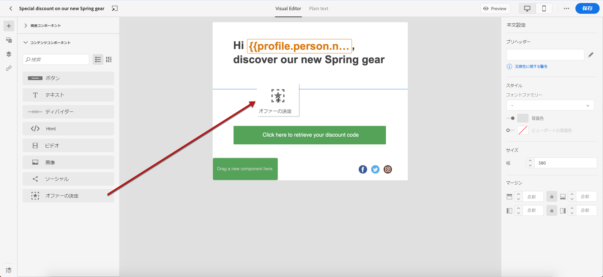
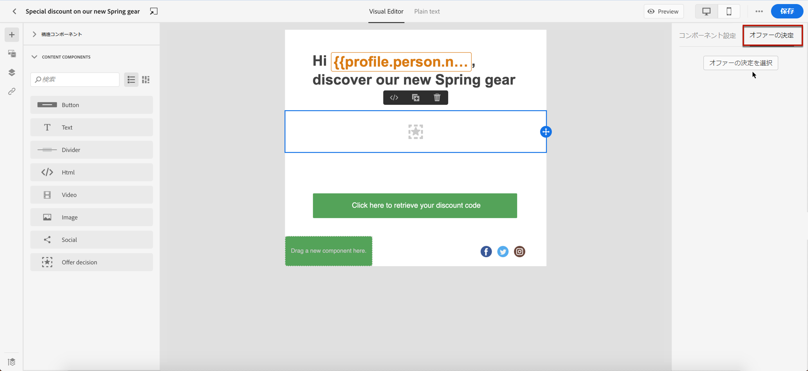
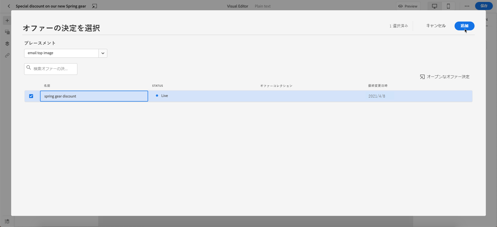
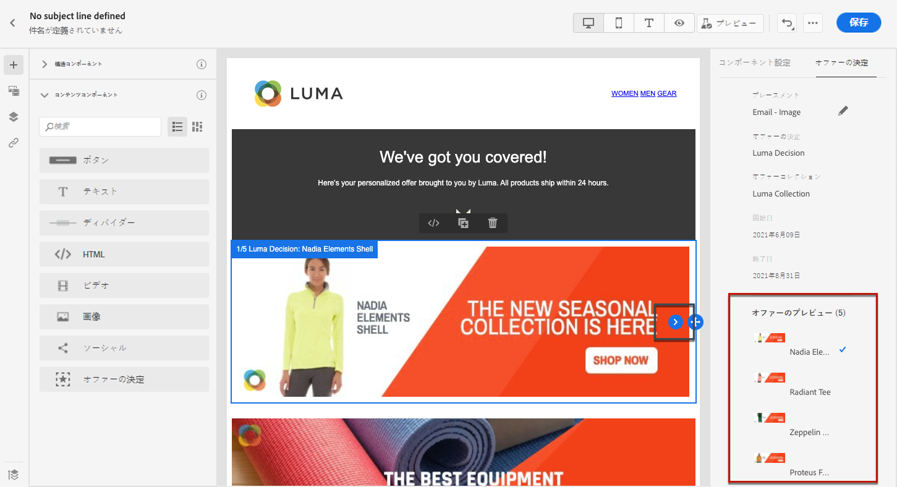
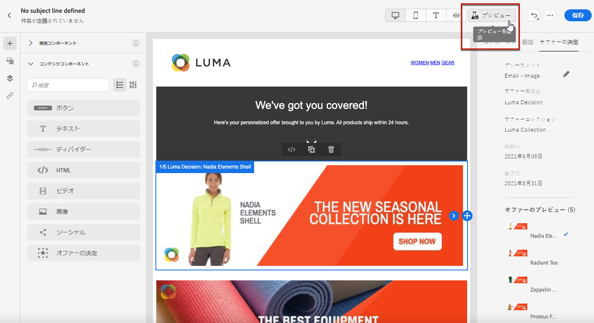
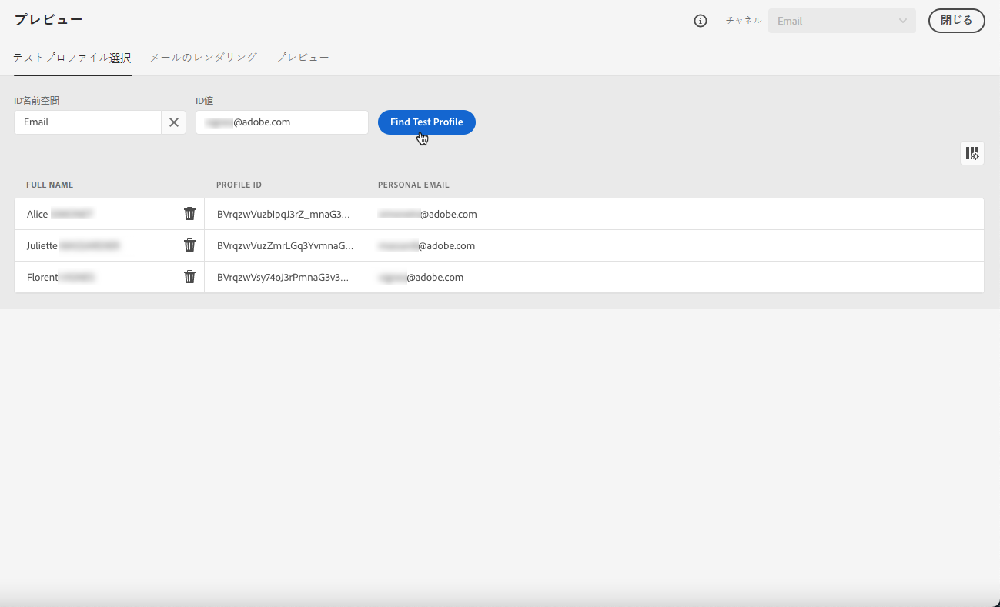
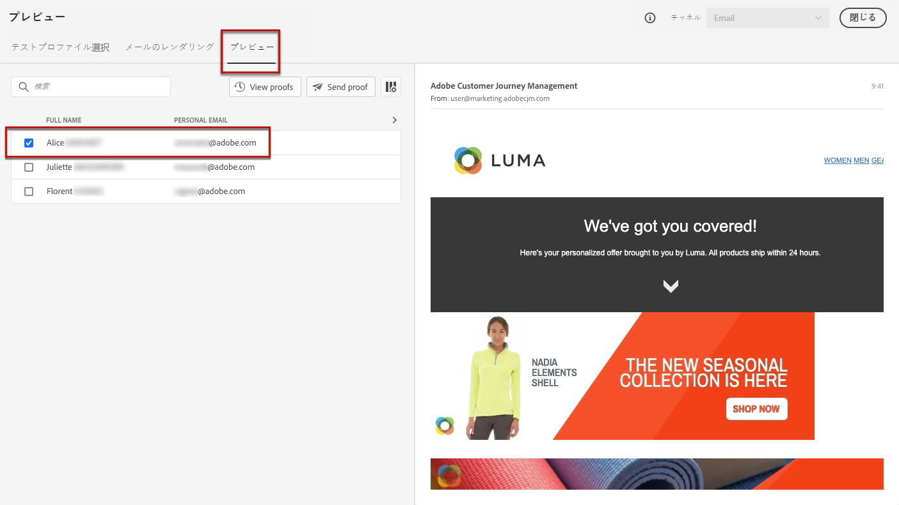
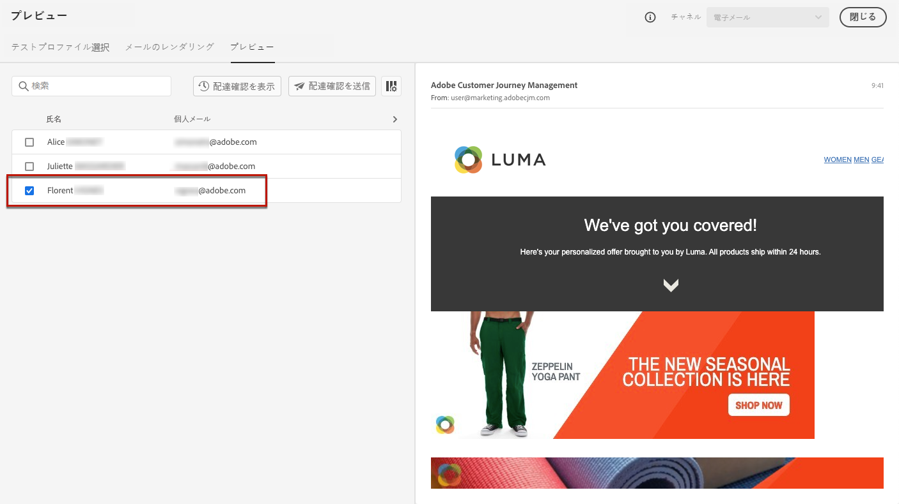

# パーソナライズされたオファーの追加 {#deliver-personalized-offers}

[!DNL Journey Optimizer] Eメールメッセージでは、オファー判定エンジンを活用して顧客に提供する最適なオファーを選択する決定（旧称「オファーアクティビティ」）を挿入できます。

例えば、受信者のロイヤルティレベルに応じて変わる特別割引オファーを、メールに表示する決定を追加できます。

ランキング式の作成方法について詳しくは、[この節](offers/get-started/starting-offer-decisioning.md)を参照してください。

オファーの設定方法を示す&#x200B;**の完全なエンドツーエンドの例**&#x200B;については、この決定をEメールで活用し、オファーを使用する方法を示しています。[この節](offers/offers-e2e.md#insert-decision-in-email)を参照してください。

&lt;a0➡️/>パーソナライゼーションとしてオファーを追加する方法](#video-offers) （ビデオ）[

## メールへの決定の挿入 {#insert-offers}

>[!CAUTION]
>
>開始する前に、[オファーの決定](offers/offer-activities/create-offer-activities.md)を定義する必要があります。

メールメッセージに決定を挿入するには、次の手順に従います。

1. メールを作成し、E メールデザイナーを開いてそのコンテンツを設定します。

1. **[!UICONTROL オファー決定]**&#x200B;コンテンツコンポーネントを追加します。

   

   [この節](content-components.md)では、コンテンツコンポーネントの使用方法を説明します。

1. 右側のパレットに「**[!UICONTROL オファーの決定]**」タブが表示されます。 「**[!UICONTROL オファーの決定]**&#x200B;を選択」をクリックします。

   

1. 表示されるウィンドウで、表示するオファーに対応する配置を選択します。

   [プレースメントは、オファーの表示に使用するコンテナです。](offers/offer-library/creating-placements.md)この例では、「メールトップ画像」のプレースメントを使用しますこのプレースメントは、オファーの上部に配置された画像タイプオファーを表示するために、オファーライブラリで作成されました。

1. コンテンツコンポーネントで使用するオファーアクティビティを選択し、「**[!UICONTROL 追加]**」をクリックします。

   >[!NOTE]
   >
   >選択した配置と互換性のある決定のみがリストに表示されます。 この例では、「メールトップ画像」のプレースメントに一致するオファーアクティビティは 1 つだけです。

   

これで、オファーアクティビティがコンポーネントに追加されました。

## Eメール内のオファーのプレビュー {#preview-offers-in-email}

**[!UICONTROL オファー]**&#x200B;セクションまたはコンテンツコンポーネントの矢印を使用して、Eメールに追加された判定の一部となる様々なオファーをプレビューできます。

判定の一部となる様々なオファーを顧客プロファイルで表示するには、次の手順に従います。

1. 「**[!UICONTROL プレビュー]**」をクリックします。

   

   >[!NOTE]
   >
   >メッセージをプレビューするには、テストプロファイルを使用できるようにする必要があります。 [テストプロファイル](building-journeys/creating-test-profiles.md)を作成する方法を説明します。

1. テストプロファイルの識別に使用する名前空間を選択するには、「**[!UICONTROL ID名前空間]**」フィールドから「**[!UICONTROL Eメール]**」を選択します。

   >[!NOTE]
   >
   >この例では、**Email**&#x200B;名前空間を使用します。 Adobe Experience Platform の ID 名前空間については、[この節](get-started-identity.md)を参照してください。

1. ID名前空間のリストで、「**[!UICONTROL Email]**」を選択し、「**[!UICONTROL Select]**」をクリックします。

1. 「**[!UICONTROL ID値]**」フィールドに、テストプロファイルを識別する値を入力します。 この例では、テストプロファイルのEメールアドレスを入力します。

   <!--For example enter smith@adobe.com and click the **[!UICONTROL Add profile]** button.-->

1. 他のプロファイルを追加して、プロファイルデータに応じて様々なバリエーションのメッセージをテストできるようにします。

   

1. 「**[!UICONTROL プレビュー]**」タブをクリックして、メッセージをテストします。

1. テストプロファイルを選択します。選択したプロファイル（女性）に対応するオファーが表示されます。

   

1. 他のテストプロファイルを選択して、メッセージの各バリアントのEメールコンテンツをプレビューします。 メッセージコンテンツに、選択したテストプロファイル（現在は男性）に対応するオファーが表示されます。

   

[この節](#preview-your-messages)でメッセージのプレビューを確認する詳細な手順について詳しく説明します。

## ハウツービデオ{#video-offers}

[!DNL Journey Optimizer]内のメッセージにoffer decisioningコンポーネントを追加する方法を説明します。

>[!VIDEO](https://video.tv.adobe.com/v/334088?quality=12)
