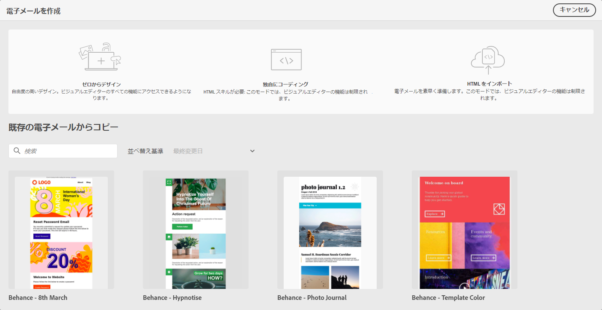

# メールデザインの概要 {#get-started-content-design}

[!DNL Journey Optimizer] でメールコンテンツを作成する際には、次のことができます。

* E メールデザイナーのインターフェイスで&#x200B;**メールをゼロから設計**&#x200B;し、 [Adobe Experience Manager Assets Essentials](assets-essentials.md) の画像を活用します。メールコンテンツの設計方法や、組み込みのテンプレートについては、[この節](create-email-content.md)を参照してください。

* E メールデザイナーで直接 **Raw HTMLをコーディングまたは貼り付け**&#x200B;ます。独自のコンテンツの作成方法については、[iこの節](existing-content.md#import-raw-html-code)を参照してください。

* ファイルまたは .zip フォルダーから&#x200B;**既存の HTML コンテンツを読み込み**&#x200B;ます。メールコンテンツの読み込み方法については、[この節](existing-content.md#import-html-content-from-file)を参照してください。

これらの機能はすべて、メッセージ作成画面から E メールデザイナーにアクセスする場合に使用できます。[メッセージの作成の詳細情報](create-message.md)。

>[!NOTE]
>
>下の領域のテンプレートは静的で、編集できないことに注意してください。これらは、説明の目的でのみ使用できます。
