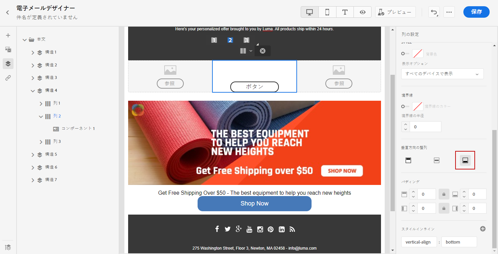
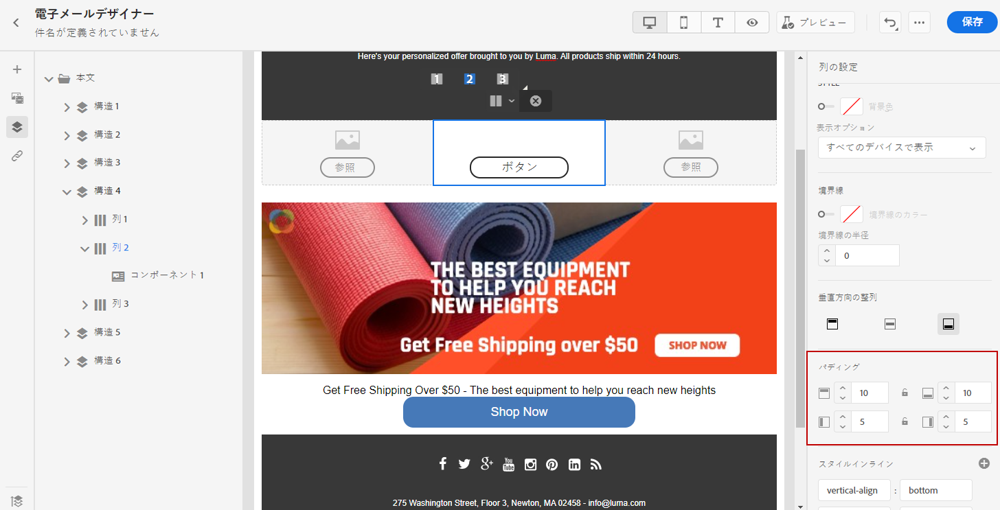

# 垂直方向の整列とパディングを調整する {#adjusting-vertical-alignment-and-padding}

この例では、3 つの列で構成される構造コンポーネント内のパディングと垂直方向の整列を調整します。

1. メール内で構造コンポーネントを直接選択するか、左側のメニューで使用可能な&#x200B;**[!UICONTROL ナビゲーションツリー]**&#x200B;を使用します。

   

1. ツールバーから、「**[!UICONTROL 列を選択]**」をクリックし、編集する列を選択します。構造ツリーから選択することもできます。

   その列の編集可能なパラメーターが、**[!UICONTROL 列設定]**&#x200B;メニューに表示されます。

   

1. 「 **[!UICONTROL 垂直方向の整列]**」で、「**[!UICONTROL 下]**」を選択します。

   コンテンツコンポーネントが列の一番下に移動します。

   

1. 「**[!UICONTROL パディング]**」で、列の上のパディングを定義します。鍵アイコンをクリックして、下のパディングとの同期を解除します。

   その列の左右のパディングを定義します。

   

1. 同じようにして、他の列の位置揃えとパディングを調整します。

1. 変更を保存します。
