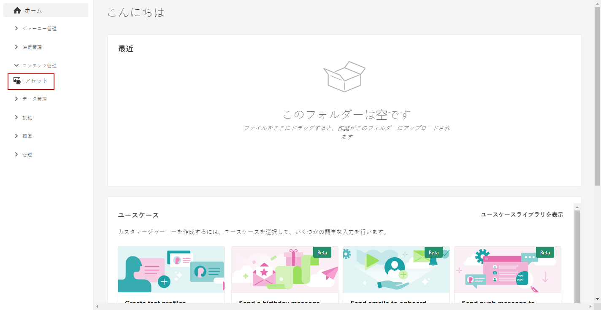
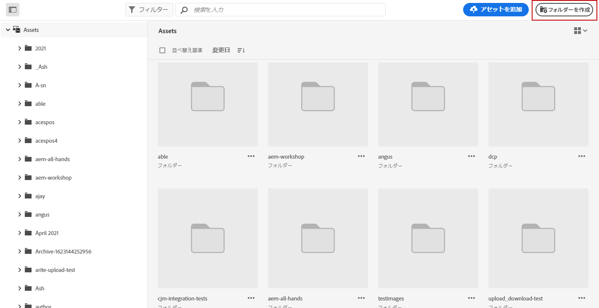
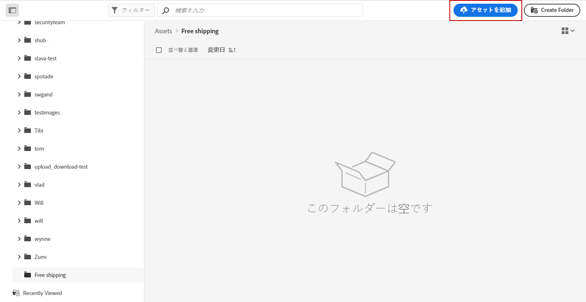
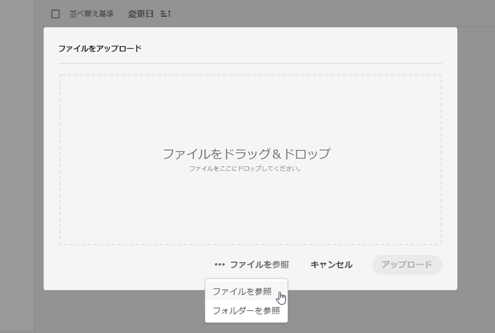
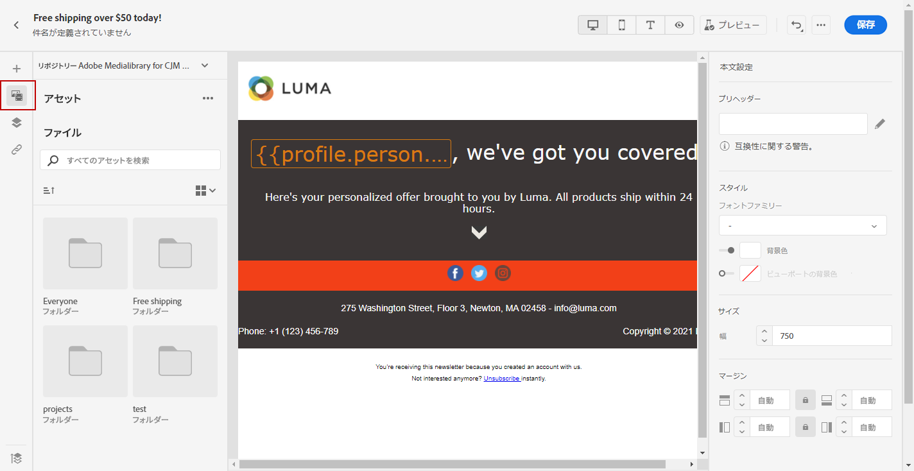
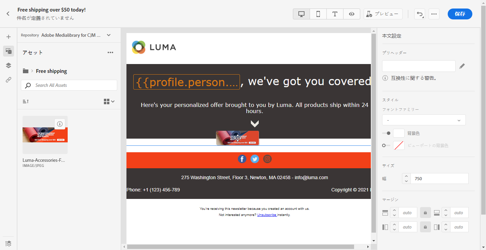
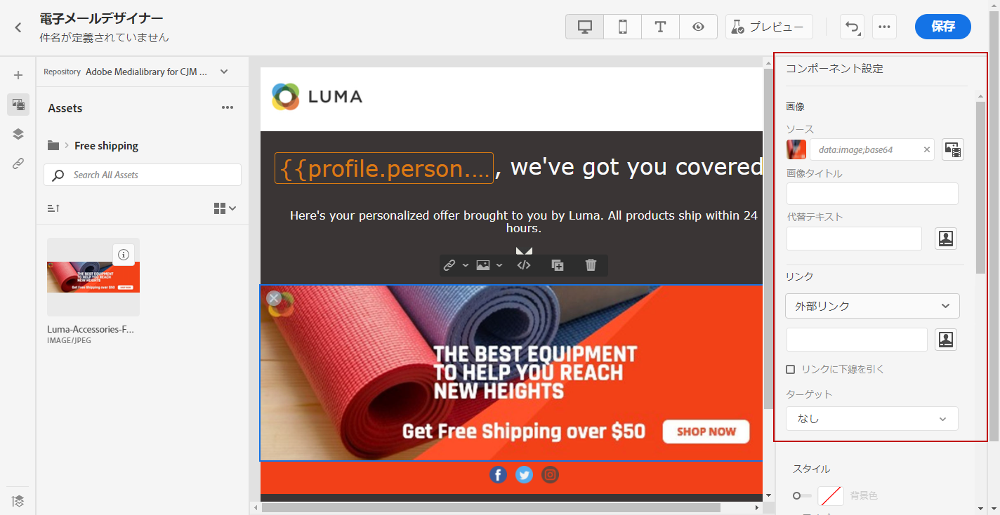

# アセットの作成と管理 {#experience-manager-assets}

## [!DNL Assets Essentials] の基本を学ぶ {#get-started-assets-essentials}

[!DNL Adobe Experience Manager Assets Essentials] を使用してマーケティングワークフローとクリエイティブワークフローを統合します。[!DNL Adobe Journey Optimizer] とネイティブに統合され、[!DNL Assets Essentials] へアクセスして、デジタルアセットの保存、管理、検出、配布を行います。メッセージの入力に使用できる、アセットの一元的なリポジトリを提供します。

[!DNL Adobe Experience Manager Assets Essentials] は、クリエイティブシステムを拡張し、デジタルアセットをエクスペリエンス配信に統合するために共同作業できる、一元化されたアセットワークスペースです。承認済みの実稼動アセットを簡単に整理、タグ付け、検索して、チーム間でブランドの一貫性を確保できます。直感的なユーザーエクスペリエンスによって、[!DNL Assets Essentials] を使用すれば、Adobe Creative アプリや Experience Cloud アプリ内でアセットをすぐに共有できます。

詳しくは、[Adobe Experience Manager Assets Essentials ドキュメント](https://experienceleague.adobe.com/docs/experience-manager-assets-essentials/help/introduction.html?lang=ja){target=&quot;_blank&quot;} を参照してください。

[!DNL Adobe Experience Manager Assets Essentials] は左メニューの「**[!UICONTROL アセット]**」セクションを使用して [!DNL Adobe Journey Optimizer] から直接アクセスできます。また、[メールのコンテンツをデザイン](design-emails.md)する際に、アセットやフォルダーにアクセスすることもできます。

## 前提条件{#assets-prerequisites}

 [!DNL Adobe Experience Manager Assets Essentials] を使用する前に、ユーザーを **Assets Essentials コンシューマーユーザー**&#x200B;または **Assets Essentials ユーザー**&#x200B;製品プロファイルに追加する必要があります。詳しくは、[Assets Essentials ドキュメント](https://experienceleague.adobe.com/docs/experience-manager-assets-essentials/help/deploy-administer.html?lang=ja){target=&quot;_blank&quot;} を参照してください。

>[!NOTE]
>2022年1月6日（PT）より前に入手した Journey Optimizer 製品の場合、組織に [!DNL Adobe Experience Manager Assets Essentials] をデプロイする必要があります。詳しくは、[Assets Essentials のデプロイ](https://experienceleague.adobe.com/docs/experience-manager-assets-essentials/help/deploy-administer.html?lang=ja){target=&quot;_blank&quot;} の節をご覧ください。

## アセットのアップロードと挿入{#add-asset}

ファイルを [!DNL Assets Essentials] にインポートするには、まず保存先のフォルダーを参照または作成する必要があります。その後、メールコンテンツに挿入できます。

アセットのアップロード方法について詳しくは、[Adobe Experience Manager Assets Essentials ドキュメント](https://experienceleague.adobe.com/docs/experience-manager-assets-essentials/help/add-delete.html?lang=ja){target=&quot;_blank&quot;}を参照してください。

1. [!DNL Adobe Journey Optimizer] のホームページから、**[!UICONTROL コンテンツ管理]**&#x200B;メニュー配下の「**[!UICONTROL Assets]**」タブを選択して [!DNL Assets Essentials] にアクセスします。

   

1. 中央のセクションまたはツリービューでフォルダーをダブルクリックして開きます。

   また、「**[!UICONTROL フォルダーを作成]**」をクリックして新しいフォルダーを作成することもできます。

   

1. 選択または作成したフォルダーで、「**[!UICONTROL アセットを追加]**」をクリックして、新しいアセットをフォルダーにアップロードします。

   

1. **[!UICONTROL ファイルをアップロード]**&#x200B;で「**[!UICONTROL 参照]**」をクリックして、**[!UICONTROL ファイルを参照]**&#x200B;するか&#x200B;**[!UICONTROL フォルダーを参照]**&#x200B;するかを選択します。

   

1. アップロードするファイルを選択します。完了したら、「**[!UICONTROL アップロード]**」をクリックします。

   アセットの管理方法について詳しくは、この[ページ](https://experienceleague.adobe.com/docs/experience-manager-assets-essentials/help/manage-organize.html?lang=ja)を参照してください。

1. アセットがアップロードされたら、電子メールデザイナーを使用してメッセージのいずれかにアセットを挿入できるようになります。

   また、アセットは [!DNL Assets Essentials] の&#x200B;**編集**&#x200B;モードでさらに編集することもできます。[詳細情報](https://experienceleague.adobe.com/docs/experience-manager-assets-essentials/help/edit-images.html?lang=ja){target=&quot;_blank&quot;}。

   

1. [!DNL Adobe Journey Optimizer] で、電子メールデザイナーの左側のペインにある「**[!UICONTROL AEM Asset ピッカー]**」を選択します。

   

1. Assets フォルダーを選択します。検索バーで、アセットやフォルダーを検索することもできます。

1. アセットをメールコンテンツにドラッグ＆ドロップします。

   
<!--
1. After adding your asset to your email, use the **[!UICONTROL Find similar Stock photos]** option to locate Stock photos that match the content, color, and composition of your image. [Learn more about Adobe Stock](stock.md).

    Note that this option is available for licensed/unlicensed Stock images and images from your Assets folder. 

    
-->

1. **[!UICONTROL コンポーネント設定]**&#x200B;で外部リンクやテキストを追加するなど、アセットをさらにカスタマイズすることができます。コンポーネント設定について詳しくは、[こちら](content-components.md)を参照してください。

   

メッセージを作成してパーソナライズしたら、公開することで実行が可能になります。[詳細情報](../messages/publish-manage-message.md)
